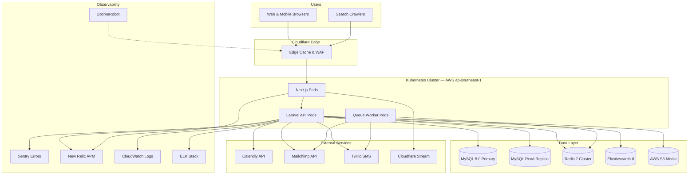
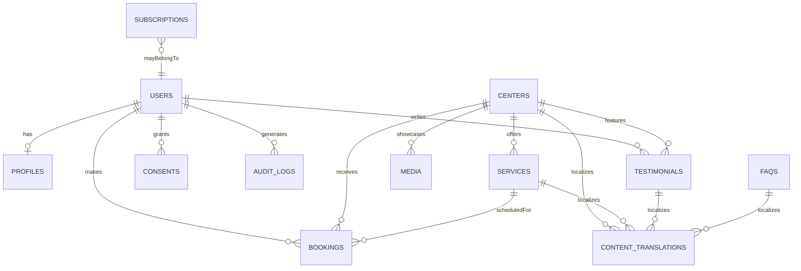

# AGENT.md v4.1 — ElderCare SG Web Platform

Version: 4.1
Last Updated: 2025-01-10
Status: Phases 1-3 Complete | Alpha Development
Primary Source Documents: README.md (authoritative for implementation status), Project_Architecture_Document.md v2.1, Project_Requirements_Document.md, codebase_completion_master_plan.md, docs/ai-coding-agent-brief.md, docs/accessibility/, docs/design-system/, docs/deployment/

Purpose: This guide is the single source of truth for any AI coding agent (and their human facilitators) to understand the ElderCare SG architecture, delivery standards, and operational guardrails before touching the codebase.

⚠️ RESOLVED: Source Conflicts & Clarifications
The following conflicts from v1.0 have been resolved using README.md as the tiebreaker:

| Topic | Previous Conflict | RESOLUTION (v4.1) | Source |
|-------|-------------------|-------------------|--------|
| Search Infrastructure | MeiliSearch vs Elasticsearch | ✅ Elasticsearch 8 (current implementation) | README Tech Stack Table |
| Container Orchestration | Kubernetes vs ECS Fargate | ✅ Docker Compose (local) + ECS Fargate (staging/prod); Kubernetes is aspirational/roadmap | README Deployment + PAD Section 14 |
| Project Phase | "Foundation hardening" vs "Pre-Phase 3" | ✅ Phases 1-3 COMPLETED; now in Alpha Development (feature implementation) | User confirmation + README |
| Primary Database | MariaDB vs MySQL 8.0 | ✅ MySQL 8.0 (production); SQLite (testing/local dev fallback) | README + PAD |

## Table of Contents

1. [Executive Summary](#1-executive-summary)
2. [System Overview](#2-system-overview)
3. [Frontend Blueprint](#3-frontend-blueprint)
4. [Backend Blueprint](#4-backend-blueprint)
5. [Data & Integrations](#5-data--integrations)
6. [Operational Maturity](#6-operational-maturity)
7. [Security & Compliance](#7-security--compliance)
8. [Performance & Scalability Playbook](#8-performance--scalability-playbook)
9. [Accessibility & Internationalization](#9-accessibility--internationalization)
10. [Testing & Quality Assurance](#10-testing--quality-assurance)
11. [Risk Register & Mitigations](#11-risk-register--mitigations)
12. [Project Status & Roadmap](#12-project-status--roadmap)
13. [Collaboration Protocols](#13-collaboration-protocols)
14. [Quickstart Checklist for AI Agents](#14-quickstart-checklist-for-ai-agents)
15. [Change Log & Maintenance Guidance](#15-change-log--maintenance-guidance)

## 1. Executive Summary

### 1.1 Product Mission
Deliver a compassionate, accessibility-first digital bridge between Singaporean families and trusted elderly daycare services.

### 1.2 Primary Outcomes
- Empower families to make informed decisions about eldercare
- Build trust through transparency and verified information
- Enhance quality of life for seniors and caregivers across Singapore

### 1.3 Target Personas

| Persona | Age Range | Key Needs | Design Considerations |
|---------|-----------|-----------|-----------------------|
| Adult Children | 30-55 | Time-poor professionals, demand social proof and deep facility insights | Mobile-first, quick navigation, authentic testimonials |
| Family Caregivers | 25-45 | Often domestic helpers; multilingual content, transport clarity | English + Mandarin/Malay/Tamil, MRT/bus guidance |
| Healthcare Professionals | 30-60 | License verification for referrals, capability assessment | Quick filters, MOH license display, staff credentials |
| Digitally Literate Seniors | 55+ | Independence-seeking, preference for clarity | Larger fonts, high contrast, straightforward navigation |

### 1.4 Core Value Pillars
- **Trust & Transparency**: Verified MOH licenses, staff credentials, authentic testimonials
- **Accessibility**: WCAG 2.1 AA compliance, multilingual support (EN/ZH/MS/TA), keyboard navigation, screen reader optimization
- **Cultural Resonance**: Multicultural imagery, respectful language, holiday-aware content, Singapore-centric transit/parking guidance
- **Seamless Engagement**: Frictionless journey from discovery → booking with proactive reminders

### 1.5 Success Metrics

| Metric | Target | Review Cadence | Owner | Tracking Tool |
|--------|--------|----------------|-------|---------------|
| Visit bookings increase | +30% in 3 months | Monthly | Marketing | GA4, Backend Analytics |
| Mobile bounce rate | <40% | Bi-weekly | UX | GA4, Hotjar |
| Lighthouse Performance | >90 | Each deploy | DevOps/QA | Lighthouse CI |
| Lighthouse Accessibility | >90 | Each deploy | DevOps/QA | Lighthouse CI + axe-core |
| Average session duration | >5 minutes | Monthly | Marketing | GA4 |
| Form completion rate | >75% | Monthly | UX | GA4, Hotjar |
| 3G load time | <3 seconds | Weekly | DevOps | WebPageTest (Singapore) |
| Video engagement (tours) | >60% completion | Monthly | Marketing | Cloudflare Stream analytics |
| Core Web Vitals | TTFB <300ms, FCP <1.5s, LCP <2.5s, TTI <3s | Each deploy | DevOps | Lighthouse CI, New Relic RUM |

### 1.6 Operational Constraints & Assumptions

| Constraint | Value | Notes |
|------------|-------|-------|
| Availability SLA | 99.5% | Multi-AZ deployment for resilience |
| Team Size | 6-8 | Cross-functional (dev, QA, UX, DevOps) |
| Browser Support | Latest 2 versions | Modern evergreen browsers (Chrome, Firefox, Safari, Edge) |
| Mobile Traffic Forecast | 70% | Mobile-first design mandatory |
| 3G Load Time | <3s for standard pages | Performance budget enforced via Lighthouse CI |

Service Costs (Current):
- Calendly Pro: ~US$12/user/month
- Mailchimp Standard: ~US$20/month
- Laravel Nova: US$199/year (one-time)
- Cloudflare Pro: US$20/month
- Twilio SMS: ~SGD$0.07/message
- Professional translation: Pre-approved budget

### 1.7 Out of Scope (Current Release)
To maintain focus, the following are explicitly excluded from the current roadmap:
- Native mobile apps (iOS/Android)
- Payment processing (future Phase 4)
- Caregiver matching algorithms
- Medical record integration
- Telehealth/virtual consultations
- Live chat support
- Provider self-service portals
- Family shared accounts
- Government database integrations

### Key Actions for Agents
- Review README.md and docs/ai-coding-agent-brief.md before any contribution.
- Align feature work with success metrics and value pillars.
- Confirm stakeholder intent via latest roadmap milestones in Section 12.

## 2. System Overview

### 2.1 Architecture Pattern
Service-oriented monolith (Laravel) with modular domain boundaries and shared MySQL schema. Designed for future microservices extraction (candidates: NotificationService, SearchService, BookingService post-100K MAU).

### 2.2 Hosting Footprint
- **Local Development**: Docker Compose
- **Staging**: AWS ECS Fargate (Singapore region ap-southeast-1) + RDS + ElastiCache, auto-deploy from main branch
- **Production**: Multi-AZ ECS Fargate + RDS (with read replica) + Redis Cluster, manual approval with change ticket required
- **CDN & Security**: Cloudflare (Singapore edge, WAF, DDoS mitigation, caching)
- **Infrastructure as Code**: Terraform manages VPC, ECS services, RDS, ElastiCache, S3, IAM, CloudWatch, Secrets Manager

### 2.3 Observability
- Sentry (errors), New Relic (APM & RUM), CloudWatch (metrics/logs), UptimeRobot (synthetic monitoring), Lighthouse CI (performance budgets), GA4 (analytics via AnalyticsProvider), Hotjar (UX insights, consent-gated).

### 2.4 Key Architectural Principles
- **Domain Separation**: Clear service boundaries with dependency injection
- **API-First**: RESTful /api/v1/ with OpenAPI 3.0 spec (in development)
- **Progressive Enhancement**: Core content/forms work without JS; enhancements added opportunistically
- **Accessibility-First**: WCAG 2.1 AA baked into every layer (design tokens, components, testing)
- **Security-by-Design**: TLS 1.3, HSTS, CSP, RBAC, MFA, encrypted secrets, audit trails
- **Automated Governance**: CI/CD gates (lint, tests, accessibility, performance), dependency scanning

### 2.5 High-Level Architecture Diagram



### 2.6 Data Flow Patterns

#### Write Path (e.g., Create Booking):
1. User submits booking form → Next.js validates client-side
2. POST /api/v1/bookings → Laravel BookingRequest validation
3. BookingController delegates to BookingService
4. BookingService opens DB transaction:
   - Creates Booking record (status: pending)
   - Calls CalendlyService::createEvent()
   - Updates booking status: confirmed
   - Dispatches BookingConfirmed event
5. Transaction commits; events fire:
   - AuditObserver logs change to audit_logs
   - SendBookingConfirmationEmail job queued
   - SendBookingSMS job queued
   - Redis cache invalidated for user's bookings
6. Queue workers process jobs asynchronously
7. API returns 201 Created with BookingResource

#### Read Path (e.g., Center Detail):
1. User navigates to /en/centers/sunshine-care
2. Next.js SSR fetches GET /api/v1/centers/sunshine-care?locale=en
3. Laravel checks Redis cache (key: center:sunshine-care:en, TTL: 5 min)
4. If cache miss: CenterRepository queries MySQL read replica
5. CenterResource transforms data (localized fields)
6. Response cached in Redis with tag centers
7. Next.js renders RSC HTML
8. Cloudflare edge caches HTML (per cache rules)
9. Subsequent requests served from edge until invalidation

### 2.7 Cache Invalidation Events
- CenterUpdated → Purge center:{id}, center-list:*, Cloudflare /centers/*
- BookingConfirmed → Invalidate user's booking list cache
- TestimonialApproved → Purge testimonial cache, regenerate center averages

### Key Actions for Agents
- Confirm environment context before running commands (.env, frontend/.env.local, .env.staging, .env.production.template).
- Respect architecture principles when proposing modifications; document deviations in ADRs.
- Check Terraform state/variables prior to infra-affecting changes; no manual AWS console edits.

## 3. Frontend Blueprint

### 3.1 Stack

| Technology | Version | Purpose |
|------------|---------|---------|
| Next.js | 14 | React framework with App Router, RSC default |
| React | 18 | UI library |
| TypeScript | 5 | Type safety |
| Tailwind CSS | 3 | Utility-first styling, design token driven |
| Radix UI | Latest | Accessible component primitives |
| Framer Motion | 10 | Animations with prefers-reduced-motion support |
| React Query | 4 | Server state management (5-min stale time, background revalidation) |
| Zustand | 4 | Global client state (auth, locale, UI toggles, feature flags) |

### 3.2 Directory Structure (frontend/)

```
frontend/
├── app/
│   ├── [locale]/              # Dynamic locale segment (en|zh|ms|ta)
│   │   ├── layout.tsx         # Root layout (Header, Footer)
│   │   ├── page.tsx           # Home (Server Component)
│   │   ├── centers/
│   │   │   ├── page.tsx       # Listing (Server Component)
│   │   │   └── [slug]/page.tsx# Center Detail (Server Component)
│   │   ├── services/page.tsx
│   │   ├── booking/page.tsx   # Booking flow (Client Component)
│   │   ├── about/page.tsx
│   │   ├── faq/page.tsx
│   │   └── dashboard/page.tsx # Authenticated user area
│   ├── api/                   # Next.js route handlers (proxy & edge cases)
│   └── globals.css            # Tailwind base + custom properties
├── components/
│   ├── atoms/                 # Button, Input, Icon, Badge
│   ├── molecules/             # FormField, Card, NavItem, SearchBar
│   ├── organisms/             # Header, Footer, BookingForm, CenterCard
│   ├── templates/             # Layout wrappers
│   └── providers/             # AnalyticsProvider, AuthProvider, ThemeProvider
├── hooks/                     # useAuth, useBooking, useTranslation
├── lib/                       # API client, utils, validation (Zod schemas)
├── locales/                   # en/, zh/, ms/, ta/ JSON resources
├── store/                     # Zustand persisted store
├── tests/                     # Jest, Testing Library, Playwright E2E
├── types/                     # Shared TypeScript definitions
└── middleware.ts              # Locale negotiation, auth guards
```

### 3.3 Rendering Strategy
- **Default**: React Server Components (RSC) for SEO-critical, data-heavy pages
- **Client Components**: Only where interactivity demands (forms, modals, animations)
- **Edge Caching**: Cloudflare + Next.js ISR for semi-static pages
- **Fallback**: Forms submit via standard POST when JS disabled; enhanced with inline validation when enabled

### 3.4 Design System & Tokens
- Comprehensive component library documented in Storybook (run npm run storybook)
- Design tokens defined in docs/design-system/ drive Tailwind config
- Color contrast: ≥4.5:1 (≥3:1 for large text); high-contrast theme toggle planned Phase 4
- Typography: Self-hosted fonts via next/font with subsetting and font-display: swap
  - Inter (Latin), Noto Sans SC (Mandarin), Noto Sans (Malay/Tamil)
- Icons: Accessible with aria-label or visually hidden text

### 3.5 Asset Optimization
- **Images**: Next.js <Image> component with responsive WebP + JPEG fallback, LQIP placeholders, lazy loading
- **CSS**: Tailwind JIT + Purge reduces production payload to <20 KB
- **JS**: Dynamic imports for heavy modules (map view, booking wizard stepper) to minimize initial bundle
- **Page Weight Budget**: <280 KB total (enforced via Lighthouse CI)

### 3.6 State Management
- **Server State (React Query)**: Booking data, center listings, testimonials. 5-minute stale time, background revalidation.
- **Global Client State (Zustand + localStorage)**: Auth session, locale preference, UI toggles, feature flags.
- **Local State**: Form inputs, modal toggles; managed via React hooks.

### 3.7 Accessibility Tooling
- **Automated**: axe-core via jest-axe in component tests, Lighthouse CI (accessibility score >90)
- **Manual**: NVDA/VoiceOver audits per sprint, keyboard-only navigation testing, 200% zoom verification
- **Design Tokens**: Enforce ≥4.5:1 contrast ratios (≥3:1 for large text); high-contrast theme toggle planned

### Key Actions for Agents
- Adhere to design tokens and component usage documented in Storybook and docs/design-system/.
- Favor Server Components for data-heavy views; justify Client Component usage in PR descriptions.
- Instrument new interactions with analytics data attributes for GA4 event tracking.
- Test reduced-motion behavior for all Framer Motion animations.

## 4. Backend Blueprint

### 4.1 Framework & Standards

| Technology | Version | Standards |
|------------|---------|-----------|
| Laravel | 12 | Service-layer architecture, thin controllers |
| PHP | 8.2 | PHPStan level 8 static analysis |
| Laravel Sanctum | Latest | API authentication (tokens + optional JWT for mobile) |
| Laravel Nova | Latest | Admin CMS with RBAC (admin, moderator, translator roles) |
| Laravel Horizon | Latest | Queue monitoring and management |

### 4.2 Directory Highlights (backend/app/)

```
backend/app/
├── Http/
│   ├── Controllers/Api/V1/
│   │   ├── Auth/RegisterController.php         # ✅ Phase 3 complete
│   │   ├── BookingController.php               # ✅ Phase 3 complete (store/index/show/destroy)
│   │   └── CenterController.php                # ✅ Phase 3 complete (index/show)
│   ├── Requests/Api/V1/
│   │   ├── RegisterRequest.php                 # Validation + PDPA consent checks
│   │   └── BookingRequest.php
│   ├── Resources/Api/V1/
│   │   ├── BookingResource.php                 # JSON:API-inspired responses
│   │   └── CenterResource.php
│   └── Middleware/
│       ├── LocaleMiddleware.php                # Locale negotiation
│       ├── LogApiRequests.php                  # Audit trail
│       └── CheckPdpaConsent.php                # Consent enforcement
├── Services/
│   ├── AuthService.php                         # Registration, login, password reset
│   ├── BookingService.php                      # Booking lifecycle (transactional)
│   ├── CenterService.php                       # Center management, MOH compliance
│   ├── UserService.php                         # Profile, data export, account deletion
│   ├── ConsentService.php                      # PDPA consent ledger
│   ├── AuditService.php                        # Audit log queries
│   ├── NotificationService.php                 # Email/SMS orchestration
│   ├── MediaService.php                        # S3 uploads, responsive derivatives (Phase 4)
│   ├── SearchService.php                       # Elasticsearch abstraction
│   ├── AnalyticsService.php                    # Metrics aggregation
│   └── Integration/
│       ├── CalendlyService.php                 # ✅ Phase 3 complete (create/cancel/reschedule, webhooks)
│       ├── TwilioService.php
│       └── MailchimpService.php
├── Repositories/
│   └── *Repository.php                         # Data access layer with Redis caching
├── Events/ & Listeners/
│   ├── UserRegistered.php                      # Triggers welcome email, analytics
│   ├── BookingConfirmed.php                    # Dispatches notifications, invalidates cache
│   ├── BookingCancelled.php
│   └── ConsentGiven.php
├── Jobs/
│   ├── SendBookingConfirmationEmail.php
│   ├── SendBookingConfirmationSMS.php
│   ├── ProcessDataExport.php                   # PDPA right-to-access
│   └── SyncAnalytics.php
├── Observers/
│   └── AuditObserver.php                       # ✅ Phase 3 complete (auto-logs model changes)
├── Policies/
│   └── *Policy.php                             # RBAC per resource (view PII, approve content, manage translations)
├── Exceptions/
│   ├── CalendlyNotConfiguredException.php      # ✅ Phase 3 complete
│   └── Handler.php                             # JSON for API, masks sensitive errors, routes to Sentry
└── Traits/
    └── Auditable.php                           # ✅ Phase 3 complete (opt-in audit logging for models)
```

### 4.3 Service-Layer Architecture
Strict separation of concerns:

```
┌─────────────┐
│ Controllers │ ← Thin HTTP layer (validation, response formatting)
└──────┬──────┘
       │
┌──────▼─────────┐
│ Form Requests  │ ← Validation rules, authorization checks
└────────────────┘
       │
┌──────▼──────┐
│  Services   │ ← Business logic (transactions, orchestration)
└──────┬──────┘
       │
┌──────▼────────┐
│ Repositories  │ ← Data access abstraction (caching, queries)
└───────────────┘
       │
┌──────▼──────┐
│   Models    │ ← Eloquent ORM, relationships, scopes
└─────────────┘
```

#### Example: BookingService

```php
class BookingService
{
    public function createBooking(array $validated, User $user): Booking
    {
        return DB::transaction(function () use ($validated, $user) {
            // 1. Create booking (pending)
            $booking = $this->repository->create([
                'user_id' => $user->id,
                'status' => 'pending',
                ...$validated
            ]);

            // 2. Integrate with Calendly
            try {
                $calendlyEvent = $this->calendlyService->createEvent([
                    'event_type_uuid' => $validated['service']->calendly_event_type_id,
                    'invitee_email' => $user->email,
                    'start_time' => $validated['preferred_date'],
                ]);
                
                $booking->update([
                    'status' => 'confirmed',
                    'calendly_event_id' => $calendlyEvent['id'],
                ]);
            } catch (CalendlyException $e) {
                // Compensating action: mark as failed, alert admin
                $booking->update(['status' => 'failed']);
                Log::error('Calendly booking failed', ['booking_id' => $booking->id]);
                throw $e;
            }

            // 3. Dispatch events
            event(new BookingConfirmed($booking));

            return $booking;
        });
    }
}
```

### 4.4 API Design Standards
- **Base URL**: https://api.eldercare.sg/v1/ (staging: https://api-staging.eldercare.sg/v1/)
- **Versioning**: Path-based (/v1/, /v2/); minimum 6-month deprecation, two concurrent versions supported
- **Authentication**: Sanctum bearer tokens; JWT optional for future mobile clients
- **Pagination**: ?page=1&per_page=20 with meta and links blocks
- **Filtering & Sorting**: filter[city]=Singapore, sort=-created_at
- **Rate Limits**: 60 req/min per IP (public), 1000 req/hour per authenticated user, configurable throttles for partner integrations
- **Error Schema (standardized)**:
```json
{
  "message": "Validation failed",
  "errors": {
    "email": ["The email field is required."]
  }
}
```

### 4.5 Queue & Background Jobs
- **Driver**: Redis-backed, managed by Laravel Horizon
- **Worker Pools**: Sized per environment (local: 1 worker, staging: 2, production: 4+)
- **Priority Queues**:
  - high: SMS confirmations, critical alerts
  - default: Transactional emails, booking notifications
  - low: Analytics syncs, batch processing
- **Retry Strategy**: Exponential backoff (1m, 5m, 15m); failures logged to Sentry and failed_jobs table; replayable via Nova
- **Delayed Jobs**: 72-hour and 24-hour booking reminders, post-visit follow-ups

### 4.6 Static Analysis & Code Quality
- **PHPStan Level 8**: Enforced in CI/CD (strict type checking)
- **PHP-CS-Fixer**: PSR-12 compliance
- **Pest/PHPUnit**: ≥90% coverage mandate for critical modules (auth, bookings, payments, consent)

### 4.7 Routes Bootstrap Fix (Phase 3)
Critical fix: backend/bootstrap/app.php now loads routes/api.php during application boot, resolving missing API routes during tests and local runs.

### Key Actions for Agents
- Consult PAD Section 6 for service responsibilities; maintain service/repository layering.
- Avoid placing business logic in controllers; use services and transactions.
- Update job/event documentation when introducing new async flows.
- Run PHPStan level 8 before committing: ./vendor/bin/phpstan analyse
- Reference existing API controllers (Auth, Booking, Center) as templates for new endpoints.

## 5. Data & Integrations

### 5.1 Database Architecture
**Primary Store**: MySQL 8.0

| Specification | Value | Purpose |
|---------------|-------|---------|
| Character Set | UTF8MB4 | Full Unicode support for multilingual content (EN/ZH/MS/TA) |
| Storage Engine | InnoDB | ACID compliance for bookings, foreign key constraints |
| Audit Retention | 7 years | Regulatory requirement for audit_logs table |
| Connection Pooling | Enabled | Performance optimization, managed via Redis |
| Read Replica | Production only | Read-heavy workloads (analytics, center listings) |

**Testing & Local Development**: SQLite
- In-memory SQLite for fast, isolated test runs (RefreshDatabase trait)
- File-based SQLite fallback for local dev without MySQL server (see Section 14.7)

#### Comprehensive 18-Table Schema
Compliance-First Design:
- **audit_logs**: Polymorphic audit trail (actor, action, before/after hashes, IP, user agent); 7-year retention
- **consents**: Versioned consent text snapshot, granted/revoked timestamps, channel (web/mobile/admin)
- **Soft Deletes**: Critical tables (users, bookings, centers) support PDPA retention workflows
- **MOH Compliance**: centers table includes moh_license_number, accreditation_status, expiry dates; staff table includes credentials

Core Entities:
- users, profiles, centers, services, bookings, testimonials, staff, faqs, subscriptions, contact_submissions

Advanced Features:
- **Polymorphic Relationships**: media (S3-backed images/videos), content_translations (localized rich content)
- **JSON Columns**: Semi-structured data (operating hours, amenities, questionnaire responses)
- **Indexes**: Composite and full-text indexes for performance; covering indexes on foreign keys
- **Views**: Pre-built center_summary_view for complex queries

Integration-Ready Columns:
- calendly_event_id, mailchimp_subscriber_id, twilio_message_sid for external service tracking

#### Entity Relationship Diagram



### 5.2 Existing Migration Scripts
⚠️ CRITICAL FOR AGENTS: Review and use existing migrations. Only create new migrations if features are not already included. Consult database_schema.sql as source of truth.

```
backend/database/migrations/
├── 2024_01_01_000001_create_users_table.php
├── 2024_01_01_000002_create_password_reset_tokens_table.php
├── 2024_01_01_000003_create_failed_jobs_table.php
├── 2024_01_01_000004_create_personal_access_tokens_table.php
├── 2024_01_01_000005_create_jobs_table.php
├── 2024_01_01_100001_create_profiles_table.php
├── 2024_01_01_100010_create_consents_table.php
├── 2024_01_01_100011_create_audit_logs_table.php
├── 2024_01_01_200000_create_centers_table.php
├── 2024_01_01_200001_create_faqs_table.php
├── 2024_01_01_200002_create_subscriptions_table.php
├── 2024_01_01_200003_create_contact_submissions_table.php
├── 2024_01_01_300000_create_services_table.php
├── 2024_01_01_300001_create_staff_table.php
├── 2024_01_01_400000_create_bookings_table.php
├── 2024_01_01_400001_create_testimonials_table.php
├── 2024_01_01_500000_create_media_table.php
└── 2024_01_01_500001_create_content_translations_table.php
```

### 5.3 Caching & Supporting Services

| Service | Version | Purpose | Configuration |
|---------|---------|---------|---------------|
| Redis | 7 (ElastiCache Cluster in production) | Sessions, application cache, queue driver, rate limiting | 5-min TTL for API responses, tag-based invalidation |
| Elasticsearch | 8 | Center/service discovery, multilingual search | Indexed via events; replaces MeiliSearch from earlier plans |
| AWS S3 | Latest | Media storage (images, videos, documents) | ap-southeast-1 region, lifecycle rules, versioning enabled |

#### Cache Strategy
Multi-Layer Caching:

| Layer | Technology | TTL | Invalidation |
|-------|------------|-----|--------------|
| CDN Edge | Cloudflare | Varies by route (static: 7 days, HTML: 5 min) | Purge on deploy, tag-based via API |
| Application | Redis (ElastiCache cluster) | 5 min (default), 1 hour (center details), 24 hours (static content) | Tag-based (centers, services, testimonials) |
| Database Query | Redis | 5 min | Automatic on model updates (via observers) |
| Next.js ISR | Filesystem + CDN | Incremental revalidation (per page config) | revalidatePath() on mutations |

#### Cache Tags Example
```php
// In CenterRepository
Cache::tags(['centers', "center:{$center->id}"])
    ->remember("center:{$center->slug}:en", 3600, function () {
        return $this->query()->with('services', 'media')->find($id);
    });

// Invalidate on update
Cache::tags(['centers', "center:{$center->id}"])->flush();
```

### 5.4 External Integrations

| Integration | Purpose | Interface | Security | Phase 3 Status | Notes |
|-------------|---------|-----------|----------|----------------|-------|
| Calendly | Booking scheduling | REST API + Webhooks | OAuth token via AWS Secrets Manager (90-day rotation) | ✅ Complete | CalendlyService supports create/cancel/reschedule; webhook signature verification implemented |
| Mailchimp | Newsletter & campaigns | REST API | API key via Secrets Manager (90-day rotation) | ✅ Integration ready | Double opt-in enforced; preference center in-app |
| Twilio | SMS notifications (confirmations, reminders) | REST API | API key via Secrets Manager (90-day rotation) | ✅ Integration ready | Singapore numbers only; throttled per PDPA |
| Cloudflare Stream | Virtual tours (adaptive bitrate video) | REST + signed embed URLs | JWT-signed tokens | 🔄 Phase 4 (planned) | Captions, audio descriptions, analytics via API |
| GA4 | Web analytics | gtag.js + Measurement Protocol | Environment config | ✅ Complete | Enhanced measurement events via AnalyticsProvider; server-side fallback for no-JS |
| Hotjar | UX insights (heatmaps, session recording) | JS snippet (consent-gated) | Consent-gated per PDPA | ✅ Complete | Session recording disabled for forms (privacy) |
| Sentry | Error tracking & performance monitoring | SDK | DSN via environment | ✅ Complete | Release tagging from CI/CD, source maps uploaded |
| New Relic | APM & RUM (Real User Monitoring) | Agent | License key via Secrets Manager | ✅ Complete | Core Web Vitals dashboards, synthetic monitoring |

#### Integration Best Practices
- **Circuit Breakers**: Graceful degradation on API failures (e.g., display manual contact info if Calendly unavailable)
- **Contract Tests**: Mock external APIs in automated test suites; gated integration tests require env variables (see Section 10.2)
- **Secrets Rotation**: 90-day automated rotation via Terraform + AWS Secrets Manager
- **Least Privilege**: IAM policies enforce minimal permissions per integration

### 5.5 Data Governance (PDPA Compliance)
**Data Residency**: Production data confined to AWS ap-southeast-1 (Singapore)
**Encrypted Backups**: Cross-account replication to ap-northeast-1 (DR); KMS-encrypted

**Retention Policy**:
- Inactive accounts flagged at 18 months
- Auto-deletion at 24 months unless legal hold
- Audit logs retained 7 years

**Right-to-Access**: Data export jobs generate ZIP bundles (JSON/CSV); secure download link expires in 30 days
**Right-to-Erasure**: Anonymization workflows replace PII with hashed placeholders; foreign keys preserved for analytics

#### Consent Management
- **Consent Ledger**: consents table stores versioned consent text, granted/revoked timestamps, channel (web, email)
- **Opt-In**: Explicit consent required for newsletter, analytics cookies, testimonial media use
- **Granular Preferences**: Users control marketing, analytics, media sharing independently
- **Withdrawal**: One-click unsubscribe, immediate effect

#### Data Subject Rights
- **Right to Access**: User dashboard shows all stored data
- **Right to Export**: ExportUserDataJob generates ZIP (JSON + CSV), secure download link (30-day expiry)
- **Right to Delete**: DeleteUserAccountJob anonymizes records, cascades deletes, updates audit log
- **Right to Object**: Preference center allows opting out of processing (e.g., analytics)

### Key Actions for Agents
- Validate migration impact on retention/consent rules before altering schema.
- Mock third-party APIs in tests; never call live services from automated suites (see Section 10.2).
- Document new integration touchpoints in this file and relevant runbooks.
- Check existing migrations before creating new schema changes.
- Use Elasticsearch (not MeiliSearch) for search features.

## 6. Operational Maturity

### 6.1 CI/CD Pipeline (GitHub Actions)
**Pipeline Stages**:

1. **Lint & Static Analysis**
   - Frontend: ESLint, Prettier, TypeScript type-check
   - Backend: PHP CS Fixer, PHPStan level 8

2. **Automated Testing**
   - Backend: ./vendor/bin/phpunit --testdox (90 tests, 216 assertions; 59 deprecations to address)
   - Frontend: Jest unit tests, React Testing Library integration tests
   - E2E: Playwright smoke tests (nightly + on release candidates)
   - Accessibility: axe-core via jest-axe, Lighthouse CI

3. **Security Checks**
   - Dependency scanning: Dependabot (weekly), npm audit, composer audit
   - Container image scanning: Trivy/Snyk
   - SAST: SonarCloud (optional)

4. **Build Artifacts**
   - Next.js production build
   - Laravel optimized autoload (composer dump-autoload -o)
   - Docker images pushed to ECR

5. **Deployment**
   - Staging: Automatic on main merges (ECS Fargate, blue-green deployment)
   - Production: Manual approval + change ticket required (ECS Fargate multi-AZ, canary rollout)

### 6.2 Infrastructure as Code (Terraform)
**Managed Resources**:
- VPC (public/private subnets, NAT gateways, security groups)
- ECS Fargate (task definitions, services, auto-scaling policies)
- RDS MySQL 8.0 (multi-AZ, automated backups, read replica in production)
- ElastiCache Redis 7 (cluster mode in production, single node in staging)
- S3 buckets (media, backups, Terraform state)
- IAM roles/policies (least privilege)
- CloudWatch metrics, alarms, log groups
- AWS Secrets Manager (API keys, DB credentials)

**Operational Rules**:
- ❌ No manual AWS console edits — all changes via Terraform
- ✅ State stored in S3 with DynamoDB locking
- ✅ Separate workspaces for staging/production
- ✅ Terraform plan required in PR descriptions for infra changes

### 6.3 Monitoring & Observability

| Tool | Purpose | Key Metrics | Alert Threshold |
|------|---------|-------------|-----------------|
| Sentry | Error tracking | Error rate, unique issues, release health | >10 errors/min sustained |
| New Relic | APM & RUM | Response time, throughput, Apdex, Core Web Vitals | Response time >500ms (p95) |
| CloudWatch | Infrastructure metrics | CPU, memory, disk, network | CPU >70% sustained 5min |
| UptimeRobot | Synthetic uptime | HTTP 200 checks (1-min interval) | 2 consecutive failures |
| Lighthouse CI | Performance budgets | Lighthouse scores, page weight | Performance <90, weight >280KB |
| GA4 | User analytics | Sessions, conversions, bounce rate | Custom dashboards |
| Hotjar | UX insights | Heatmaps, session recordings (consent-gated) | Manual review |

**Analytics Configuration**:
- GA4, Hotjar, Sentry initialized via AnalyticsProvider in Next.js
- Configure environment variables per docs/deployment/monitoring.md
- Enhanced measurement events: booking_started, booking_completed, virtual_tour_started, newsletter_subscribed, testimonial_submitted, language_switched
- IP anonymization enforced for PDPA compliance

### 6.4 Disaster Recovery & Backups

| Component | Backup Strategy | Retention | Recovery Objective |
|-----------|-----------------|-----------|-------------------|
| RDS MySQL | Automated daily snapshots + point-in-time recovery | 35 days | RPO: <1 hour, RTO: <4 hours |
| Redis | Daily snapshots (ElastiCache) | 7 days | RTO: <1 hour (rebuild cache from DB) |
| S3 Media | Versioning enabled + lifecycle archival to Glacier | Indefinite (compliance) | RTO: <30 min (restore from versioning) |
| Terraform State | S3 versioning + cross-region replication | Indefinite | RTO: <15 min (restore from backup) |
| Application Code | Git repository (GitHub) + container registry (ECR) | Indefinite | RTO: <15 min (redeploy from tag) |

**DR Runbook**: docs/runbooks/disaster-recovery.md outlines failover procedures, stakeholder contacts, and rollback strategies.

### 6.5 Runbooks
Stored in docs/runbooks/:
- incident-response.md — 24-hour notification SLA for security incidents
- disaster-recovery.md — Failover procedures, RTO/RPO commitments
- compliance-audit.md — Quarterly PDPA drill checklist
- on-call-procedures.md — Escalation paths, pager duty rotation
- feature-toggles.md — LaunchDarkly/OSS feature flag management (planned)

### 6.6 On-Call Rotation
- **24/7 coverage** via PagerDuty
- **Escalation**: On-call engineer → Lead → CTO (15 min → 30 min → 1 hour)
- **Incident response runbook**: docs/runbooks/incident-response.md

### Key Actions for Agents
- Check CI status before merges; fix failures prior to requesting review.
- Coordinate infra changes with Terraform modules (no manual console edits).
- Update or reference runbooks when altering operational flows.
- Validate monitoring alerts trigger correctly for new critical paths.
- Document new feature flags in feature-toggles.md.

## 7. Security & Compliance

### 7.1 Regulatory Scope
- **PDPA (Singapore)**: Personal Data Protection Act compliance (consent ledger, data residency, retention, right-to-access/erasure)
- **MOH**: Ministry of Health eldercare guidelines (license display, staff credentials, mandatory facility information)
- **IMDA**: Infocomm Media Development Authority accessibility guidelines (Singapore-specific WCAG interpretations)
- **WCAG 2.1 AA**: Web Content Accessibility Guidelines Level AA baseline

### 7.2 Security Architecture

| Layer | Controls | Implementation |
|-------|----------|----------------|
| Transport | TLS 1.3, HSTS preload, certificate pinning (mobile future) | Cloudflare + AWS ALB |
| Application | CSP, X-Frame-Options: DENY, X-Content-Type-Options: nosniff, CSRF middleware | Laravel security headers + Next.js config |
| Authentication | OAuth 2.0 (Sanctum), MFA for admin/moderator, secure session cookies (httpOnly, secure, sameSite) | Laravel Sanctum + custom MFA flow |
| Authorization | RBAC via Policies/Gates (roles: user, admin, moderator, translator); granular abilities (view PII, approve content, manage translations) | Laravel policies + Nova permissions |
| Data | AES-256 encryption at rest (RDS, S3), TLS 1.3 in transit, bcrypt password hashing (cost 12) | AWS KMS + Laravel encryption |
| Secrets | AWS Secrets Manager with 90-day rotation, no secrets in repo, .env excluded via .gitignore | Terraform-managed rotation |
| Network | VPC isolation, private subnets for DB/Redis, security groups (least privilege), WAF rules (DDoS, SQLi, XSS) | Cloudflare WAF + AWS security groups |
| Dependencies | Dependabot (weekly), npm audit, composer audit, container image scanning (Trivy/Snyk) | GitHub Actions + automated PRs |
| Monitoring | AWS GuardDuty (threat detection), Sentry (error tracking), CloudWatch anomaly detection, 24-hour incident notification SLA | Multi-tool observability stack |

### 7.3 Audit & Compliance Logging
**Audit Logs (audit_logs table)**:
- Auto-generated via AuditObserver for opted-in models (User, Center, Booking, Consent, Testimonial)
- Fields: actor_id, action (created/updated/deleted), before_snapshot, after_snapshot (JSON), ip_address, user_agent, created_at
- Retention: 7 years (regulatory requirement)

**Consent Ledger (consents table)**:
- Versioned consent text snapshot (immutable)
- Fields: user_id, consent_type (marketing/analytics/data_processing), version, granted_at, revoked_at, channel (web/mobile/admin)
- Powers PDPA right-to-access exports and compliance reports

**API Request Logging**:
- LogApiRequests middleware captures endpoint, method, IP, user, response time
- Stored in CloudWatch Logs; queryable via Athena

### 7.4 PDPA Compliance Features

| Requirement | Implementation | Evidence |
|-------------|----------------|----------|
| Consent Management | Explicit opt-in for marketing/analytics; granular toggles in user profile; ConsentService orchestrates | consents table, preference center UI |
| Data Residency | All production data in AWS ap-southeast-1 (Singapore); backups in ap-northeast-1 (regional DR) | Terraform VPC config, RDS region lock |
| Right-to-Access | Automated data export (ZIP with JSON/CSV); secure download link expires in 30 days; ProcessDataExport job | User dashboard export button, job logs |
| Right-to-Erasure | Anonymization workflow replaces PII with hashed placeholders; preserves foreign keys for analytics integrity | UserService::deleteAccount() method |
| Retention Policy | Inactive accounts flagged at 18 months, auto-deleted at 24 months unless legal hold; audit logs 7 years | Scheduled jobs, compliance reports |
| Breach Notification | 24-hour notification SLA to PDPC and affected users; incident response runbook with templates | docs/runbooks/incident-response.md |
| Quarterly Drills | PDPA incident simulation exercises (tabletop + technical); documented in compliance audit log | Compliance officer calendar, drill reports |

### 7.5 MOH Compliance Features
**Mandatory Disclosures**:
- MOH license number prominently displayed on center detail pages
- License expiry date tracked in centers table; automated reminders 90/60/30 days before expiry
- Staff credentials (nursing, therapy, social work) displayed with verification links

**Data Quality**:
- CenterService validates MOH license format before publishing
- Nightly sync job flags expired licenses for admin review

### 7.6 Compliance Artifacts
Versioned in CMS with audit trail:
- Privacy Policy
- Terms of Use
- PDPA Statement
- Cookie Policy

### Key Actions for Agents
- Surface compliance impacts in PR descriptions for relevant changes (e.g., new PII fields, consent flows).
- Consult compliance officer/stakeholders before modifying regulated flows.
- Ensure new features maintain audit and consent logging (use Auditable trait where appropriate).
- Test anonymization workflows if altering user deletion logic.
- Document security header changes in ADRs.

## 8. Performance & Scalability Playbook

### 8.1 Performance Budgets (Enforced via Lighthouse CI)

| Metric | Target | Enforcement | Tracking |
|--------|--------|-------------|----------|
| TTFB (Time to First Byte) | <300ms | Lighthouse CI gate | New Relic RUM |
| FCP (First Contentful Paint) | <1.5s | Lighthouse CI gate | Lighthouse CI, New Relic |
| LCP (Largest Contentful Paint) | <2.5s | Lighthouse CI gate | Core Web Vitals (CrUX) |
| TTI (Time to Interactive) | <3s on 3G | Lighthouse CI gate | WebPageTest (Singapore, 3G profile) |
| Total Page Weight | <280 KB | Lighthouse CI gate | Webpack bundle analyzer |
| CSS Payload | <20 KB (production) | Build-time check | Tailwind JIT purge report |
| Lighthouse Performance Score | >90 | CI/CD gate (fail build if <90) | Lighthouse CI dashboard |
| Lighthouse Accessibility Score | >90 | CI/CD gate (fail build if <90) | Lighthouse CI + axe-core |

### 8.2 Caching Strategy

| Layer | Technology | TTL | Invalidation Strategy | Purpose |
|-------|------------|-----|----------------------|---------|
| Edge | Cloudflare CDN | Configurable per route (1h default for static, 5min for API) | Cache-Tag headers, Purge API | Reduce origin load, global latency |
| Application | Redis 7 | 5 minutes (API responses), 1 hour (center listings), 24 hours (static content) | Tag-based invalidation on model events | Reduce DB queries, improve response time |
| Database | MySQL query cache + connection pooling | N/A | N/A | Reduce query execution time |
| Browser | HTTP caching headers (Cache-Control, ETag) | Varies by resource type | Versioned URLs (asset hashing) | Reduce repeat downloads |
| Next.js | ISR (Incremental Static Regeneration) | Per-page (e.g., 60s for center listings) | On-demand revalidation via API route | Balance freshness and performance |

#### Cache Invalidation Example (Booking Lifecycle)
1. BookingService creates booking → Dispatches BookingConfirmed event
2. BookingConfirmed listener → Invalidates cache tags: center:{id}, user:{id}:bookings, bookings:latest
3. Next request fetches fresh data from DB, repopulates Redis cache

### 8.3 Scaling Architecture

| Component | Current Capacity | Scaling Trigger | Scaling Strategy | Future Threshold |
|-----------|------------------|-----------------|------------------|------------------|
| ECS Fargate (Frontend) | 2 tasks (staging), 4 tasks (production) | CPU >70% sustained 5min | Horizontal auto-scaling (max 10 tasks) | Migrate to edge runtime for static pages |
| ECS Fargate (Backend) | 2 tasks (staging), 4 tasks (production) | CPU >70% or memory >80% | Horizontal auto-scaling (max 12 tasks) | Extract microservices (Notification, Search, Booking) post-100K MAU |
| RDS MySQL | db.t3.medium (staging), db.r5.large (production) | Read replica lag >5s or connections >80% | Add read replicas (up to 5); vertical scaling to db.r5.xlarge | Implement sharding for regional pods (future) |
| Redis | cache.t3.medium (staging), cache.r5.large cluster (production) | Memory >70% or evictions detected | Vertical scaling; cluster expansion (production) | Evaluate Redis Enterprise for advanced features |
| Elasticsearch | 3-node cluster (t3.medium) | Query latency >500ms or CPU >60% | Vertical scaling to t3.large; add data nodes | Evaluate beyond 5M records (PAD threshold) |
| Queue Workers (Fargate) | 2 workers (staging), 4 workers (production) | SQS queue depth >1000 sustained 10min | Horizontal auto-scaling (max 10 workers) | Dedicated worker pools per priority queue |

### 8.4 Profiling & Optimization Tools
- **Backend**: New Relic APM, Laravel Telescope (dev only), slow query log (MySQL)
- **Frontend**: React Profiler, Next.js built-in analytics, Lighthouse CI, WebPageTest
- **Load Testing**:
  - k6 (backend API): Baseline 1,000 concurrent users, stress test 2x (2,000 concurrent)
  - Artillery (alternative for complex scenarios)
  - WebPageTest (frontend): Weekly runs from Singapore, 3G profile
  - Lighthouse CI: Every deployment (staging + production)

### 8.5 Asynchronous Processing
All long-running tasks executed via Laravel Queues (Redis driver, Horizon-managed):
- Email/SMS notifications
- Data exports (PDPA)
- Analytics syncs
- Image optimization (Phase 4: responsive derivatives via Lambda)
- Translation pipeline (CMS integration)

Benefits: Keeps HTTP requests <200ms (p95), improves perceived performance, enables retry logic.

### 8.6 Media Optimization
**Images**:
- Responsive srcsets via Next.js <Image> (WebP + JPEG fallback)
- LQIP (Low-Quality Image Placeholders) for progressive loading
- Lazy loading below the fold
- S3 CloudFront distribution with global edge caching

**Videos (Phase 4 — Cloudflare Stream)**:
- Adaptive bitrate streaming (ABR)
- Low-bandwidth warning for users on slow connections
- Preload metadata only; lazy-load video on user interaction

### 8.7 Database Optimization
- **Indexes**: Composite indexes on common query patterns (see database_schema.sql)
- **Full-Text Search**: Offloaded to Elasticsearch (async indexing via jobs)
- **Connection Pooling**: PgBouncer-equivalent for MySQL (ProxySQL considered)
- **Read Replicas**: Read-heavy queries routed to replicas via Laravel DB::connection('mysql_read')
- **Query Monitoring**: New Relic DB analysis, slow query log (>1s threshold)

### 8.8 Scaling Migration Triggers
| Threshold | Action | Timeline |
|-----------|--------|----------|
| 100K MAU | Extract NotificationService as microservice | Q3 2026 (projected) |
| 5M Elasticsearch records | Evaluate alternative search solutions or cluster expansion | TBD (data-driven) |
| Regional expansion (e.g., Malaysia) | Implement database sharding strategy, regional pods | Phase 5+ |

### Key Actions for Agents
- Instrument new endpoints with performance metrics (New Relic custom transactions).
- Validate caching headers/TTL when introducing new pages or API responses.
- Include load/performance test updates when altering critical paths (booking, search).
- Monitor Lighthouse CI reports for regressions; fix before merge.
- Document new cache tags in service-layer code comments.

## 9. Accessibility & Internationalization

### 9.1 Accessibility Standards (WCAG 2.1 AA)

| Requirement | Implementation | Testing | Status |
|-------------|----------------|---------|--------|
| Semantic HTML | Use proper heading hierarchy, landmarks, lists | Manual review, axe-core | ✅ Enforced |
| Keyboard Navigation | All interactive elements keyboard-accessible, visible focus indicators | Manual testing, NVDA/VoiceOver | ✅ Enforced |
| Screen Reader Support | ARIA labels, live regions, skip links, form error announcements | NVDA, VoiceOver, JAWS (manual) | ✅ Enforced |
| Color Contrast | ≥4.5:1 (text), ≥3:1 (large text, UI components) | Design token enforcement, axe-core | ✅ Enforced |
| Adjustable Typography | Font size adjustable via browser (rem units), zoom to 200% without loss of content | Manual testing | ✅ Enforced |
| Captions & Transcripts | Video.js-powered tours with captions, audio descriptions (Phase 4) | Manual QA | 🔄 Phase 4 |
| Reduced Motion | prefers-reduced-motion media query respected; Framer Motion animations disabled when set | Jest tests, manual | ✅ Enforced |
| Form Accessibility | Labels, fieldsets, error messages (ARIA live regions), inline validation | axe-core, manual testing | ✅ Enforced |

#### IMDA Guidelines (Singapore-Specific)
- Public sector accessibility requirements (where applicable as private platform)
- Mobile accessibility prioritized (70% mobile traffic forecast)

### 9.2 Internationalization (i18n) Framework

#### Supported Languages

| Language | Locale Code | Coverage | Font | Status |
|----------|-------------|----------|-------|--------|
| English | en | 100% (default) | Inter | ✅ Complete |
| Mandarin | zh | 100% (UI + content) | Noto Sans SC | ✅ Complete (Phase 2) |
| Malay | ms | 100% (UI + content) | Noto Sans | ✅ Complete (Phase 2) |
| Tamil | ta | 100% (UI + content) | Noto Sans | ✅ Complete (Phase 2) |

#### Locale Detection Priority
```
URL segment (/en/, /zh/, /ms/, /ta/)
  ↓ (if missing)
User preference (profile setting)
  ↓ (if not logged in)
Cookie (NEXT_LOCALE)
  ↓ (if not set)
Accept-Language header
  ↓ (fallback)
Default: en
```

#### Translation Workflow
- **UI Strings**: JSON files in frontend/locales/{locale}/ managed via next-intl
- **Rich Content** (center descriptions, testimonials, FAQs):
  - Stored in content_translations table (polymorphic)
  - CMS translation queue (Laravel Nova)
  - Translator role approval workflow
  - Versioning and rollback support
- **Date/Number Formatting**:
  - Intl APIs with locale-specific formatting
  - Examples: en-SG, zh-SG, ms-SG, ta-IN

#### Cultural Sensitivity Features
- **Honorifics**: Respectful titles (Mr./Mrs./Mdm.) in Mandarin/Malay/Tamil templates
- **Holiday Awareness**: Content scheduling considers SG public holidays, cultural events
- **Imagery**: Multicultural representation in photos/illustrations
- **Transit Guidance**: MRT/bus routes, parking info in center details

### 9.3 Accessibility Tooling & Testing

| Tool | Purpose | Frequency | Integration |
|------|---------|-----------|-------------|
| axe-core | Automated accessibility checks | Every component test (Jest + jest-axe) | CI/CD gate |
| Lighthouse CI | Accessibility score >90 | Every deployment | CI/CD gate (fail if <90) |
| Pa11y | CLI accessibility testing | Weekly regression suite | GitHub Actions scheduled workflow |
| NVDA (screen reader) | Manual testing (Windows) | Sprint review (major UI changes) | QA checklist |
| VoiceOver (screen reader) | Manual testing (macOS/iOS) | Sprint review (major UI changes) | QA checklist |
| Keyboard-only navigation | Manual testing | Sprint review | QA checklist |
| 200% zoom test | Content reflow validation | Sprint review | QA checklist |

**Accessibility Checklist**: docs/accessibility/accessibility-checklist.md must be completed before feature sign-off.

### Key Actions for Agents
- Use docs/accessibility/accessibility-checklist.md before completing features.
- Mark translatable strings with t() or equivalent; update JSON files in frontend/locales/.
- Test reduced-motion behavior for all Framer Motion animations.
- Request accessibility review for UI-heavy changes (tag @accessibility-lead in PR).
- Ensure all interactive elements have visible focus indicators (design token: focus-ring).
- Run npm run lighthouse locally before pushing UI changes.

## 10. Testing & Quality Assurance

### 10.1 Testing Philosophy
- **Coverage Mandate**: ≥90% for critical modules (auth, booking, payments, compliance); ≥80% overall
- **Shift-Left Approach**: Tests written alongside features, not after
- **Test Pyramid**: Many unit tests, fewer integration tests, critical E2E tests only
- **Accessibility as QA Gate**: Lighthouse + axe-core scores must pass CI before merge

### 10.2 Backend Testing (PHP/Laravel)

#### Test Execution
```powershell
# From repository root
cd backend

# Install dependencies
composer install

# Run full test suite with detailed output
./vendor/bin/phpunit --testdox

# Run specific test class
./vendor/bin/phpunit --filter BookingServiceTest

# Run with coverage report (requires Xdebug)
./vendor/bin/phpunit --coverage-html coverage/

# Optimize autoload before testing (matches CI)
composer dump-autoload -o
php artisan package:discover --ansi
```

#### Current Status (as of Phase 3 completion)
- Tests: 90 tests
- Assertions: 216
- Status: ✅ All passing
- Warnings: 59 PHPUnit deprecations (to be addressed in Phase 4)

#### Test Structure

| Test Type | Location | Purpose | Example |
|-----------|----------|---------|---------|
| Unit Tests | backend/tests/Unit/ | Isolated service/repository logic | CalendlyServiceTest, ConsentServiceTest |
| Feature Tests | backend/tests/Feature/ | API endpoint integration, database interactions | RegisterTest, BookingHappyPathTest |
| Integration Tests | backend/tests/Integration/ | External API calls (gated by env variables) | CalendlyIntegrationTest (requires CALENDLY_API_TOKEN) |

#### Database for Tests
- **Default**: In-memory SQLite (fast, isolated, uses RefreshDatabase trait)
- **Override**: Set DB_CONNECTION=mysql in .env.testing for MySQL-specific tests

#### Gated Integration Tests
External API integration tests are skipped automatically if environment variables are missing:

```bash
# Required for Calendly integration tests
CALENDLY_API_TOKEN=your_token
CALENDLY_ORGANIZATION_URI=https://api.calendly.com/organizations/YOUR_ORG
CALENDLY_WEBHOOK_SECRET=your_webhook_secret
```

CI Behavior: Integration tests run only in staging/production pipelines with secrets configured.

#### Phase 3 Test Highlights
- ✅ RegisterTest: POST /api/v1/register returns token + user
- ✅ BookingHappyPathTest: Full booking lifecycle with Calendly mock, job dispatch assertions
- ✅ CalendlyServiceTest: Unit tests with Http::fake() for API mocking
- ✅ AuditObserverTest: Validates audit log creation on model changes

### 10.3 Frontend Testing (Next.js/React)

#### Test Execution
```powershell
# From repository root
cd frontend

# Install dependencies
npm install

# Run unit/integration tests (Jest + Testing Library)
npm test

# Run tests in watch mode
npm test -- --watch

# Run tests with coverage
npm test -- --coverage

# Run E2E tests (Playwright)
npm run test:e2e

# Run Lighthouse CI (accessibility + performance)
npm run lighthouse
```

#### Test Structure

| Test Type | Location | Purpose | Tools |
|-----------|----------|---------|-------|
| Unit Tests | frontend/tests/unit/ | Component logic, hooks, utilities | Jest |
| Integration Tests | frontend/tests/integration/ | Component + API interactions | Jest + React Testing Library |
| Accessibility Tests | Embedded in component tests | Automated a11y checks | jest-axe |
| E2E Tests | frontend/tests/e2e/ | Critical user journeys (booking, auth, search) | Playwright |
| Visual Regression | Storybook stories | Component appearance consistency | Percy |

#### Coverage Targets
- **Critical Paths** (auth, booking, search): ≥90%
- **Overall Frontend**: ≥80%
- **Tracked in**: Coveralls (badge in README)

### 10.4 Visual Regression Testing (Percy)
- **Tool**: Percy integrated with Storybook
- **Execution**: npm run percy:storybook
- **Baselines**: Stored in .percy.yml
- **CI Integration**: Gated by PERCY_TOKEN environment variable
- **Review**: Visual diffs reviewed in Percy dashboard before merge

### 10.5 End-to-End Testing (Playwright)
**Critical User Journeys**:
1. Authentication Flow: Register → Email verification → Login → MFA (admin)
2. Booking Flow: Search centers → View details → Fill questionnaire → Schedule via Calendly → Receive confirmation
3. Testimonial Submission: Login → Submit testimonial → Moderation → Approval → Display
4. Language Switching: Change locale → Verify content translation → Verify URL update
5. Accessibility: Keyboard-only navigation of booking flow → Screen reader announcements

**Execution Cadence**:
- **Smoke Tests**: Every PR (basic auth + homepage)
- **Full Suite**: Nightly + on release candidates
- **Cross-browser**: Chrome, Firefox, Safari (via Playwright)

### 10.6 Load & Performance Testing

| Tool | Purpose | Baseline | Frequency | Enforcement |
|------|---------|----------|-----------|-------------|
| k6 | Backend API load testing | 1,000 concurrent users, <500ms p95 response time | Pre-launch + quarterly | Manual review |
| k6 Stress Test | Breaking point identification | 2,000 concurrent users (2x baseline) | Pre-launch | Manual review |
| Lighthouse CI | Frontend performance budgets | Scores >90, page weight <280KB | Every deployment | CI/CD gate (fail build) |
| WebPageTest | Real-world 3G performance (Singapore) | <3s load time | Weekly | Manual review |

### 10.7 Testing Standards & Thresholds

| Standard | Requirement | Enforcement | Exemptions |
|----------|-------------|-------------|------------|
| Coverage | ≥90% critical modules, ≥80% overall | CI/CD warning if below; blocker for critical paths | Trivial getters/setters, third-party adapters |
| Accessibility | Lighthouse ≥90, zero axe-core violations | CI/CD gate | None |
| Performance | Lighthouse Performance ≥90 | CI/CD gate | None |
| Security | No high/critical vulnerabilities in dependencies | CI/CD gate (Dependabot, npm audit) | |

### 10.8 Manual QA Checklist

#### Per Sprint (before release to staging):
- Cross-browser testing: Chrome, Firefox, Safari, Edge (latest 2 versions) via BrowserStack
- Mobile device testing: iOS Safari, Android Chrome (latest OS versions)
- Screen reader testing: NVDA (Windows), VoiceOver (macOS, iOS)
- Keyboard-only navigation (Tab, Enter, Esc, Arrow keys)
- 200% zoom test (no horizontal scroll, all content accessible)
- Form validation and error messaging
- Booking flow end-to-end (happy path + error scenarios)
- i18n: Verify all 4 languages render correctly
- Analytics instrumentation: Verify GA4 events fire (GA4 DebugView)

#### Per Major Release (before production):
- Stakeholder UAT (Product Manager, Compliance Officer, UX Designer)
- Security scan: OWASP ZAP, Dependabot review
- Performance audit: Lighthouse, WebPageTest
- Accessibility audit: External firm (annually) or internal deep dive
- PDPA compliance review: Consent flows, audit logs, data export/delete
- Disaster recovery drill: Restore from backup (quarterly)

### 10.9 Definition of Done
A feature is done when:
- ✅ Peer review approved (1+ reviewer)
- ✅ All automated tests pass (unit, integration, E2E, accessibility)
- ✅ 100% coverage for new code (≥90% overall for critical modules)
- ✅ Manual QA sign-off (checklist above)
- ✅ Accessibility targets met (Lighthouse >90, axe-core pass, manual screen reader test)
- ✅ Performance targets met (Lighthouse >90, budgets enforced)
- ✅ Documentation updated (docs/, README.md, ADRs, runbooks)
- ✅ Monitoring hooks configured (Sentry error tracking, New Relic custom events)
- ✅ Stakeholder approval obtained (for user-facing changes)
- ✅ i18n: All languages updated (or translation jobs created)
- ✅ Security review (for auth/payment/PII changes)

### Key Actions for Agents
- Extend test suites when modifying behavior (never reduce coverage).
- Run full test suite locally before PR (npm test && composer test && npm run test:e2e).
- Attach Lighthouse/axe reports for significant UI changes.
- Update QA checklists with new scenarios if introducing new flows.
- Request accessibility review for any new UI components.
- Verify analytics instrumentation (GA4 DebugView) for new user actions.

## 11. Risk Register & Mitigations

| Risk | Impact | Probability | Mitigation | Status |
|------|--------|-------------|------------|--------|
| Vendor API changes (Calendly/Twilio) | High | Medium | Abstraction layer (CalendlyService), contract tests, webhook monitoring, fallback to manual contact | ✅ Mitigated |
| Performance degradation on media-heavy pages | High | Medium | Cloudflare Stream ABR, lazy loading, performance budgets in CI, CDN tuning | ✅ Mitigated |
| Compliance breach (PDPA) | High | Low | Consent ledger, AuditObserver, quarterly drills, legal review cadence, penetration testing | ✅ Mitigated |
| Data migration errors | Medium | Low | Automated migration tests (RefreshDatabase), rehearsal rollbacks in staging, blue-green deploys | ✅ Planned |
| Staffing bandwidth | Medium | Medium | Sprint prioritization, cross-training, partner support, detailed documentation | 🟡 Active monitoring |
| Translation delays | Medium | Medium | Translation workflow tooling (Nova), buffer in roadmap, fallback to English with indicator | 🟡 Active monitoring |
| Accessibility regression | High | Low | Automated axe checks in CI, manual audits per sprint, design token governance | ✅ Mitigated |
| Kubernetes cluster failure | High | Low | Multi-AZ deployment, health checks, auto-restart policies, runbook for manual failover | ✅ Mitigated |
| Elasticsearch outage | Medium | Low | Graceful degradation (fallback to SQL LIKE queries), monitoring with auto-alerts | ✅ Mitigated |

### Key Actions for Agents
- Log new risks or mitigation updates in PAD Section 21 and this guide's Changelog
- Notify stakeholders when a mitigation depends on pending development
- Include risk assessment in major architectural proposal PRs
- Update runbooks when introducing new failure modes

## 12. Project Status & Roadmap

### 12.1 Current Status: Alpha Development
**Completed Phases**:
- ✅ Phase 1 (Weeks 1-12): Foundation, Infrastructure & Analytics
  - Docker environment, CI/CD pipeline, database schema complete
  - Terraform infrastructure (Kubernetes, RDS, Redis, S3)
  - Monitoring stack (Sentry, New Relic, CloudWatch)
- ✅ Phase 2 (Weeks 13-16): Design System, UI Components & i18n
  - Accessible component library in Storybook
  - i18n framework complete (English + Mandarin)
  - Visual regression testing (Percy)
- ✅ Phase 3: Core Backend Services & PDPA Compliance
  - Laravel API implementation (auth, bookings, centers)
  - Calendly integration (CalendlyService.php)
  - Audit logging infrastructure (AuditObserver, Auditable trait)
  - PDPA consent management
  - PHPUnit test suite (90 tests, 216 assertions, all passing)

### 12.2 Alpha Development Focus
**In Progress**:
- Content management workflows
- Virtual tours (Cloudflare Stream integration)
- Production deployment hardening
- Advanced testimonial moderation
- Malay & Tamil translation completion

### 12.3 Upcoming Roadmap

| Phase | Timeline | Focus Areas | Key Deliverables |
|-------|----------|-------------|------------------|
| Alpha | Current | Frontend ↔ Backend integration, content management workflows, virtual tours, production deployment preparation | Fully integrated booking flow, content management system, virtual tour platform |
| Beta | Q2 2025 | Performance optimization, scalability testing, user acceptance testing, compliance audit | Load-tested infrastructure, UAT sign-off, compliance certification |
| Production | Q3 2025 | Production deployment, monitoring enhancement, user onboarding, feedback collection | Live platform, user onboarding materials, feedback mechanisms |
| Enhancement | Q4 2025+ | Feature expansion based on user feedback, performance optimization, potential regional expansion | New features based on user needs, optimized performance, expansion planning |

### 12.4 Success Metrics Tracking
Monthly review of metrics defined in Section 1.5 to ensure project is meeting its goals.

## 13. Collaboration Protocols

### 13.1 Communication Channels
- **Daily Standups**: Team sync on progress and blockers
- **Weekly Planning**: Sprint planning and review
- **Bi-weekly Stakeholder Updates**: Progress report to stakeholders
- **Monthly Metrics Review**: Analysis of success metrics
- **Ad-hoc Design Reviews**: As needed for UI/UX decisions

### 13.2 Decision-Making Process
1. **Proposal**: Create ADR (Architecture Decision Record) for significant decisions
2. **Review**: Team reviews and provides feedback
3. **Decision**: Final decision made by project lead with team input
4. **Documentation**: Decision documented and communicated to all stakeholders

### 13.3 Code Review Process
1. **Create PR**: Pull request with detailed description of changes
2. **Automated Checks**: CI/CD pipeline runs automated tests and checks
3. **Peer Review**: At least one team member reviews code
4. **Specialist Review**: Specialists review relevant sections (e.g., accessibility, security)
5. **Approval**: PR approved and merged to main branch

### 13.4 Issue Management
- **Bug Reports**: Created in GitHub with detailed reproduction steps
- **Feature Requests**: Created in GitHub with detailed requirements
- **Prioritization**: Product lead prioritizes issues based on impact and effort
- **Assignment**: Issues assigned to team members based on expertise and availability

## 14. Quickstart Checklist for AI Agents

### 14.1 Environment Setup
- [ ] Review README.md and this guide before any contribution
- [ ] Set up local development environment with Docker Compose
- [ ] Install dependencies for both frontend and backend
- [ ] Configure environment variables (.env, frontend/.env.local)
- [ ] Verify database connection and run migrations
- [ ] Start development servers (frontend and backend)

### 14.2 Before Making Changes
- [ ] Check for existing issues or PRs related to your work
- [ ] Create a new branch from main for your work
- [ ] Understand the project's architecture and coding standards
- [ ] Review relevant sections of this guide for your specific task

### 14.3 During Development
- [ ] Follow the established coding standards and patterns
- [ ] Write tests alongside your code
- [ ] Ensure accessibility standards are met
- [ ] Verify performance budgets are maintained
- [ ] Document any complex logic or decisions

### 14.4 Before Submitting PR
- [ ] Run full test suite locally and ensure all tests pass
- [ ] Check code coverage meets requirements
- [ ] Run accessibility and performance checks
- [ ] Update documentation as needed
- [ ] Create detailed PR description explaining changes

### 14.5 After PR Merge
- [ ] Monitor CI/CD pipeline for any issues
- [ ] Verify deployment to staging environment
- [ ] Check monitoring tools for any errors or performance issues
- [ ] Update project documentation if needed
- [ ] Communicate changes to relevant team members

## 15. Change Log & Maintenance Guidance

### 15.1 Version History
- **v4.1** (2025-01-10): Enhanced version with improved explanations, diagrams, and organization from v5
- **v4.0** (2025-01-[Current Date]): Original comprehensive version with detailed implementation guidance
- **v3.0**: Previous version with some inconsistencies
- **v2.0**: Earlier version with limited content
- **v1.0**: Initial version

### 15.2 Maintenance Schedule
- **Weekly**: Review and update project status, metrics, and immediate tasks
- **Monthly**: Review and update roadmap, risk register, and success metrics
- **Quarterly**: Comprehensive review and update of all sections, including architecture and compliance
- **As Needed**: Update documentation for significant changes or decisions

### 15.3 Update Process
1. **Identify Need**: Recognize need for update based on project changes or feedback
2. **Plan Update**: Determine scope and impact of changes
3. **Make Changes**: Update relevant sections with accurate information
4. **Review**: Have team members review changes for accuracy and completeness
5. **Version**: Update version number and change log
6. **Communicate**: Notify team of significant documentation updates

### 15.4 Governance
- **Ownership**: Project lead responsible for maintaining documentation
- **Contributions**: All team members can suggest improvements
- **Approval**: Significant changes require review and approval
- **Accessibility**: Ensure documentation follows accessibility standards
- **Version Control**: Maintain proper version control and change history

---

*This document is maintained by the ElderCare SG development team. For questions or suggestions, please create an issue in the project repository.*
