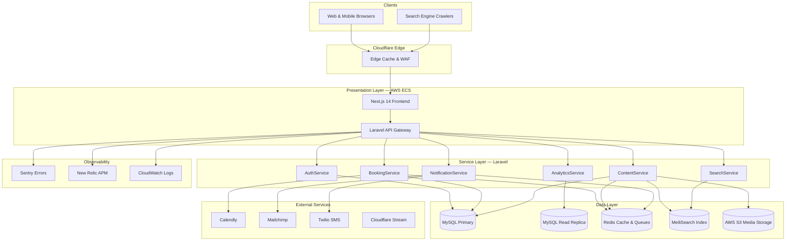
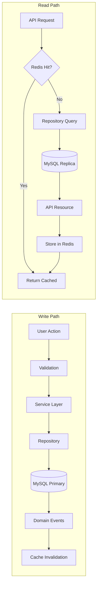
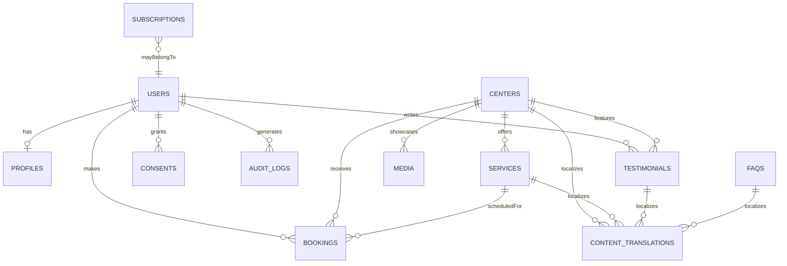

# ElderCare SG — Project Architecture Document (v2.1)

| Field | Value |
| --- | --- |
| Document Status | Approved for implementation |
| Last Updated | October 2025 |
| Owners | Technical Architecture Team |
| Review Cadence | Quarterly or on major architectural change |
| Stakeholders | Product Management, Engineering, QA, UX, DevOps, Compliance |

---

## Table of Contents

- **[1. Executive Summary](#1-executive-summary)**
- **[2. System Overview](#2-system-overview)**
- **[3. Architecture Principles](#3-architecture-principles)**
- **[4. System Architecture](#4-system-architecture)**
- **[5. Frontend Architecture](#5-frontend-architecture)**
- **[6. Backend Architecture](#6-backend-architecture)**
- **[7. Data Architecture](#7-data-architecture)**
- **[8. Integration Architecture](#8-integration-architecture)**
- **[9. Analytics & Measurement Architecture](#9-analytics--measurement-architecture)**
- **[10. Internationalization & Localization](#10-internationalization--localization)**
- **[11. Content Management Architecture](#11-content-management-architecture)**
- **[12. Security Architecture](#12-security-architecture)**
- **[13. Compliance Architecture](#13-compliance-architecture)**
- **[14. DevOps & Infrastructure](#14-devops--infrastructure)**
- **[15. Performance Architecture](#15-performance-architecture)**
- **[16. Accessibility Architecture](#16-accessibility-architecture)**
- **[17. Testing & Quality Strategy](#17-testing--quality-strategy)**
- **[18. Scalability & Reliability Considerations](#18-scalability--reliability-considerations)**
- **[19. Technology Stack Summary](#19-technology-stack-summary)**
- **[20. Implementation Roadmap](#20-implementation-roadmap)**
- **[21. Risk Assessment](#21-risk-assessment)**
- **[22. Appendices & References](#22-appendices--references)**

---

## 1. Executive Summary

### 1.1 Project Overview

ElderCare SG is an accessibility-first web platform connecting Singaporean families with trustworthy elderly daycare providers. The platform is engineered to deliver transparent facility information, immersive engagement experiences, and seamless booking workflows while complying with Singapore’s regulatory landscape (PDPA, MOH, IMDA) and achieving Lighthouse performance scores above 90.

### 1.2 Platform Vision

- **Empower families** with comprehensive, verifiable information and multimedia storytelling so they can make confident eldercare decisions.
- **Humanize the journey** through culturally aware design, multilingual support, and compassionate content.
- **Operationalize trust** via rigorous compliance, accessibility, and security baked into every subsystem.

### 1.3 Phased Delivery Model

| Phase | Timeline | Deliverables | Notes |
| --- | --- | --- | --- |
| Phase 1 — MVP | Weeks 1-12 | Service discovery, photo galleries, Calendly-backed bookings, testimonials, contact forms, Mailchimp newsletter, English + Mandarin support, PDPA/MOH compliance, WCAG 2.1 AA baseline, <3s on 3G | Launch-ready foundation |
| Phase 2 — Enhancements | Weeks 13-16 | Virtual tours (Cloudflare Stream), Malay & Tamil, advanced search & map, analytics dashboards, performance tuning for media-rich experiences | Completes initial feature charter |

### 1.4 Key Architectural Decisions

| Decision Area | Choice | Rationale |
| --- | --- | --- |
| Architecture pattern | Service-oriented Laravel monolith | Enables modular boundaries without microservice overhead during early scale |
| Frontend | Next.js 14 with React Server Components | SEO-critical, performant, server components minimize JS payload |
| Backend | Laravel 12 (PHP 8.2) | Rapid development, mature ecosystem, strong security, internal expertise |
| Database | MySQL 8.0 (primary + read replica) | ACID guarantees for bookings, proven reliability |
| Caching & queues | Redis 7 | Sessions, cache, queue driver for async workloads |
| Search | MeiliSearch | Excellent multilingual support, simpler ops vs. Elasticsearch |
| Container orchestration | AWS ECS Fargate | Managed runtime reduces DevOps overhead, scales horizontally |
| CDN & security | Cloudflare | Singapore edge, WAF, DDoS mitigation, caching |
| Admin & CMS | Laravel Nova | Accelerates curation workflows, role-based controls |
| Video (Phase 2) | Cloudflare Stream | Adaptive bitrate, analytics, localized delivery |

### 1.5 Success Metrics

| Metric | Target | Measurement | Owner | Cadence |
| --- | --- | --- | --- | --- |
| Visit bookings | +30% within first 3 months | GA4 conversions + booking DB | Marketing | Monthly |
| Mobile bounce rate | <40% | GA4 device segmentation | UX | Bi-weekly |
| Lighthouse Performance | >90 | Lighthouse CI (staging & prod) | DevOps | Each deploy |
| Lighthouse Accessibility | >90 | Lighthouse CI + axe-core | QA | Each deploy |
| Session duration | >5 minutes | GA4 engagement metrics | Marketing | Monthly |
| 3G load time | <3 seconds (standard pages) | WebPageTest (Singapore) | DevOps | Weekly |
| Form completion | >75% | Hotjar form analytics | UX | Monthly |
| Video engagement (Phase 2) | >60% completion | Cloudflare Stream analytics | Marketing | Monthly |

### 1.6 Document Purpose & Audience

- **Primary**: Software Engineers, DevOps, QA, Technical Leads.
- **Secondary**: Product Managers, Compliance Officers, Stakeholders, onboarding partners.
- **Goals**: Serve as authoritative blueprint, decision register, compliance evidence, and onboarding resource.

---

## 2. System Overview

### 2.1 Value Proposition

- **Trust through transparency**: Verified MOH licenses, staff credentials, authentic testimonials.
- **Accessibility for all**: WCAG 2.1 AA compliance, multilingual support, reduced-motion experiences.
- **Cultural resonance**: Respectful tone, diverse imagery, holiday-aware operations.
- **Seamless engagement**: Frictionless journey from discovery to booking with proactive reminders.

### 2.2 Target Personas

- **Adult Children (30-55)**: Time-poor professionals, mobile-first, demand deep insight and social proof.
- **Family Caregivers (25-45)**: Often domestic helpers; require multilingual content and transport clarity.
- **Healthcare Professionals (30-60)**: Need quick license/capability verification for referrals.
- **Digitally Literate Seniors (55+)**: Prefer larger fonts, high contrast, straightforward navigation.

### 2.3 MVP Scope (Phase 1)

- **Service discovery** with filtering, rich center detail pages, transport guidance, pricing structures.
- **Media storytelling**: Curated photo galleries, staff spotlights.
- **Booking system**: Calendly integration, pre-booking questionnaire, email/SMS confirmations, rescheduling, PDPA-aware consent capture.
- **Testimonials**: Moderated workflow, verified booking badge.
- **Communications**: Contact forms, Mailchimp double opt-in newsletter, preference center.
- **User accounts**: Registration, profile management, consent ledger, data export, account deletion.
- **Localization**: English default, Mandarin parity for content and UI.

### 2.4 Phase 2 Enhancements

- **Virtual tours**: Cloudflare Stream with adaptive bitrate, chapter markers, captions, audio descriptions, optional WebXR.
- **Advanced discovery**: Map view, faceted filters (staff ratio, medical services, languages), saved searches, alerts.
- **Analytics dashboard**: Real-time visitor metrics, conversion funnels, content performance, heatmap integrations (with consent).
- **Expanded localization**: Malay and Tamil coverage, native speaker review workflows.

### 2.5 Out of Scope (Current Release)

- Native mobile apps, payment processing, caregiver matching, medical record integration, telehealth, live chat, provider self-service portals, family shared accounts, and government database integrations.

### 2.6 Constraints & Assumptions

- **Regulatory**: PDPA data residency (AWS ap-southeast-1), MOH display compliance, WCAG 2.1 AA, IMDA guidelines.
- **Operational**: 99.5% availability SLA, 12-week MVP timeline, team size 6-8.
- **Technical**: Modern browser support (latest two versions), mobile-first design (70% traffic forecast), <3s load on 3G.
- **Financial**: Calendly Pro (~US$12/user/month), Mailchimp Standard (~US$20/month), Laravel Nova (US$199/year), Cloudflare Pro (US$20/month), Twilio SMS (~SGD$0.07/message), professional translation budget pre-approved.

---

## 3. Architecture Principles

- **User-centric design**: Prioritize clarity, progressive disclosure, guardrail UX, skeleton loaders, and fallback paths (e.g., manual contact when Calendly fails).
- **Accessibility first**: Semantic HTML, Radix primitives, keyboard navigability, focus management, ARIA live regions, screen reader QA, motion reduction toggles.
- **Security by design**: Layered defenses, RBAC, MFA for admins, encryption (TLS 1.3 / AES-256 / bcrypt 12), CSP & security headers, dependency auditing, rate limiting.
- **Performance optimized**: Page weight budgets (<280KB), RSC defaults, image/WebP optimization, CDN caching, Redis caching, asynchronous jobs.
- **Compliance built-in**: Consent ledger, audit trails, retention automation (24-month inactivity), right-to-access/export/delete, MOH license enforcement, auto-generated compliance reports.
- **Scalable & maintainable**: Service-layer boundaries, repository pattern, dependency injection, 90% test coverage mandate, ADR documentation, horizontal scaling readiness.
- **Cultural sensitivity**: I18n-first architecture, locale-aware formatting, respectful honorifics, inclusive imagery, holiday scheduling awareness.

---

## 4. System Architecture

### 4.1 High-Level Architecture Diagram



### 4.2 Component Interaction Patterns

- **Content request**: User hits `/en/centers/sunshine-care` → Cloudflare edge cache → Next.js server component fetches `GET /api/v1/centers/sunshine-care?locale=en` → `ContentService` reads Redis fallback then MySQL replica → response cached in Redis for 5 minutes → SSR HTML returned and cached at edge (per cache rules).
- **Booking workflow**: Booking form posts to `/api/v1/bookings` → validation (Form Request) → `BookingService` transaction creates booking (pending) → Calendly event creation → booking updated (confirmed) → events dispatched for notifications & analytics → `SendBookingConfirmationEmail/SMS` jobs queued in Redis → Horizon workers execute asynchronously.

### 4.3 Data Flow Diagram



### 4.4 API Guidelines

- **Base URL**: `https://api.eldercare.sg/v1/`
- **Versioning**: Version in path, minimum 6-month deprecation, two concurrent versions supported.
- **Authentication**: Laravel Sanctum bearer tokens (JWT optional for future mobile clients).
- **Pagination**: `?page=1&per_page=20`, provide `meta` and `links` blocks.
- **Filtering & sorting**: `filter[city]=Singapore`, `sort=-created_at` conventions.
- **Error schema**:

```json
{
  "message": "Validation failed",
  "errors": {
    "email": ["The email field is required."]
  }
}
```

- **Rate limits**: 60 req/min per IP (public) and 1000/hour per authenticated user, configurable throttles for partner integrations.

### 4.5 Event-Driven Operations

- **Events**: `UserRegistered`, `BookingConfirmed`, `BookingCancelled`, `TestimonialSubmitted`, `CenterUpdated`, `ConsentGiven`.
- **Queue**: Redis driver, Horizon-managed workers, exponential backoff (1m, 5m, 15m), `failed_jobs` retention for manual replay.
- **Priority queues**: `high` (SMS/email), `default` (transactional emails), `low` (analytics, syncs).

### 4.6 Migration Path to Microservices

- Candidate extractions: `NotificationService`, `SearchService`, `BookingService` (post-traffic growth >100K MAU).
- Strategy: Introduce API Gateway (Kong/Tyk), strangler pattern per service, shared auth via central token service, maintain backward compatibility via feature flags.

---

## 5. Frontend Architecture

### 5.1 Overview

- **Framework**: Next.js 14 App Router with React Server Components default.
- **Languages**: TypeScript 5, Tailwind CSS 3, Radix UI primitives, Framer Motion with `prefers-reduced-motion` support.
- **State**: React Query for server data, Zustand for global client state, local component state via hooks.

### 5.2 Directory Structure (`frontend/`)

```
frontend/
├── app/
│   ├── [locale]/              # Dynamic locale segment
│   │   ├── layout.tsx         # Root layout (header/footer)
│   │   ├── page.tsx           # Home (Server Component)
│   │   ├── centers/
│   │   │   ├── page.tsx       # Listing (Server Component)
│   │   │   └── [slug]/page.tsx# Detail (Server Component)
│   │   ├── services/page.tsx  # Service catalog
│   │   ├── booking/page.tsx   # Booking flow (Client Component)
│   │   ├── about/page.tsx
│   │   ├── faq/page.tsx
│   │   └── dashboard/page.tsx # Authenticated area
│   ├── api/                   # Next.js route handlers (proxy & edge cases)
│   └── globals.css            # Tailwind base styles
├── components/
│   ├── atoms/                 # Buttons, Inputs, Icons, Badge, etc.
│   ├── molecules/             # FormField, Card, NavItem, SearchBar
│   ├── organisms/             # Header, Footer, BookingForm, ServiceCard
│   ├── templates/             # Layout wrappers
│   └── providers/             # Store/Theme/Auth providers
├── hooks/                     # `useAuth`, `useBooking`, `useTranslation`
├── lib/                       # API client, utils, validation schemas (Zod)
├── locales/                   # `en/`, `zh/`, `ms/`, `ta/` JSON resources
├── store/                     # Zustand persisted store
├── tests/                     # Jest + Testing Library + Playwright specs
├── types/                     # Shared TypeScript definitions
└── middleware.ts              # Locale negotiation
```

### 5.3 State Management

- **Server state** (`@tanstack/react-query`): Booking data, center listings, testimonials. 5-minute stale time, background revalidation.
- **Global client state** (Zustand + persistence): Auth session, locale, UI toggles, feature flags.
- **Local state**: Form inputs, modal toggles; degrade gracefully if JS disabled.

### 5.4 Routing & Navigation

- Locale-prefixed URLs (`/{locale}/{path}`); middleware fallbacks: URL → cookie (`NEXT_LOCALE`) → `Accept-Language` → default `en`.
- Protected routes (e.g., `/dashboard`) enforce auth via middleware and server-component guards.
- Breadcrumbs derived from route segments provide context for screen readers.

### 5.5 Asset Optimization

- Next.js `<Image>` for responsive WebP with JPEG fallback, LQIP placeholders, and lazy loading.
- Fonts self-hosted via `next/font` (Inter, Noto Sans SC, Noto Sans) with subsetting and `font-display: swap`.
- Tailwind JIT + Purge reduces CSS payload to <20 KB in production.
- Dynamic imports for heavy modules (map view, booking wizard stepper) to minimize initial JS payload.

### 5.6 Progressive Enhancement

- Forms submit via standard POST when JS is unavailable; enhanced with inline validation and toasts when JS enabled.
- Navigation functions with plain anchors; Next.js `Link` offers client-side transitions opportunistically.
- Critical content (center details, testimonials) rendered server-side to guarantee baseline accessibility.

### 5.7 Accessibility Tooling

- axe-core integrated in CI, Percy visual diff with accessibility assertions, manual audits per sprint (NVDA & VoiceOver).
- Design tokens enforce ≥4.5:1 contrast ratios (≥3:1 for large text); high-contrast theme toggle slated for Phase 2.

---

## 6. Backend Architecture

### 6.1 Overview

- Laravel 12 service-layer architecture with repository pattern and strict typing (PHPStan level 8).
- Thin HTTP controllers delegate to services; events/listeners manage cross-cutting concerns.

### 6.2 Directory Highlights (`backend/app/`)

- `Http/Controllers/Api/V1/*Controller.php` — REST endpoints.
- `Http/Requests` — Validation & authorization per action.
- `Services` — Business logic modules (`AuthService`, `BookingService`, `ContentService`, `NotificationService`, `AnalyticsService`, `SearchService`).
- `Repositories` — Data access abstraction with caching.
- `Events` & `Listeners` — Domain event orchestration for notifications, analytics, cache invalidation.
- `Jobs` — Queueable tasks (emails, SMS, analytics sync, data exports).
- `Policies` — Authorization per resource (admin, moderator, translator scopes).

### 6.3 Service Example: `BookingService`

- Transactionally creates bookings with Calendly integration, updates status, dispatches `BookingConfirmed`, and handles failure with compensating action (status rollback, admin alert).
- Enforces 24-hour cancellation policy, triggers notifications, invalidates caches.

### 6.4 API Composition

- Form Requests centralize validation and PDPA consent checks.
- API Resources (`BookingResource`, `CenterResource`) ensure consistent serialization, including localized fields based on request locale.
- Middleware (`LocaleMiddleware`, `LogApiRequests`, `CheckPdpaConsent`) enforce localization, auditing, and consent requirements.

### 6.5 Queue & Job Processing

- Redis-backed queues managed by Laravel Horizon; worker pools sized per environment.
- Jobs declare `$tries` and `$backoff`; failures logged to Sentry and `failed_jobs` table, replayable via Nova.
- Delayed jobs schedule reminders (72-hour, 24-hour) and post-visit follow-ups.

### 6.6 Error Handling

- Custom exception handler returns JSON for API routes, masks sensitive errors in production, and routes unexpected exceptions to Sentry; business exceptions return actionable 422 responses.
- Global 404/500 pages in frontend provide user-friendly messaging and support contact options.

---

## 7. Data Architecture

### 7.1 Principles

- UTF8MB4 charset for multilingual support; InnoDB engine for ACID compliance.
- Strict foreign keys with cascading deletes for compliance; `deleted_at` soft deletes for retention workflows.
- Audit logging of personal data access/modification retained 7 years.

### 7.2 Entity Relationship Diagram



### 7.3 Key Tables

- **`users`**: Roles (`user`, `admin`, `moderator`, `translator`), soft deletes, MFA flags.
- **`profiles`**: Address, preferred language, accessibility preferences.
- **`centers`**: MOH license, accreditation, capacity, geolocation, emergency protocols.
- **`services`**: Program metadata, pricing, duration, staff ratio, `calendly_event_type_id`.
- **`bookings`**: Lifecycle status, Calendly IDs, questionnaire JSON, cancellation reason, audit timestamps.
- **`content_translations`**: Polymorphic localized rich content with language codes and approval metadata.
- **`media`**: S3 object references, alt text, consent flag, moderation status.
- **`consents`**: Versioned consent text snapshot, granted/revoked timestamps, channel.
- **`audit_logs`**: Actor, action, before/after hashes, IP, user agent.

### 7.4 Data Retention & Residency

- Production data confined to AWS ap-southeast-1; encrypted backups stored cross-account with KMS.
- Inactive accounts flagged at 18 months; auto-deletion at 24 months unless legal hold.
- Data export jobs generate ZIP bundles with JSON/CSV; secure download link expires in 30 days.

---

## 8. Integration Architecture

| Integration | Purpose | Interface | Security | Notes |
| --- | --- | --- | --- | --- |
| Calendly | Booking scheduling | REST API | OAuth token via AWS Secrets Manager | Webhook sync for cancellations planned Phase 2 |
| Mailchimp | Newsletter & campaigns | REST API | API key via Secrets Manager | Double opt-in enforced; preference center in-app |
| Twilio | SMS notifications | REST API | API key via Secrets Manager | Singapore numbers only; throttled per PDPA |
| Cloudflare Stream | Virtual tours | REST + signed embed URLs | JWT-signed tokens | Captions & analytics via API |
| GA4 | Web analytics | gtag.js + Measurement Protocol | Env config | Enhanced measurement events, server-side fallback |
| Hotjar | UX insights | JS snippet (consent-gated) | Consent ensures PDPA compliance | Session recording disabled for forms |
| Sentry | Error tracking | SDK | DSN via env | Release tagging from CI/CD |
| New Relic | APM & RUM | Agent | License key via Secrets Manager | Core Web Vitals dashboards |

- Secrets rotate every 90 days; Terraform manages IAM policies; least privilege enforced.
- Circuit breakers and graceful degradation provide fallbacks (e.g., manual contact info on Calendly outage).

---

## 9. Analytics & Measurement Architecture

- Custom data layer powering GA4 events with Measurement Protocol backups.
- Core events: `booking_started`, `booking_completed`, `virtual_tour_started`, `newsletter_subscribed`, `testimonial_submitted`, `language_switched`.
- Dashboards: Google Data Studio, Looker Studio connectors (future), weekly automated summaries.
- Experimentation: Feature-flag friendly; GrowthBook/Optimizely integration targeted post-MVP.
- Privacy: Consent banner gates non-essential analytics; IP anonymization enforced.

---

## 10. Internationalization & Localization

- Locale detection priority: URL → user preference → `Accept-Language` → default `en`.
- Translation workflow: UI strings via JSON (`next-intl`), rich content via CMS translation queue with translator approvals.
- Typography: Font subsets per locale; dynamic line-height for CJK scripts; fallback fonts defined.
- Date/number formatting via `Intl` APIs localized to `en-SG`, `zh-SG`, `ms-SG`, `ta-IN`.
- Honorific templates enforce respectful titles; cultural holiday calendar guides content scheduling.

---

## 11. Content Management Architecture

- Laravel Nova dashboards segmented by role (admin, moderator, translator).
- Content lifecycle: Draft → Review → Publish with versioning and rollback.
- Media workflow: S3 uploads via signed URLs, responsive derivatives (Phase 2 via Lambda), mandatory alt text and consent flag.
- Testimonials: Moderation queue, verified badge for bookings, center responses (Phase 2), PDPA-compliant consent storage.

---

## 12. Security Architecture

- Authentication: Sanctum tokens, MFA for admin/moderator accounts, password strength enforcement.
- Authorization: RBAC via policies/gates; granular abilities (view PII, approve content, manage translations).
- Transport & application security: TLS 1.3, HSTS preload, CSP, X-Frame-Options, X-Content-Type-Options, CSRF middleware.
- Secrets & credentials: AWS Secrets Manager, IAM least privilege, periodic rotation, no secrets in repo.
- Monitoring & response: Sentry alerts, CloudWatch metrics, GuardDuty, incident response runbook with 24-hour notification SLA.
- Dependency hygiene: Dependabot, `npm audit`, `composer audit`, container image scanning in CI.

---

## 13. Compliance Architecture

- PDPA: Explicit consent capture stored in `consents`, data residency in Singapore, automated workflows for access/export/delete, quarterly incident drills.
- MOH: Mandatory display of license numbers, staff credentials; automated reminders for expiring certifications.
- IMDA & WCAG: Accessibility integrated into QA gates; transcripts/captions required for multimedia.
- Legal artifacts: Privacy policy, terms of use, PDPA statement versioned in CMS with audit trail.

---

## 14. DevOps & Infrastructure

- Environments: Local (Docker Compose), Staging (AWS ECS Fargate + RDS + Redis), Production (multi-AZ ECS Fargate, RDS with read replica, Redis cluster).
- Infrastructure as Code: Terraform modules manage VPC, ECS services, RDS, ElastiCache, S3, Secrets Manager.
- CI/CD (GitHub Actions):
  - Lint & unit tests (frontend/backend).
  - Build artifacts (Next.js, Laravel).
  - Playwright E2E smoke tests on staging.
  - Lighthouse CI + axe-core gating.
  - Staging deploy on `main` merges; production deploy via manual approval with change ticket.
- Observability: Sentry, New Relic, CloudWatch, UptimeRobot, optional ELK stack.
- Backups & DR: RDS automated backups (35-day retention), daily snapshots replicated cross-account, Redis snapshotting, S3 versioning, DR runbook (RTO < 4h, RPO < 1h).

---

## 15. Performance Architecture

- Budgets: TTFB < 300ms, FCP < 1.5s, LCP < 2.5s, TTI < 3s on 3G; tracked via Lighthouse CI and New Relic RUM.
- Caching: Cloudflare edge for static assets, Next.js ISR for semi-static pages, Redis for API responses (5 min TTL with tag-based invalidation).
- Database optimization: Indexed queries, connection pooling, read-heavy workloads routed to replica, query caching via Redis.
- Asynchronous processing: Emails, SMS, analytics, translation jobs processed via queues to keep requests responsive.
- Media optimization: Responsive imagery, Cloudflare Stream ABR, low-bandwidth warning for virtual tours.

---

## 16. Accessibility Architecture

- Automated checks: axe-core, Lighthouse accessibility; Percy visual assertions.
- Manual validation: Screen reader testing (NVDA, VoiceOver), keyboard-only navigation, 200% zoom verification, color contrast audits.
- Content requirements: Alt text, transcripts, captions, accessible form error messaging with ARIA live regions.
- Inclusive design tokens: Centralized theme ensures contrast compliance and visible focus styling.

---

## 17. Testing & Quality Strategy

- Unit tests: Jest (frontend), PHPUnit (backend) targeting ≥90% coverage for critical modules.
- Integration tests: React Testing Library, Laravel HTTP tests for API & policy coverage.
- End-to-end tests: Playwright for booking flows, localization, accessibility smoke tests; executed nightly and on release candidates.
- Visual regression: Percy snapshots for critical templates (home, center detail, booking wizard).
- Performance testing: Lighthouse CI each deploy; manual WebPageTest weekly; k6 load tests (1000 concurrent baseline, 2x stress) pre-launch.
- QA process: Accessibility and security checklists required before release sign-off.

---

## 18. Scalability & Reliability Considerations

- ECS auto-scaling on CPU/memory thresholds; stateless app layer uses Redis for sessions.
- Database scaling via read replicas; sharding strategy documented for future regional pods.
- Search scaling: MeiliSearch scaled vertically initially; evaluate Elasticsearch beyond 5M records.
- Resilience: Circuit breakers, retries, fallback UIs (e.g., manual contact form), health checks integrated with ALB.
- Feature flags: LaunchDarkly (or OSS alternative) orchestrates progressive rollouts and kill switches.

---

## 19. Technology Stack Summary

| Layer | Technologies |
| --- | --- |
| Frontend | Next.js 14, React 18, TypeScript 5, Tailwind CSS 3, Radix UI, Framer Motion, React Query 4, Zustand 4 |
| Backend | Laravel 12, PHP 8.2, Laravel Sanctum, Laravel Nova |
| Data | MySQL 8.0, Redis 7, MeiliSearch 1.4, AWS S3 |
| Infrastructure | Docker, AWS ECS Fargate, AWS RDS, AWS ElastiCache, Cloudflare, Terraform, GitHub Actions |
| Observability | Sentry, New Relic, CloudWatch, UptimeRobot |
| Analytics | GA4, Hotjar, Cloudflare Stream analytics, Google Data Studio |
| Communications | Calendly, Mailchimp, Twilio |

---

## 20. Implementation Roadmap

### Phase 1 (Weeks 1-12)

- Week 1-2: Repository setup, Dockerized dev environment, Git workflow, coding standards.
- Week 3-4: AWS staging infrastructure, core migrations (users, profiles, consents, audit logs), seed data.
- Week 5-6: Service discovery UI/APIs, localization framework, CMS groundwork.
- Week 7-8: Booking flow with Calendly, notifications, consent management.
- Week 9-10: Testimonials, media handling, Mailchimp integration, analytics instrumentation.
- Week 11-12: QA hardening, accessibility audit, load testing, documentation, staging sign-off.

### Phase 2 (Weeks 13-16)

- Virtual tours, Malay/Tamil localization, advanced search/map, analytics dashboard, media performance tuning.
- Refer to `docs/codebase_completion_master_plan.md` for detailed activities.

---

## 21. Risk Assessment

| Risk | Impact | Likelihood | Mitigation | Status |
| --- | --- | --- | --- | --- |
| External API downtime (Calendly/Twilio) | High | Medium | Circuit breakers, manual fallback, monitoring | Mitigated |
| Translation delays | Medium | Medium | Translator tooling, buffer in roadmap, fallback to English | Active |
| Accessibility regression | High | Low | Automated axe checks, manual audits, design token governance | Mitigated |
| Performance degradation on media-heavy pages | High | Medium | ABR video, lazy loading, performance budgets, CDN tuning | Mitigated |
| Compliance breach (PDPA) | High | Low | Consent ledger, audit trails, legal review, incident response plan | Mitigated |
| Data migration errors | Medium | Low | Automated migration tests, rollback strategy, staging rehearsals | Planned |
| Staffing bandwidth | Medium | Medium | Sprint prioritization, cross-training, partner support | Active |

---

## 22. Appendices & References

- Reference docs: `README.md`, `Project_Requirements_Document.md`, `codebase_completion_master_plan.md`, `docs/accessibility.md`, `docs/design-system.md`, `docs/deployment.md`.
- Architectural Decision Records: `docs/adr/ADR-001` onward capture major decisions.
- Runbooks: Incident response, DR, compliance audits in `docs/runbooks/`.
- Glossary: Key domain terms in `docs/glossary.md`.

---

**This document supersedes previous PAD versions and is the single source of truth for architectural intent.**
    id BIGINT UNSIGNED AUTO_INCREMENT PRIMARY KEY,
    email VARCHAR(255) UNIQUE NOT NULL,
    user_id BIGINT UNSIGNED NULL COMMENT 'NULL if non-registered user',
    
    -- Mailchimp integration
    mailchimp_subscriber_id VARCHAR(255) NULL,
    
    -- Status
    status ENUM('active', 'unsubscribed', 'bounced', 'pending') DEFAULT 'pending',
    
    -- Preferences (JSON)
    preferences JSON NULL COMMENT 'Content preferences, frequency',
    
    -- Timestamps
    subscribed_at TIMESTAMP NULL,
    unsubscribed_at TIMESTAMP NULL,
    created_at TIMESTAMP DEFAULT CURRENT_TIMESTAMP,
    updated_at TIMESTAMP DEFAULT CURRENT_TIMESTAMP ON UPDATE CURRENT_TIMESTAMP,
    
    FOREIGN KEY (user_id) REFERENCES users(id) ON DELETE CASCADE,
    INDEX idx_email (email),
    INDEX idx_status (status),
    INDEX idx_mailchimp_id (mailchimp_subscriber_id)
) ENGINE=InnoDB DEFAULT CHARSET=utf8mb4 COLLATE=utf8mb4_unicode_ci;

-- FAQs table
CREATE TABLE faqs (
    id BIGINT UNSIGNED AUTO_INCREMENT PRIMARY KEY,
    category ENUM('general', 'booking', 'services', 'pricing', 'accessibility') NOT NULL,
    question TEXT NOT NULL,
    answer TEXT NOT NULL,
    
    -- Ordering
    sort_order INT UNSIGNED DEFAULT 0,
    
    -- Status
    status ENUM('active', 'inactive') DEFAULT 'active',
    
    created_at TIMESTAMP DEFAULT CURRENT_TIMESTAMP,
    updated_at TIMESTAMP DEFAULT CURRENT_TIMESTAMP ON UPDATE CURRENT_TIMESTAMP,
    
    INDEX idx_category (category),
    INDEX idx_status (status),
    INDEX idx_sort_order (sort_order)
) ENGINE=InnoDB DEFAULT CHARSET=utf8mb4 COLLATE=utf8mb4_unicode_ci;
7.4 Indexing Strategy
Primary Indexes (Already defined above):

Primary keys on all tables
Foreign keys for relationships
Unique indexes on email, slug, license numbers
Composite Indexes (For common query patterns):

SQL

-- Centers: Filter by city and status
CREATE INDEX idx_centers_city_status ON centers(city, status);

-- Bookings: User's upcoming bookings
CREATE INDEX idx_bookings_user_date_status ON bookings(user_id, booking_date, status);

-- Testimonials: Center's approved testimonials
CREATE INDEX idx_testimonials_center_status ON testimonials(center_id, status);

-- Content Translations: Quick locale lookup
CREATE INDEX idx_translations_locale_status ON content_translations(locale, status);
Full-Text Indexes (For search):

SQL

-- Centers: Name and description search
CREATE FULLTEXT INDEX idx_centers_fulltext ON centers(name, description);

-- Services: Name and description search
CREATE FULLTEXT INDEX idx_services_fulltext ON services(name, description);
7.5 Data Retention & Archival Policy
Data Type	Retention Period	Archival Strategy	Deletion Policy
Active user accounts	Indefinite	N/A	User-initiated only
Inactive user accounts	2 years of inactivity	Email notice → 30 days → soft delete	Hard delete after 30-day grace period
Deleted user accounts	30 days (soft delete)	N/A	Hard delete, cascade to related records
Bookings (completed)	2 years	Move to archive table	Anonymize after 2 years
Audit logs	7 years	Move to cold storage after 1 year	Delete after 7 years (legal requirement)
Consents	User lifetime + 7 years	Archive with user data	Delete 7 years after account deletion
Media files (orphaned)	90 days	N/A	Delete from S3 and database
Failed jobs	30 days	N/A	Delete
Automated Cleanup Jobs:

PHP

// app/Console/Kernel.php
protected function schedule(Schedule $schedule)
{
    // Delete inactive users (2 years + 30 days)
    $schedule->job(new DeleteInactiveUsers())->monthly();
    
    // Archive old bookings
    $schedule->job(new ArchiveOldBookings())->weekly();
    
    // Clean up orphaned media
    $schedule->job(new CleanupOrphanedMedia())->weekly();
    
    // Delete old failed jobs
    $schedule->command('queue:prune-failed --hours=720')->daily(); // 30 days
}
7.6 Backup & Recovery Strategy
Automated Backups (AWS RDS):

Frequency: Daily automated snapshots
Retention: 30 days
Window: 02:00-04:00 SGT (low traffic period)
Point-in-time Recovery: 5-day window
Manual Backups:

Frequency: Monthly
Retention: 12 months
Storage: S3 with Glacier archival after 6 months
Cross-Region Replication:

Secondary Region: AWS Tokyo (ap-northeast-1)
Purpose: Disaster recovery
Lag: <1 minute
Recovery Time Objectives (RTO):

Critical systems: 1 hour
Non-critical systems: 4 hours
Recovery Point Objectives (RPO):

Maximum data loss: 5 minutes (via point-in-time recovery)
Backup Testing:

Quarterly restore drills
Documented recovery procedures
Regular verification of backup integrity
8. Integration Architecture
ElderCare SG integrates with four critical external services: Calendly (booking), Mailchimp (newsletter), Twilio (SMS), and Cloudflare Stream (video hosting - Phase 2).

8.1 Calendly API Integration
Purpose: Real-time appointment scheduling with automatic availability management.

Authentication:

Method: Personal Access Token (stored in .env)
Token Scope: Read/write access to event types and scheduled events
Security: Token rotated quarterly, never committed to version control
Endpoints Used:

Endpoint	Method	Purpose	Frequency
/event_types	GET	List available appointment types	On service page load (cached 1 hour)
/scheduled_events	POST	Create new appointment	On booking submission
/scheduled_events/{uuid}	DELETE	Cancel appointment	On booking cancellation
Webhook: invitee.created	POST	Confirm booking	Real-time
Webhook: invitee.canceled	POST	Handle cancellations	Real-time
Data Flow:

mermaid

sequenceDiagram
    participant User
    participant Frontend
    participant Laravel
    participant CalendlyService
    participant Calendly API
    participant Queue
    
    User->>Frontend: Submit booking form
    Frontend->>Laravel: POST /api/v1/bookings
    Laravel->>CalendlyService: createEvent()
    CalendlyService->>Calendly API: POST /scheduled_events
    Calendly API-->>CalendlyService: Event created (ID: abc123)
    CalendlyService-->>Laravel: Return event data
    Laravel->>Database: Save booking (status: confirmed, calendly_event_id: abc123)
    Laravel->>Queue: Dispatch SendConfirmation jobs
    Laravel-->>Frontend: Success response
    Frontend-->>User: Show confirmation
    
    Note over Calendly API,Laravel: Later (async via webhook)
    Calendly API->>Laravel: POST /webhooks/calendly (invitee.created)
    
S
