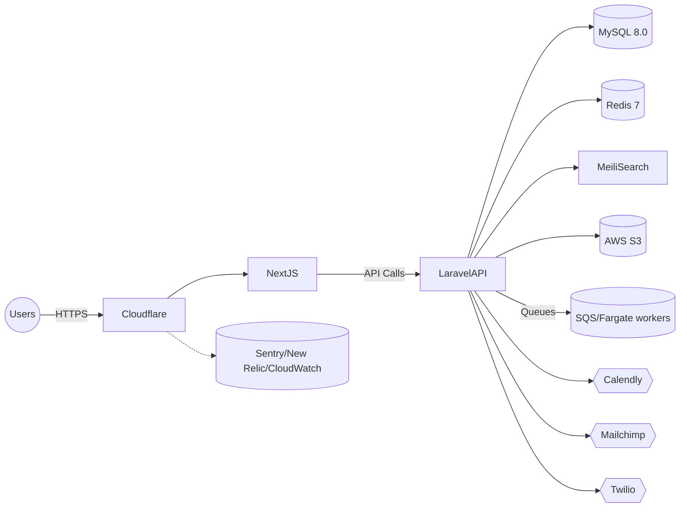

# AGENT Onboarding Guide — ElderCare SG Web Platform

**Version:** 1.0
**Last Updated:** 2025-10-08 19:01 SGT
**Primary Source Documents:** `Project_Architecture_Document.md`, `Project_Requirements_Document.md`, `codebase_completion_master_plan.md`, `docs/ai-coding-agent-brief.md`, `docs/accessibility/`, `docs/design-system/`, `docs/deployment/`

> **Purpose**: This guide is the single source of truth for any AI coding agent (and their human facilitators) to understand the ElderCare SG architecture, delivery standards, and operational guardrails before touching the codebase.

---

## Table of Contents

1. [Executive Summary](#1-executive-summary)
2. [System Overview](#2-system-overview)
3. [Frontend Blueprint](#3-frontend-blueprint)
4. [Backend Blueprint](#4-backend-blueprint)
5. [Data & Integrations](#5-data--integrations)
6. [Operational Maturity](#6-operational-maturity)
7. [Security & Compliance](#7-security--compliance)
8. [Performance & Scalability Playbook](#8-performance--scalability-playbook)
9. [Accessibility & Internationalization](#9-accessibility--internationalization)
10. [Testing & Quality Assurance](#10-testing--quality-assurance)
11. [Risk Register & Mitigations](#11-risk-register--mitigations)
12. [Lifecycle & Roadmap Hooks](#12-lifecycle--roadmap-hooks)
13. [Collaboration Protocols](#13-collaboration-protocols)
14. [Quickstart Checklist for AI Agents](#14-quickstart-checklist-for-ai-agents)
15. [Change Log & Maintenance Guidance](#15-change-log--maintenance-guidance)

---

## 1. Executive Summary

- **Product Mission:** Deliver a compassionate, accessibility-first digital bridge between Singaporean families and trusted elderly daycare services.
- **Target Audiences:** Adult children (primary), caregivers, healthcare professionals, digitally literate seniors, and support agencies.
- **Core Value Pillars:** Trust & transparency, accessibility, cultural resonance, seamless booking and engagement, compliance with Singapore regulations.
- **North-Star Success Metrics:** +30% visit bookings in 3 months, Lighthouse scores >90, <40% mobile bounce, >5-minute session duration, >60% video completion (see `Project_Requirements_Document.md`).

**Key Actions for Agents**
- **Review** `README.md` and `docs/ai-coding-agent-brief.md` before any contribution.
- **Align** feature work with success metrics and value pillars.
- **Confirm** stakeholder intent via latest roadmap milestones.

---

## 2. System Overview

- **Architecture Pattern:** Service-oriented monolith (Laravel) with modular boundaries and shared MySQL schema (`Project_Architecture_Document.md`).
- **Hosting Footprint:** AWS ECS Fargate (Singapore region) + Cloudflare CDN/WAF. Terraform manages infrastructure (`docs/deployment/`).
- **Environments:** Local (Docker Compose), Staging (ECS), Production (ECS). Observability across all tiers.
- **Key Principles:** Domain separation, API-first, progressive enhancement, accessibility-first, security-by-design, automated governance.
- **Logical Components:** Next.js frontend, Laravel backend, supporting services (MySQL, Redis, MeiliSearch, S3), third-party APIs (Calendly, Mailchimp, Twilio, Cloudflare Stream).

**Key Actions for Agents**
- **Confirm** environment context before running commands (`.env`, `frontend/.env.local`).
- **Respect** architecture principles when proposing modifications.
- **Check** Terraform state/variables prior to infra-affecting changes.

---

## 3. Frontend Blueprint

- **Stack:** Next.js 14, React 18, TypeScript 5, Tailwind CSS, Radix UI primitives, Framer Motion (reduced-motion aware), Zustand (client state), React Query (server state).
- **Directory Guardrails:** `frontend/app/` (RSC pages/layouts), `frontend/components/` (shared UI), `frontend/lib/` (utilities), `frontend/hooks/`, `frontend/tests/`.
- **Rendering Strategy:** Mix of React Server Components and edge caching; fallback to CSR only where interactivity demands.
- **Design System:** Defined in `docs/design-system/`; tokens drive Tailwind config; follow accessibility color palette.
- **Client Tooling:** ESLint, Prettier, Jest, Testing Library, Playwright.

**Key Actions for Agents**
- **Adhere** to design tokens and component usage documented in `docs/design-system/`.
- **Favor** server components for data-heavy views; justify CSR usage in PR notes.
- **Instrument** interactions with analytics data attributes when introducing new components.

---

## 4. Backend Blueprint

- **Framework:** Laravel 12 (PHP 8.2) with domain-focused service classes (`backend/app/Domain/*`).
- **API Surface:** RESTful, versioned at `/api/v1/`; JSON:API-inspired responses, consistent error envelopes. Sanctum for auth.
- **Domain Modules:** Users, Centers, Bookings, Testimonials, Content, Newsletters, Subsidies, Integrations (Calendly/Mailchimp/Twilio).
- **Async Workloads:** Laravel Queues backed by SQS/Fargate for email, SMS, data sync. Event-Listener patterns for audit trails.
- **Policies & Validation:** Form requests for validation, Policies/Guard for RBAC enforcement.
- **Testing:** PHPUnit + Pest. Factories/seeders maintain sample data for test baselines.

**Key Actions for Agents**
- **Consult** `Project_Architecture_Document.md` section 7 for module responsibilities.
- **Maintain** service/repository layering; avoid placing logic in controllers.
- **Update** job/event documentation when introducing new async flows.

---

## 5. Data & Integrations

- **Primary Store:** MySQL 8.0 (RDS). Normalized schema with auditing and consent ledgers.
- **Caching & Sessions:** Redis 7 (ElastiCache). Used for caching, queues, rate limiting.
- **Search:** MeiliSearch (hosted) for center/service discovery (replaces older Elasticsearch plan).
- **Object Storage:** AWS S3 (ap-southeast-1) with lifecycle rules, Cloudflare R2 considered for future offloading.
- **External APIs:**
  - Calendly (booking orchestration)
  - Mailchimp (newsletter management)
  - Twilio (SMS notifications)
  - Cloudflare Stream (Phase 2 video hosting)
- **Data Governance:** PDPA-compliant retention policies, anonymization workflows, consent tracking.

**Key Actions for Agents**
- **Validate** migration impact on retention/consent rules before altering schema.
- **Mock** third-party APIs in tests; never call live services from automated suites.
- **Document** new integration touchpoints in `docs/AGENT.md` and relevant runbooks.

---

## 6. Operational Maturity

- **CI/CD:** GitHub Actions with pipelines for lint/test, build, security checks, and environment deploy (staging automatic on `main`). Manual approval for production.
- **Infrastructure as Code:** Terraform modules for ECS, RDS, ElastiCache, S3, IAM, CloudWatch, secrets.
- **Monitoring:** Sentry (errors), New Relic (APM), CloudWatch metrics/logs, UptimeRobot (synthetic), Lighthouse CI (performance budgets).
- **Runbooks:** Stored in `docs/runbooks/` (incident response, DR, compliance audit, on-call).
- **Backups:** RDS snapshots + S3 archival, cross-region replication to ap-northeast-1.

**Key Actions for Agents**
- **Check** CI status before merges; fix failures prior to requesting review.
- **Coordinate** infra changes with Terraform modules (no manual console edits).
- **Update** or reference runbooks when altering operational flows.

---

## 7. Security & Compliance

- **Regulatory Scope:** PDPA, MOH eldercare guidelines, IMDA accessibility, WCAG 2.1 AA.
- **Security Posture:**
  - OAuth2 + Sanctum & MFA for admin access.
  - Strict CSP, CSRF, SQLi/XSS safeguards.
  - Secrets via AWS Secrets Manager/SSM; rotated per schedule.
  - Audit logs for user actions, consent ledger for PDPA.
- **Privacy:** Data residency in Singapore, anonymization protocols, right-to-be-forgotten workflows.
- **Compliance Documentation:** `docs/accessibility/`, `Project_Requirements_Document.md` sections 2–4, `docs/deployment/security.md` (if present).

**Key Actions for Agents**
- **Surface** compliance impacts in PR descriptions for relevant changes.
- **Consult** compliance officer/stakeholders before modifying regulated flows.
- **Ensure** new features maintain audit and consent logging.

---

## 8. Performance & Scalability Playbook

- **Performance Budgets:** Lighthouse >90, 3G load <3s, Core Web Vitals thresholds.
- **Caching Strategy:** HTTP caching via Cloudflare, application caching via Redis, Next.js ISR for dynamic pages.
- **Scaling:** ECS Fargate autoscaling (CPU/memory), read replicas for MySQL (planned), queue worker scaling by SQS depth.
- **Profiling Tools:** New Relic, Laravel Telescope (dev), React Profiler.
- **Load Testing:** k6 (backend), Lighthouse CI & WebPageTest (frontend).

**Key Actions for Agents**
- **Instrument** new endpoints with performance metrics.
- **Validate** caching headers/TTL when introducing new pages.
- **Include** load/perf test updates when altering critical paths.

---

## 9. Accessibility & Internationalization

- **Standards:** WCAG 2.1 AA baseline, IMDA guidelines.
- **Features:** Keyboard-only navigation, ARIA-rich components, adjustable typography, captions/audio descriptions, color contrast >= 4.5:1.
- **Localization:** English, Mandarin, Malay, Tamil. Content stored with locale metadata, translation pipeline uses CMS and translation memory (`Project_Architecture_Document.md` section 11).
- **Testing:** axe-core (automation), NVDA/VoiceOver manual sweeps, screen magnification tests.

**Key Actions for Agents**
- **Use** `docs/accessibility/accessibility-checklist.md` before completing features.
- **Mark** translatable strings and update translation files/stubs.
- **Request** accessibility review for UI-heavy changes.

---

## 10. Testing & Quality Assurance

- **Automated Coverage:**
  - Frontend: Jest + React Testing Library + Playwright E2E.
  - Backend: PHPUnit/Pest, Laravel Dusk (as needed).
  - Accessibility: axe-core, Lighthouse CI.
  - Visual Regression: Percy.
- **Manual QA:** BrowserStack multi-browser/device, assistive technology validation, stakeholder UAT for major releases.
- **Definition of Done:** Peer review, 100% automated coverage, manual QA sign-off, documentation updates, monitoring hooks configured.

**Key Actions for Agents**
- **Extend** test suites when modifying behavior.
- **Update** QA checklists with new scenarios.
- **Attach** Lighthouse/axe reports for significant UI changes.

---

## 11. Risk Register & Mitigations

Refer to `Project_Architecture_Document.md` section 20 for full matrix. Highlights:

| Risk | Impact | Probability | Mitigation | Status |
| --- | --- | --- | --- | --- |
| Vendor API changes (Calendly/Twilio) | High | Medium | Abstraction layer, contract tests, fallbacks | Active |
| Performance degradation on media-heavy pages | High | Medium | Adaptive bitrate (Cloudflare Stream), lazy loading, perf budgets | Mitigated |
| Compliance breach (PDPA) | High | Low | Consent ledger, audit trails, legal review cadence | Mitigated |
| Data migration errors | Medium | Low | Automated migration tests, rehearsal rollbacks | Planned |
| Staffing bandwidth | Medium | Medium | Sprint prioritization, cross-training, partner support | Active |

**Key Actions for Agents**
- **Log** new risks or mitigation updates in the PAD risk table and Changelog.
- **Notify** stakeholders when a mitigation depends on pending development.
- **Include** risk assessment in major architectural proposals.

---

## 12. Lifecycle & Roadmap Hooks

- **Current Phase:** Foundation hardening (per `codebase_completion_master_plan.md`).
- **Upcoming Milestones:**
  - v1.0: Authentication, content management, base booking, analytics instrumentation.
  - v1.1: Multilingual refinement, subsidy calculator, advanced testimonials.
  - v2.0: Cloudflare Stream integration, AI recommendations, provider portal.
- **Feature Toggles:** Documented in `docs/runbooks/feature-toggles.md` (create/update as needed).

**Key Actions for Agents**
- **Align** contributions with roadmap phase priorities.
- **Document** new toggles and update rollout plans.
- **Flag** dependencies that could affect milestone schedules.

---

## 13. Collaboration Protocols

- **Branching:** `feature/*`, `bugfix/*`, `chore/*`. Rebase-based workflow preferred.
- **PR Expectations:** Architecture alignment summary, tests, screenshots/demo where applicable, risk assessment.
- **ADR Process:** Use `docs/adr/ADR-###.md` template for significant decisions. Reference ADRs in PRs.
- **Communication:** Slack channel `#eldercare-dev`, weekly architecture sync, incident bridge hotline (see runbook).
- **Documentation:** Update `docs/` and runbooks alongside code changes.

**Key Actions for Agents**
- **Submit** ADRs before implementing high-impact changes.
- **Maintain** transparent PR narratives referencing this guide.
- **Sync** with on-call/lead engineer for operationally sensitive work.

---

## 14. Quickstart Checklist for AI Agents

1. **Context Intake**
   - [ ] Read `docs/AGENT.md` (this file) end-to-end.
   - [ ] Review `Project_Architecture_Document.md` sections relevant to task.
   - [ ] Confirm roadmap priorities in `codebase_completion_master_plan.md`.
2. **Environment Prep**
   - [ ] Clone repo and run `docker-compose up -d`.
   - [ ] Copy `.env` files (`cp .env.example .env`, `cp frontend/.env.local.example frontend/.env.local`).
   - [ ] Run `composer install` + `npm install` in respective directories if working outside Docker.
3. **Verification**
   - [ ] Execute backend migrations `php artisan migrate`.
   - [ ] Run automated suites (`npm test`, `composer test`, Playwright) before coding.
4. **Change Implementation**
   - [ ] Draft plan aligned with architecture principles.
   - [ ] Implement with tests and documentation updates.
5. **Pre-PR Checks**
   - [ ] `npm run lint` / `npm run test` / `composer test` all pass.
   - [ ] Lighthouse/axe checks for UI changes.
   - [ ] Update runbooks/ADR if applicable.
6. **Delivery**
   - [ ] Prepare thorough PR description (context, approach, risks, testing).
   - [ ] Tag reviewers per ownership matrix.

**Key Actions for Agents**
- **Archive** completed checklist with PR for traceability.
- **Raise** blockers early via designated communication channels.
- **Ensure** local environment mirrors target environment before debugging.

---

## 15. Change Log & Maintenance Guidance

| Date | Author | Change Summary | Linked Docs |
| --- | --- | --- | --- |
| 2025-10-08 | Cascade AI Agent | Initial creation of `docs/AGENT.md` consolidating architecture insights | `Project_Architecture_Document.md` v2.1 |
| 2025-10-08 | Cascade AI Agent | Updated Phase 1 documentation references (env templates, CI/CD, monitoring) | `docs/phase1-execution-plan.md`, `docs/ci-cd-overview.md`, `docs/deployment/monitoring.md`, `docs/git-workflow.md` |

**Update Protocol**
- **When to Update:** Any architectural change, new integration, workflow modification, risk/mitigation update, or process adjustment affecting onboarding.
- **How to Update:**
  1. Modify relevant sections in `docs/AGENT.md`.
  2. Append new entry to change log table.
  3. Cross-reference supporting docs (PAD, ADRs, runbooks).
  4. Notify team via `#eldercare-docs` channel and tag lead architect.
- **Validation:** Re-run Quickstart Checklist to ensure instructions remain accurate; perform markdown lint/spellcheck.

**Key Actions for Agents**
- **Treat** this document as living; keep synchronized with PAD, ADRs, and runbooks.
- **Record** rationale for major updates in ADRs or PAD sections.
- **Audit** this guide quarterly to maintain relevance.

---

> **Operational Reminder:** Uphold the elevated operating framework—deep analysis, systematic planning, technical excellence, strategic partnership, and transparent communication—on every engagement.
