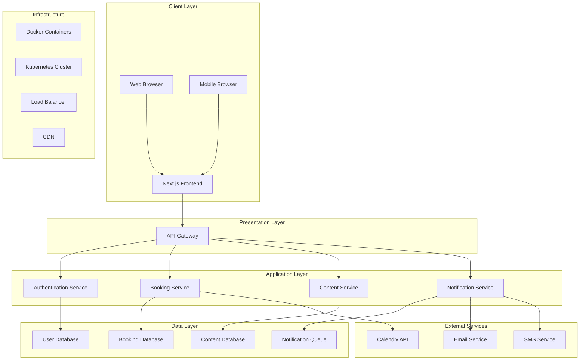
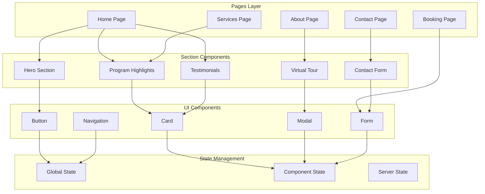
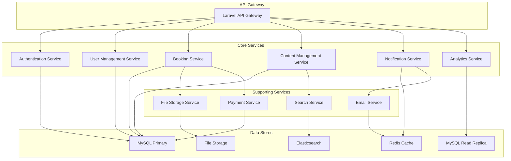
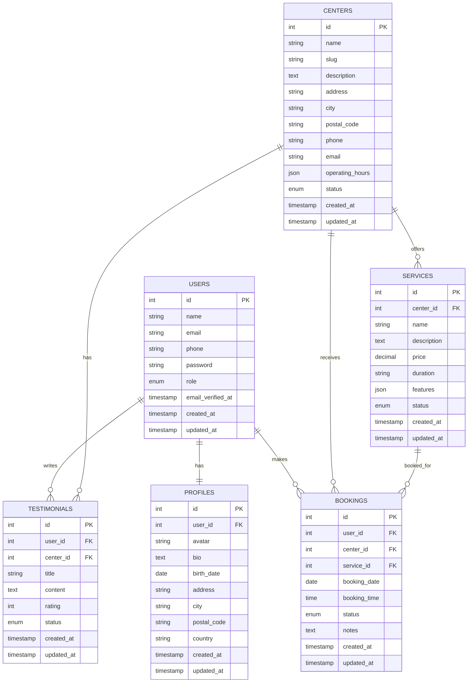
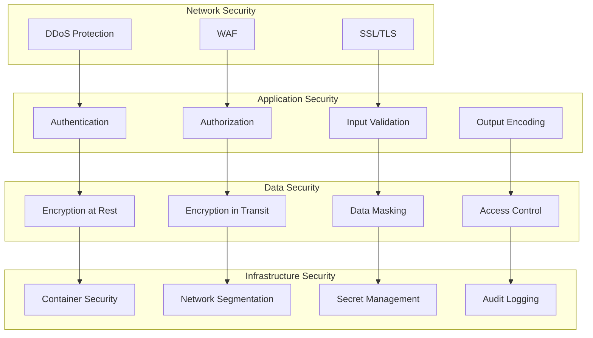

# ElderCare SG - Project Architecture Document

## Table of Contents
1. [Executive Summary](#executive-summary)
2. [System Overview](#system-overview)
3. [Architecture Principles](#architecture-principles)
4. [System Architecture](#system-architecture)
5. [Frontend Architecture](#frontend-architecture)
6. [Backend Architecture](#backend-architecture)
7. [Data Architecture](#data-architecture)
8. [Security Architecture](#security-architecture)
9. [DevOps Architecture](#devops-architecture)
10. [Performance Architecture](#performance-architecture)
11. [Accessibility Architecture](#accessibility-architecture)
12. [Scalability Considerations](#scalability-considerations)
13. [Technology Stack](#technology-stack)
14. [Implementation Roadmap](#implementation-roadmap)
15. [Risk Assessment](#risk-assessment)
16. [Conclusion](#conclusion)

## Executive Summary

The ElderCare SG platform is a comprehensive web solution designed to connect Singaporean families with quality elderly daycare services. This document outlines the technical architecture that will support a scalable, secure, and accessible platform while maintaining compliance with Singapore's regulatory requirements.

The architecture follows a modern microservices approach with clear separation of concerns between frontend and backend systems. It emphasizes performance, security, and accessibility while ensuring the platform can grow with the business needs.

## System Overview

ElderCare SG is a responsive web platform that serves as a bridge between elderly care service providers and families in Singapore. The platform provides:

- Information about daycare services and facilities
- Virtual tours of care centers
- Booking system for visits and services
- Testimonials and reviews from other families
- Contact and inquiry forms
- Multilingual support (English, Mandarin, Malay, Tamil)

The system is designed with a mobile-first approach, ensuring optimal experience on smartphones and tablets, which are the primary devices used by the target audience.

## Architecture Principles

1. **User-Centric Design**: All architectural decisions prioritize the end-user experience, especially for elderly users and their families who may have varying levels of technical proficiency.

2. **Accessibility First**: The architecture is built with WCAG 2.1 AA compliance as a foundational requirement, not an afterthought.

3. **Security by Design**: Security measures are integrated throughout the architecture, with particular attention to Singapore's PDPA requirements.

4. **Performance Optimized**: The architecture prioritizes fast loading times and smooth interactions, especially on mobile devices and slower connections.

5. **Scalable and Maintainable**: The system is designed to grow with the business while maintaining code quality and ease of maintenance.

6. **Data Privacy**: All data handling respects user privacy and complies with Singapore's data protection regulations.

7. **Cultural Sensitivity**: The architecture supports Singapore's multicultural context with proper internationalization and localization.

## System Architecture

### High-Level Architecture

### Architecture Patterns

1. **Microservices Architecture**: The backend is organized into discrete services that communicate via APIs, allowing for independent scaling and maintenance.

2. **API-First Design**: All functionality is exposed through well-documented RESTful APIs, enabling future mobile app development.

3. **Event-Driven Architecture**: Background processes and notifications are handled through an event-driven system using Redis queues.

4. **CQRS (Command Query Responsibility Segregation)**: Separate models for read and write operations optimize performance for different use cases.

## Frontend Architecture

### Component Architecture

### Key Frontend Technologies

1. **Next.js 14**: React framework with server-side rendering for performance and SEO
2. **TypeScript**: Type safety for better code quality and developer experience
3. **Tailwind CSS**: Utility-first CSS framework for rapid UI development
4. **Radix UI**: Accessible component primitives
5. **Framer Motion**: Animation library with accessibility considerations
6. **React Query**: Server state management with caching and synchronization
7. **Zustand**: Lightweight state management for client state

### Frontend Architecture Patterns

1. **Atomic Design**: Components are organized in a hierarchy from atoms to organisms, promoting reusability.
2. **Server Components**: Leveraging Next.js 14's server components for optimal performance.
3. **Progressive Enhancement**: Core functionality works without JavaScript, with enhancements added when available.
4. **Mobile-First Responsive Design**: Layouts are designed for mobile first, then enhanced for larger screens.

## Backend Architecture

### Service Architecture

### Key Backend Technologies

1. **Laravel 12**: PHP framework for robust API development
2. **PHP 8.2**: Latest PHP version with performance improvements
3. **MySQL 8.0**: Primary database with full-text search capabilities
4. **Redis 7**: In-memory data store for caching and queues
5. **Elasticsearch**: Search service for advanced content discovery
6. **MeiliSearch**: Lightweight alternative for specific search use cases
7. **Laravel Sanctum**: Authentication for API endpoints

### Backend Architecture Patterns

1. **Repository Pattern**: Abstracts data access logic, making it easier to switch data sources.
2. **Service Pattern**: Encapsulates business logic, keeping controllers thin.
3. **Factory Pattern**: For creating objects with complex initialization logic.
4. **Observer Pattern**: For handling events and side effects in a decoupled manner.
5. **Strategy Pattern**: For implementing different algorithms for similar tasks.

## Data Architecture

### Database Design

### Data Management Strategy

1. **Data Partitioning**: Large tables are partitioned by date ranges to improve query performance.
2. **Indexing Strategy**: Optimized indexes for common query patterns.
3. **Data Archiving**: Historical data is archived to maintain database performance.
4. **Backup Strategy**: Regular automated backups with point-in-time recovery capability.
5. **Data Encryption**: Sensitive data is encrypted at rest and in transit.

## Security Architecture

### Security Layers

### Security Measures

1. **Authentication and Authorization**:
   - JWT-based stateless authentication
   - Role-based access control (RBAC)
   - Multi-factor authentication for admin accounts
   - OAuth 2.0 integration for third-party logins

2. **Data Protection**:
   - AES-256 encryption for sensitive data at rest
   - TLS 1.3 for all data in transit
   - Field-level encryption for particularly sensitive information
   - Regular security audits and penetration testing

3. **API Security**:
   - API rate limiting to prevent abuse
   - Input validation and sanitization
   - CORS configuration for cross-origin requests
   - API versioning for backward compatibility

4. **Infrastructure Security**:
   - Container image scanning for vulnerabilities
   - Network segmentation between services
   - Secrets management with rotation policies
   - Comprehensive audit logging

## DevOps Architecture

### CI/CD Pipeline

```mermaid
graph LR
    A[Developer Push] --> B[GitHub Actions]
    B --> C[Code Quality Checks]
    C --> D[Unit Tests]
    D --> E[Integration Tests]
    E --> F[Security Scans]
    F --> G[Build Docker Images]
    G --> H[Deploy to Staging]
    H --> I[E2E Tests]
    I --> J[Manual Approval]
    J --> K[Deploy to Production]
    K --> L[Health Checks]
    L --> M[Monitoring]
```

### DevOps Practices

1. **Infrastructure as Code (IaC)**:
   - Terraform for cloud resource management
   - Docker Compose for local development
   - Kubernetes manifests for production deployment

2. **Continuous Integration/Continuous Deployment**:
   - Automated testing on every commit
   - Automated deployment to staging environment
   - Manual approval for production deployments
   - Rollback capabilities for failed deployments

3. **Monitoring and Observability**:
   - Application performance monitoring (APM)
   - Log aggregation and analysis
   - Custom dashboards for key metrics
   - Alerting for critical issues

4. **Backup and Disaster Recovery**:
   - Automated database backups
   - Cross-region replication for critical data
   - Regular disaster recovery drills
   - Documented recovery procedures

## Performance Architecture

### Performance Optimization Strategies

1. **Frontend Performance**:
   - Code splitting and lazy loading
   - Image optimization with WebP format
   - Critical CSS inlining
   - Service worker for offline functionality

2. **Backend Performance**:
   - Database query optimization
   - Redis caching for frequently accessed data
   - Connection pooling for database connections
   - Asynchronous processing for heavy operations

3. **Network Performance**:
   - CDN for static assets
   - HTTP/2 for multiplexing
   - Gzip compression for text-based assets
   - Browser caching strategies

4. **Monitoring and Optimization**:
   - Real User Monitoring (RUM)
   - Synthetic monitoring for key user journeys
   - Performance budgets for frontend assets
   - Regular performance audits

## Accessibility Architecture

### Accessibility Implementation

1. **Semantic HTML**:
   - Proper use of HTML5 elements
   - Logical heading structure
   - Descriptive link text
   - Form labels and descriptions

2. **Keyboard Navigation**:
   - Full keyboard accessibility
   - Visible focus indicators
   - Skip navigation links
   - Logical tab order

3. **Screen Reader Support**:
   - ARIA labels and roles
   - Alt text for images
   - Descriptions for complex elements
   - Announcements for dynamic content

4. **Visual Accessibility**:
   - Sufficient color contrast
   - Text resizing support
   - High contrast mode
   - Reduced motion support

## Scalability Considerations

### Horizontal Scaling Strategy

1. **Frontend Scaling**:
   - Stateless design for easy scaling
   - CDN for global content distribution
   - Edge computing for dynamic content
   - Progressive loading for content-rich pages

2. **Backend Scaling**:
   - Microservices for independent scaling
   - Database read replicas for read-heavy workloads
   - Queue-based processing for resource-intensive tasks
   - Auto-scaling based on traffic patterns

3. **Database Scaling**:
   - Read replicas for read operations
   - Database sharding for large datasets
   - Caching layers to reduce database load
   - Connection pooling for efficient resource use

4. **Infrastructure Scaling**:
   - Container orchestration with Kubernetes
   - Auto-scaling groups for compute resources
   - Load balancing for traffic distribution
   - Geographic distribution for global reach

## Technology Stack

### Frontend Stack

| Technology | Version | Purpose |
|------------|---------|---------|
| Next.js | 14 | React framework with SSR |
| React | 18 | UI library |
| TypeScript | 5 | Type safety |
| Tailwind CSS | 3 | Styling framework |
| Radix UI | Latest | Accessible components |
| Framer Motion | 10 | Animations |
| React Query | 4 | Server state management |
| Zustand | 4 | Client state management |
| Playwright | Latest | E2E testing |
| Jest | 29 | Unit testing |

### Backend Stack

| Technology | Version | Purpose |
|------------|---------|---------|
| Laravel | 12 | PHP framework |
| PHP | 8.2 | Programming language |
| MySQL | 8.0 | Primary database |
| Redis | 7 | Caching and queues |
| Elasticsearch | 8 | Search service |
| MeiliSearch | Latest | Lightweight search |
| Laravel Sanctum | Latest | Authentication |
| PHPUnit | 10 | Unit testing |
| Pint | Latest | Code style |

### DevOps Stack

| Technology | Version | Purpose |
|------------|---------|---------|
| Docker | Latest | Containerization |
| Kubernetes | Latest | Container orchestration |
| GitHub Actions | Latest | CI/CD pipeline |
| Terraform | Latest | Infrastructure as code |
| AWS | Latest | Cloud provider |
| Cloudflare | Latest | CDN and security |
| Sentry | Latest | Error tracking |
| New Relic | Latest | APM and monitoring |

## Implementation Roadmap

### Phase 1: Foundation (Weeks 1-4)

1. **Project Setup**
   - Repository creation and configuration
   - Development environment setup
   - CI/CD pipeline implementation
   - Documentation structure

2. **Core Architecture**
   - Frontend and backend project structure
   - Database schema design
   - API design and documentation
   - Authentication system implementation

3. **Basic UI Components**
   - Design system implementation
   - Core UI components
   - Layout components
   - Basic styling

### Phase 2: Core Features (Weeks 5-8)

1. **Content Management**
   - Static content pages
   - Center information system
   - Service catalog
   - Basic search functionality

2. **Booking System**
   - Booking workflow implementation
   - Calendar integration
   - Notification system
   - Booking management

3. **User Management**
   - User registration and login
   - Profile management
   - Role-based access control
   - User dashboard

### Phase 3: Advanced Features (Weeks 9-12)

1. **Enhanced Search**
   - Advanced search filters
   - Search analytics
   - Search result optimization
   - Search performance tuning

2. **Virtual Tours**
   - Video integration
   - Interactive tour features
   - Mobile optimization
   - Accessibility features

3. **Testimonials and Reviews**
   - Review system implementation
   - Rating system
   - Review moderation
   - Social proof features

### Phase 4: Optimization and Launch (Weeks 13-16)

1. **Performance Optimization**
   - Frontend optimization
   - Backend optimization
   - Database tuning
   - CDN implementation

2. **Security Hardening**
   - Security audit
   - Vulnerability assessment
   - Security fixes
   - Penetration testing

3. **Accessibility Compliance**
   - Accessibility audit
   - Accessibility improvements
   - Screen reader testing
   - Keyboard navigation testing

4. **Launch Preparation**
   - Production deployment
   - Monitoring setup
   - Backup implementation
   - Launch documentation

## Risk Assessment

### Technical Risks

| Risk | Probability | Impact | Mitigation |
|------|-------------|--------|------------|
| Performance bottlenecks | Medium | High | Performance testing, optimization, monitoring |
| Security vulnerabilities | Medium | High | Security audits, penetration testing, regular updates |
| Data loss | Low | Critical | Regular backups, replication, disaster recovery plan |
| Third-party service failures | Medium | Medium | Service monitoring, fallback options, SLAs |
| Scalability issues | Medium | High | Load testing, scalable architecture, monitoring |

### Business Risks

| Risk | Probability | Impact | Mitigation |
|------|-------------|--------|------------|
| Regulatory changes | Medium | High | Regular compliance reviews, legal consultation |
| User adoption | Medium | High | User testing, feedback collection, iterative improvements |
| Competitive pressure | High | Medium | Continuous innovation, unique value proposition |
| Budget constraints | Medium | High | Prioritized feature development, cost optimization |
| Talent retention | Medium | Medium | Good work environment, competitive compensation |

## Conclusion

The ElderCare SG project architecture is designed to provide a robust, scalable, and secure platform for connecting Singaporean families with elderly daycare services. The architecture prioritizes performance, accessibility, and security while ensuring compliance with Singapore's regulatory requirements.

The modular design allows for independent development and scaling of different components, while the comprehensive testing strategy ensures quality and reliability. The implementation roadmap provides a structured approach to development, with clear milestones and deliverables.

This architecture document will serve as a guide for the development team, ensuring alignment on technical decisions and providing a foundation for the successful implementation of the ElderCare SG platform.
