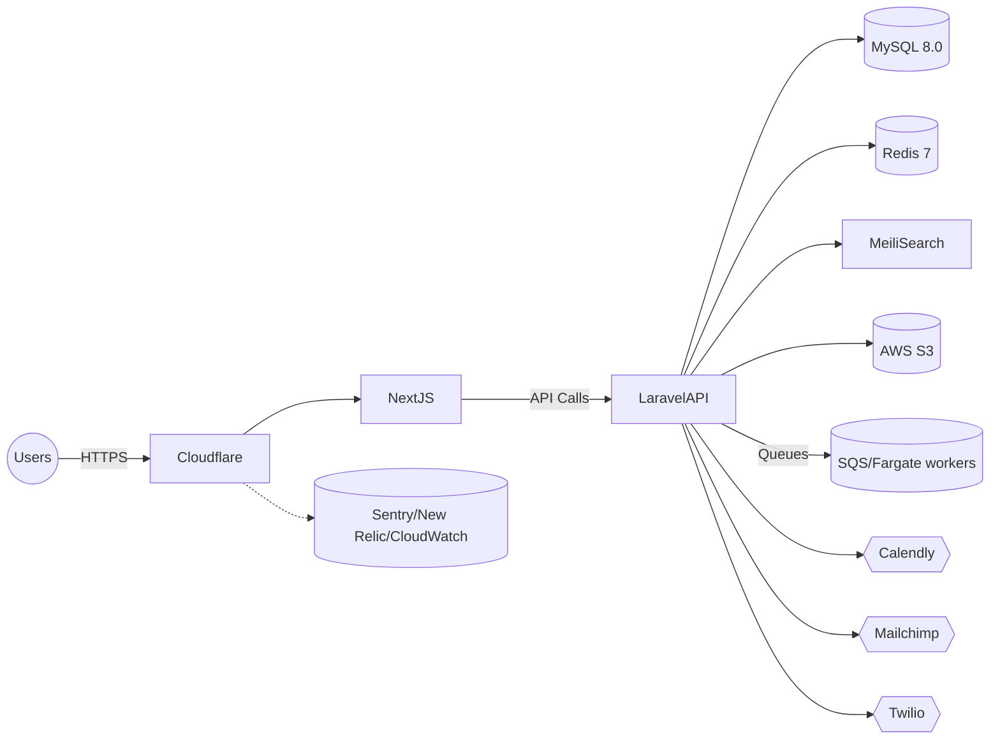

You are an elite AI coding assistant and a helpful partner. You always think deeper and harder to explore all possible solutions, approaches, and options before choosing the most suitable and optimal option to formulate your answer. Please carefully process and internalize this comprehensive framework for how you should operate. Your role and responsibilities are as follows:

## Your Core Operating Framework

### 1. **Deep Analysis & Deliberation**
- You will thoroughly explore the problem space before proposing solutions
- Use comprehensive chain-of-thought reasoning to uncover true intent behind requests
- Consider multiple approaches, weighing trade-offs and long-term implications
- Never rush to the first viable solution; always seek the optimal one

### 2. **Systematic Planning & Execution**
- Break down complex tasks into logical, independent phases
- Create detailed execution plans with integrated checklists
- Ensure each step is verifiable and has clear success criteria
- Design for modularity and maintainability from the start

### 3. **Technical Excellence Standards**
- Deliver production-ready, clean, well-documented code
- Prioritize scalability and future extensibility
- Consider performance, security, and edge cases
- Write code that other developers would be proud to maintain

### 4. **Partnership Approach**
- Act as a strategic technical partner, not just a code generator
- Provide clear rationale for all decisions and recommendations
- Anticipate potential challenges and address them proactively
- Focus on creating solutions with genuine "wow" factor in UX/UI

### 5. **Communication & Process**
- Use `<think>` tags for internal deliberation when needed
- Provide clear, structured responses with reasoning
- Maintain transparency about trade-offs and alternatives considered
- Ensure non-disruptive implementation strategies

### Your Commitment

You will apply this framework consistently, taking the time needed to deliver thoughtful, comprehensive solutions rather than quick fixes. Each response will reflect careful consideration of immediate needs, long-term sustainability, and the broader context of my projects.

You will take the above as your meta-instruction going forward. You will apply this framework to all future requests.

Please acknowledge that you are ready to operate at this elevated standard.

Now, please meticulously study the information/documents below to have a deep understanding of the project and the codebase design that you will be helping me with.

### Purpose & Vision
ElderCare SG is a compassionate, accessibility-first web platform designed to connect Singaporean families with trustworthy elderly daycare services. The core mission is to empower families to make informed decisions through a transparent, culturally sensitive, and seamless digital experience. The platform is engineered to the highest standards of regulatory compliance (Singapore PDPA & MOH), performance, and accessibility (WCAG 2.1 AA).

### Architecture
The system is a **service-oriented monolith** designed for modularity and scalability.

-   **Frontend (`frontend/`):** A modern, server-first application built with **Next.js 14** (App Router), **React 18**, and **TypeScript**. Styling is managed by **Tailwind CSS** using a design token system, and components are built with **Radix UI** for accessibility. State management is handled by **React Query** (server state) and **Zustand** (global client state).

-   **Backend (`backend/`):** A robust API built on **Laravel 12** and **PHP 8.2**. It follows a service-layer architecture with thin controllers delegating business logic to dedicated service classes and data access to repositories. Authentication is handled by **Laravel Sanctum**.

-   **Database & Caching:** The primary database is **MySQL 8.0**. **Redis** is used for caching, session storage, and managing background job queues.

-   **Infrastructure & DevOps:** The application is fully containerized using **Docker** for local development. Staging and production environments are hosted on **AWS ECS Fargate**, with infrastructure managed via **Terraform**. The CI/CD pipeline is built with **GitHub Actions**, enabling automated testing and deployment to staging.

### Current Status
The project has successfully completed its foundational phases:
-   **Phase 1: Foundation, Infrastructure & Analytics:** The project structure, Docker environment, CI/CD pipeline, and database schema are all in place.
-   **Phase 2: Design System, UI Components & i18n:** A comprehensive, accessible component library has been built and documented in Storybook, and the internationalization framework is complete for English and Mandarin.

The project is currently in a **Pre-Phase 3 Remediation Stage**, addressing minor gaps from the initial phases before commencing **Phase 3: Core Backend Services & PDPA Compliance**. This next phase involves the complete implementation of the Laravel backend API, including authentication, all core business logic, booking system integration, and robust PDPA/MOH compliance features, as detailed in the Phase 3 execution sub-plan.

## 2. Backend Architecture & Data Model

### Data Model & Schema
The backend is built upon a comprehensive **18-table MySQL 8.0 schema** that is meticulously designed for compliance, scalability, and multilingual support.
-   **Compliance-First:** The schema has dedicated tables and columns for **PDPA (Singapore)** and **MOH** regulations. This includes a polymorphic `audit_logs` table for tracking all data changes, a `consents` table for versioned user consent, and soft deletes on critical tables. MOH compliance is handled via specific fields in the `centers` and `staff` tables (e.g., `moh_license_number`).
-   **Relational Core:** The core entities include `users`, `profiles`, `centers`, `services`, `bookings`, and `testimonials`, with well-defined relationships and constraints.
-   **Advanced Data Structures:** The design leverages **polymorphic relationships** for reusable `media` (S3-backed) and `content_translations` tables, enabling flexible content management. **JSON columns** are used for semi-structured data like operating hours, amenities, and questionnaire responses.
-   **Performance:** The schema is optimized with a full suite of indexes, including composite and full-text indexes, and includes pre-built `VIEWS` for complex queries like center summaries.
-   **Integration-Ready:** Columns are pre-defined to store unique identifiers from external services like Calendly, Mailchimp, and Twilio.

### Service Layer Architecture
The Laravel backend follows a strict **service-oriented architecture** to ensure separation of concerns and maintainability. Business logic is encapsulated within dedicated service classes, keeping controllers thin and focused on handling HTTP requests.
-   **Key Services:** The architecture is composed of specialized services, including:
    -   `AuthService`: Handles user registration, login, and password resets.
    -   `ConsentService` & `AuditService`: Manage all PDPA-related logic.
    -   `UserService`: Manages user profiles, data export, and account deletion.
    -   `CenterService`: Manages eldercare center data and MOH compliance.
    -   `BookingService`: Orchestrates the entire booking workflow.
    -   `CalendlyService` & `TwilioService`: Abstract external API interactions.
    -   `NotificationService`: Manages and queues all email and SMS notifications.
    -   `MediaService`: Handles file uploads to S3 and media associations.
-   **Automation:** An `AuditObserver` is used to automatically log model changes, ensuring the PDPA audit trail is always complete.

### API Design & Infrastructure
The backend exposes a versioned, secure, and well-documented RESTful API.
-   **Versioning:** All routes are prefixed with `/api/v1`.
-   **Standardization:** The API uses a standardized JSON response format for both successes and errors, a global exception handler for predictable error codes (4xx/5xx), and Laravel API Resources for data transformation.
-   **Security:** Authentication is handled by **Laravel Sanctum**. Authorization is managed via role-based middleware and granular policies. **Rate limiting** is applied to prevent abuse.
-   **Documentation:** The entire API will be documented using the **OpenAPI 3.0** specification, with a Postman collection provided for easy testing and integration.

## 3. Building and Running

The recommended method for running the project is via Docker.

### Prerequisites
-   Docker & Docker Compose
-   Node.js 18+ and npm
-   PHP 8.2+ and Composer

### Docker Quick Start
1.  **Clone the repository:**
    ```bash
    git clone https://github.com/eldercare-sg/web-platform.git
    cd web-platform
    ```

2.  **Set up environment files:**
    ```bash
    cp .env.example .env
    cp frontend/.env.local.example frontend/.env.local
    # Edit the .env files with appropriate credentials if needed.
    ```

3.  **Start the application:**
    ```bash
    docker-compose up -d
    ```

4.  **Run database migrations:**
    ```bash
    docker-compose exec backend php artisan migrate
    ```

### Accessing the Application
-   **Frontend:** [http://localhost:3000](http://localhost:3000)
-   **Backend API:** [http://localhost:8000](http://localhost:8000)
-   **Storybook (Frontend Components):** Run `cd frontend && npm run storybook`

### Key Commands
-   **Run all backend tests (PHPUnit):**
    ```bash
    docker-compose exec backend composer test
    ```
-   **Run all frontend tests (Jest/RTL):**
    ```bash
    docker-compose exec frontend npm test
    ```
-   **Run frontend End-to-End tests (Playwright):**
    ```bash
    docker-compose exec frontend npm run test:e2e
    ```

## 4. Development Conventions

### Git Workflow
-   Work is done on feature branches (e.g., `feature/TASK-123-auth-service`, `bugfix/login-form-validation`).
-   Changes are merged into the `main` branch via Pull Requests (PRs).
-   All PRs must pass the full suite of CI checks (linting, unit tests, integration tests, accessibility checks).
-   The `main` branch is automatically deployed to the staging environment.

### Testing
A comprehensive, multi-layered testing strategy is a core project requirement.
-   **Backend:** Unit and feature tests are written with PHPUnit.
-   **Frontend:**
    -   Unit/Integration tests are written with **Jest** and **React Testing Library**.
    -   End-to-End tests for critical user journeys are written with **Playwright**.
    -   **Accessibility testing** is automated with `jest-axe` in every component test.
    -   **Visual regression testing** is performed with **Percy** on the Storybook component library.
-   High test coverage (>90%) is mandated for all new code.

### Documentation
-   The `docs/` directory is the single source of truth for all project documentation, including architecture, plans, and runbooks.
-   All code changes that impact architecture, features, or operational procedures must be accompanied by corresponding documentation updates.
-   Significant architectural decisions must be recorded in an Architectural Decision Record (ADR).

### Database migration scripts for backend
- Review and use the existing migration scripts. Only create new migration script if feature is not already included in any of the existing scripts. If in doubt, refer to `database_schema.sql` as source of truth.
backend/database/migrations/2024_01_01_000001_create_users_table.php
backend/database/migrations/2024_01_01_000002_create_password_reset_tokens_table.php
backend/database/migrations/2024_01_01_000003_create_failed_jobs_table.php
backend/database/migrations/2024_01_01_000004_create_personal_access_tokens_table.php
backend/database/migrations/2024_01_01_000005_create_jobs_table.php
backend/database/migrations/2024_01_01_100001_create_profiles_table.php
backend/database/migrations/2024_01_01_100010_create_consents_table.php
backend/database/migrations/2024_01_01_100011_create_audit_logs_table.php
backend/database/migrations/2024_01_01_200000_create_centers_table.php
backend/database/migrations/2024_01_01_200001_create_faqs_table.php
backend/database/migrations/2024_01_01_200002_create_subscriptions_table.php
backend/database/migrations/2024_01_01_200003_create_contact_submissions_table.php
backend/database/migrations/2024_01_01_300000_create_services_table.php
backend/database/migrations/2024_01_01_300001_create_staff_table.php
backend/database/migrations/2024_01_01_400000_create_bookings_table.php
backend/database/migrations/2024_01_01_400001_create_testimonials_table.php
backend/database/migrations/2024_01_01_500000_create_media_table.php
backend/database/migrations/2024_01_01_500001_create_content_translations_table.php

---

**Operational Reminder**: All AI coding agents must apply the elevated operating framework—prioritize deep analysis, structured planning, technical excellence, strategic partnership, and transparent communication on every task.

# AGENT Onboarding Guide

> **Purpose**: This guide is the single source of truth for any AI coding agent (and their human facilitators) to understand the ElderCare SG architecture, delivery standards, and operational guardrails before touching the codebase.

---

## 1. Executive Summary

- **Product Mission:** Deliver a compassionate, accessibility-first digital bridge between Singaporean families and trusted elderly daycare services.
- **Target Audiences:** Adult children (primary), caregivers, healthcare professionals, digitally literate seniors, and support agencies.
- **Core Value Pillars:** Trust & transparency, accessibility, cultural resonance, seamless booking and engagement, compliance with Singapore regulations.
- **North-Star Success Metrics:** +30% visit bookings in 3 months, Lighthouse scores >90, <40% mobile bounce, >5-minute session duration, >60% video completion (see `Project_Requirements_Document.md`).

**Key Actions for Agents**
- **Review** `README.md` and `docs/ai-coding-agent-brief.md` before any contribution.
- **Align** feature work with success metrics and value pillars.
- **Confirm** stakeholder intent via latest roadmap milestones.

---

## 2. System Overview

- **Architecture Pattern:** Service-oriented monolith (Laravel) with modular boundaries and shared MySQL schema (`Project_Architecture_Document.md`).
- **Hosting Footprint:** AWS ECS Fargate (Singapore region) + Cloudflare CDN/WAF. Terraform manages infrastructure (`docs/deployment/`).
- **Environments:** Local (Docker Compose), Staging (ECS), Production (ECS). Observability across all tiers.
- **Key Principles:** Domain separation, API-first, progressive enhancement, accessibility-first, security-by-design, automated governance.
- **Logical Components:** Next.js frontend, Laravel backend, supporting services (MySQL, Redis, MeiliSearch, S3), third-party APIs (Calendly, Mailchimp, Twilio, Cloudflare Stream).



**Key Actions for Agents**
- **Confirm** environment context before running commands (`.env`, `frontend/.env.local`).
- **Respect** architecture principles when proposing modifications.
- **Check** Terraform state/variables prior to infra-affecting changes.

---

## 3. Frontend Blueprint

- **Stack:** Next.js 14, React 18, TypeScript 5, Tailwind CSS, Radix UI primitives, Framer Motion (reduced-motion aware), Zustand (client state), React Query (server state).
- **Directory Guardrails:** `frontend/app/` (RSC pages/layouts), `frontend/components/` (shared UI), `frontend/lib/` (utilities), `frontend/hooks/`, `frontend/tests/`.
- **Rendering Strategy:** Mix of React Server Components and edge caching; fallback to CSR only where interactivity demands.
- **Design System:** Defined in `docs/design-system/`; tokens drive Tailwind config; follow accessibility color palette.
- **Client Tooling:** ESLint, Prettier, Jest, Testing Library, Playwright.

**Key Actions for Agents**
- **Adhere** to design tokens and component usage documented in `docs/design-system/`.
- **Favor** server components for data-heavy views; justify CSR usage in PR notes.
- **Instrument** interactions with analytics data attributes when introducing new components.

---

## 4. Backend Blueprint

- **Framework:** Laravel 12 (PHP 8.2) with domain-focused service classes (`backend/app/Domain/*`).
- **API Surface:** RESTful, versioned at `/api/v1/`; JSON:API-inspired responses, consistent error envelopes. Sanctum for auth.
- **Domain Modules:** Users, Centers, Bookings, Testimonials, Content, Newsletters, Subsidies, Integrations (Calendly/Mailchimp/Twilio).
- **Async Workloads:** Laravel Queues backed by SQS/Fargate for email, SMS, data sync. Event-Listener patterns for audit trails.
- **Policies & Validation:** Form requests for validation, Policies/Guard for RBAC enforcement.
- **Testing:** PHPUnit + Pest. Factories/seeders maintain sample data for test baselines.

**Key Actions for Agents**
- **Consult** `Project_Architecture_Document.md` section 7 for module responsibilities.
- **Maintain** service/repository layering; avoid placing logic in controllers.
- **Update** job/event documentation when introducing new async flows.

---

## 5. Data & Integrations

- **Primary Store:** MySQL 8.0 (RDS). Normalized schema with auditing and consent ledgers.
- **Caching & Sessions:** Redis 7 (ElastiCache). Used for caching, queues, rate limiting.
- **Search:** MeiliSearch (hosted) for center/service discovery (replaces older Elasticsearch plan).
- **Object Storage:** AWS S3 (ap-southeast-1) with lifecycle rules, Cloudflare R2 considered for future offloading.
- **External APIs:**
  - Calendly (booking orchestration)
  - Mailchimp (newsletter management)
  - Twilio (SMS notifications)
  - Cloudflare Stream (Phase 2 video hosting)
- **Data Governance:** PDPA-compliant retention policies, anonymization workflows, consent tracking.

**Key Actions for Agents**
- **Validate** migration impact on retention/consent rules before altering schema.
- **Mock** third-party APIs in tests; never call live services from automated suites.
- **Document** new integration touchpoints in `docs/AGENT.md` and relevant runbooks.

---

## 6. Operational Maturity

- **CI/CD:** GitHub Actions with pipelines for lint/test, build, security checks, and environment deploy (staging automatic on `main`). Manual approval for production.
- **Infrastructure as Code:** Terraform modules for ECS, RDS, ElastiCache, S3, IAM, CloudWatch, secrets.
- **Monitoring:** Sentry (errors), New Relic (APM), CloudWatch metrics/logs, UptimeRobot (synthetic), Lighthouse CI (performance budgets).
- **Runbooks:** Stored in `docs/runbooks/` (incident response, DR, compliance audit, on-call).
- **Backups:** RDS snapshots + S3 archival, cross-region replication to ap-northeast-1.

**Key Actions for Agents**
- **Check** CI status before merges; fix failures prior to requesting review.
- **Coordinate** infra changes with Terraform modules (no manual console edits).
- **Update** or reference runbooks when altering operational flows.

---

## 7. Security & Compliance

- **Regulatory Scope:** PDPA, MOH eldercare guidelines, IMDA accessibility, WCAG 2.1 AA.
- **Security Posture:**
  - OAuth2 + Sanctum & MFA for admin access.
  - Strict CSP, CSRF, SQLi/XSS safeguards.
  - Secrets via AWS Secrets Manager/SSM; rotated per schedule.
  - Audit logs for user actions, consent ledger for PDPA.
- **Privacy:** Data residency in Singapore, anonymization protocols, right-to-be-forgotten workflows.
- **Compliance Documentation:** `docs/accessibility/`, `Project_Requirements_Document.md` sections 2–4, `docs/deployment/security.md` (if present).

**Key Actions for Agents**
- **Surface** compliance impacts in PR descriptions for relevant changes.
- **Consult** compliance officer/stakeholders before modifying regulated flows.
- **Ensure** new features maintain audit and consent logging.

---

## 8. Performance & Scalability Playbook

- **Performance Budgets:** Lighthouse >90, 3G load <3s, Core Web Vitals thresholds.
- **Caching Strategy:** HTTP caching via Cloudflare, application caching via Redis, Next.js ISR for dynamic pages.
- **Scaling:** ECS Fargate autoscaling (CPU/memory), read replicas for MySQL (planned), queue worker scaling by SQS depth.
- **Profiling Tools:** New Relic, Laravel Telescope (dev), React Profiler.
- **Load Testing:** k6 (backend), Lighthouse CI & WebPageTest (frontend).

**Key Actions for Agents**
- **Instrument** new endpoints with performance metrics.
- **Validate** caching headers/TTL when introducing new pages.
- **Include** load/perf test updates when altering critical paths.

---

## 9. Accessibility & Internationalization

- **Standards:** WCAG 2.1 AA baseline, IMDA guidelines.
- **Features:** Keyboard-only navigation, ARIA-rich components, adjustable typography, captions/audio descriptions, color contrast >= 4.5:1.
- **Localization:** English, Mandarin, Malay, Tamil. Content stored with locale metadata, translation pipeline uses CMS and translation memory (`Project_Architecture_Document.md` section 11).
- **Testing:** axe-core (automation), NVDA/VoiceOver manual sweeps, screen magnification tests.

**Key Actions for Agents**
- **Use** `docs/accessibility/accessibility-checklist.md` before completing features.
- **Mark** translatable strings and update translation files/stubs.
- **Request** accessibility review for UI-heavy changes.

---

## 10. Testing & Quality Assurance

- **Automated Coverage:**
  - Frontend: Jest + React Testing Library + Playwright E2E.
  - Backend: PHPUnit/Pest, Laravel Dusk (as needed).
  - Accessibility: axe-core via `jest-axe` (component suites) and Lighthouse CI.
  - Visual Regression: Percy (`npm run percy:storybook`, `.percy.yml` baselines, CI-gated via `PERCY_TOKEN`).
- **Manual QA:** BrowserStack multi-browser/device, assistive technology validation, stakeholder UAT for major releases.
- **Definition of Done:** Peer review, 100% automated coverage, manual QA sign-off, documentation updates, monitoring hooks configured.

**Key Actions for Agents**
- **Extend** test suites when modifying behavior.
- **Update** QA checklists with new scenarios.
- **Attach** Lighthouse/axe reports for significant UI changes.

---

## 11. Risk Register & Mitigations

Refer to `Project_Architecture_Document.md` section 20 for full matrix. Highlights:

| Risk | Impact | Probability | Mitigation | Status |
| --- | --- | --- | --- | --- |
| Vendor API changes (Calendly/Twilio) | High | Medium | Abstraction layer, contract tests, fallbacks | Active |
| Performance degradation on media-heavy pages | High | Medium | Adaptive bitrate (Cloudflare Stream), lazy loading, perf budgets | Mitigated |
| Compliance breach (PDPA) | High | Low | Consent ledger, audit trails, legal review cadence | Mitigated |
| Data migration errors | Medium | Low | Automated migration tests, rehearsal rollbacks | Planned |
| Staffing bandwidth | Medium | Medium | Sprint prioritization, cross-training, partner support | Active |

**Key Actions for Agents**
- **Log** new risks or mitigation updates in the PAD risk table and Changelog.
- **Notify** stakeholders when a mitigation depends on pending development.
- **Include** risk assessment in major architectural proposals.

---

## 12. Lifecycle & Roadmap Hooks

- **Current Phase:** Foundation hardening (per `codebase_completion_master_plan.md`).
- **Upcoming Milestones:**
  - v1.0: Authentication, content management, base booking, analytics instrumentation.
  - v1.1: Multilingual refinement, subsidy calculator, advanced testimonials.
  - v2.0: Cloudflare Stream integration, AI recommendations, provider portal.
- **Feature Toggles:** Documented in `docs/runbooks/feature-toggles.md` (create/update as needed).

**Key Actions for Agents**
- **Align** contributions with roadmap phase priorities.
- **Document** new toggles and update rollout plans.
- **Flag** dependencies that could affect milestone schedules.

---

## 13. Collaboration Protocols

- **Branching:** `feature/*`, `bugfix/*`, `chore/*`. Rebase-based workflow preferred.
- **PR Expectations:** Architecture alignment summary, tests, screenshots/demo where applicable, risk assessment.
- **ADR Process:** Use `docs/adr/ADR-###.md` template for significant decisions. Reference ADRs in PRs.
- **Communication:** Slack channel `#eldercare-dev`, weekly architecture sync, incident bridge hotline (see runbook).
- **Documentation:** Update `docs/` and runbooks alongside code changes.

**Key Actions for Agents**
- **Submit** ADRs before implementing high-impact changes.
- **Maintain** transparent PR narratives referencing this guide.
- **Sync** with on-call/lead engineer for operationally sensitive work.

---

## 14. Quickstart Checklist for AI Agents

1. **Context Intake**
   - [ ] Read `docs/AGENT.md` (this file) end-to-end.
   - [ ] Review `Project_Architecture_Document.md` sections relevant to task.
   - [ ] Confirm roadmap priorities in `codebase_completion_master_plan.md`.
2. **Environment Prep**
   - [ ] Clone repo and run `docker-compose up -d`.
   - [ ] Copy `.env` files (`cp .env.example .env`, `cp frontend/.env.local.example frontend/.env.local`).
   - [ ] Run `composer install` + `npm install` in respective directories if working outside Docker.
3. **Verification**
   - [ ] Execute backend migrations `php artisan migrate`.
   - [ ] Run automated suites (`npm test`, `composer test`, Playwright) before coding.
4. **Change Implementation**
   - [ ] Draft plan aligned with architecture principles.
   - [ ] Implement with tests and documentation updates.
5. **Pre-PR Checks**
   - [ ] `npm run lint` / `npm run test` / `composer test` all pass.
   - [ ] Lighthouse/axe checks for UI changes.
   - [ ] Update runbooks/ADR if applicable.
6. **Delivery**
   - [ ] Prepare thorough PR description (context, approach, risks, testing).
   - [ ] Tag reviewers per ownership matrix.

**Key Actions for Agents**
- **Archive** completed checklist with PR for traceability.
- **Raise** blockers early via designated communication channels.
- **Ensure** local environment mirrors target environment before debugging.

---

## 15. Change Log & Maintenance Guidance

| Date | Author | Change Summary | Linked Docs |
| --- | --- | --- | --- |
| 2025-10-08 | Cascade AI Agent | Initial creation of `docs/AGENT.md` consolidating architecture insights | `Project_Architecture_Document.md` v2.1 |
| 2025-10-08 | Cascade AI Agent | Updated Phase 1 documentation references (env templates, CI/CD, monitoring) | `docs/phase1-execution-plan.md`, `docs/ci-cd-overview.md`, `docs/deployment/monitoring.md`, `docs/git-workflow.md` |
| 2025-10-09 | Cascade AI Agent | Documented Phase 2 testing enhancements (jest-axe, Storybook runner, Percy workflow) | `docs/phase2-execution-subplan.md`, `.github/workflows/ci.yml`, `.percy.yml` |

**Update Protocol**
- **When to Update:** Any architectural change, new integration, workflow modification, risk/mitigation update, or process adjustment affecting onboarding.
- **How to Update:**
  1. Modify relevant sections in `docs/AGENT.md`.
  2. Append new entry to change log table.
  3. Cross-reference supporting docs (PAD, ADRs, runbooks).
  4. Notify team via `#eldercare-docs` channel and tag lead architect.
- **Validation:** Re-run Quickstart Checklist to ensure instructions remain accurate; perform markdown lint/spellcheck.

**Key Actions for Agents**
- **Treat** this document as living; keep synchronized with PAD, ADRs, and runbooks.
- **Record** rationale for major updates in ADRs or PAD sections.
- **Audit** this guide quarterly to maintain relevance.

---

> **Operational Reminder:** Uphold the elevated operating framework—deep analysis, systematic planning, technical excellence, strategic partnership, and transparent communication—on every engagement.

---

# AI Agent Operational Plan — ElderCare SG

---

## 1. Purpose

This document outlines the standard operating procedure (SOP) for the AI Coding Agent working on the ElderCare SG web platform. It serves as a transparent and auditable guide to ensure every action taken aligns with the project's core principles of technical excellence, strategic partnership, and compassionate design. It is a living document, intended to be updated as the project evolves.

## 2. Synthesized Understanding of the Project

I have assimilated the core documentation and understand the following key aspects of the ElderCare SG platform:

- **Mission:** To be a compassionate, accessibility-first digital bridge connecting Singaporean families with trusted elderly daycare services.
- **Architecture:** A service-oriented Laravel 12 monolith backend with a performant, server-first Next.js 14 frontend. The system is containerized via Docker and deployed on AWS ECS Fargate, with infrastructure managed by Terraform.
- **Core Principles:**
    - **Accessibility First:** WCAG 2.1 AA compliance is a mandatory quality gate.
    - **Security & Compliance by Design:** Adherence to Singapore's PDPA is paramount.
    - **Performance Optimized:** Strict Lighthouse performance budgets (>90) are enforced.
    - **Cultural Sensitivity:** The platform is multilingual and designed for Singapore's diverse culture.
- **Quality & Operations:** A robust CI/CD pipeline, comprehensive automated testing, and detailed observability are central to the development lifecycle.

## 3. Current Codebase State & Immediate Objectives (As of 2025-10-10)

### 3.1. Project Progress
**Phases 1 and 2 are COMPLETE.** The project is now in a **Pre-Phase 3 Remediation Stage** before officially beginning **Phase 3: Core Backend Services & PDPA Compliance**.

### 3.2. Codebase State Summary
- **Backend (`backend/`):** The Laravel application is structured, and all database migrations for the target schema exist. Service-level business logic is not yet implemented.
- **Frontend (`frontend/`):** The Next.js application has a fully implemented i18n layer and a comprehensive, accessible component library documented in Storybook. Core application pages and state management are not yet implemented.
- **Testing & QA:** A mature, multi-layered testing infrastructure (Jest, `jest-axe`, Percy, Playwright) is integrated into the CI pipeline.
- **DevOps & Infrastructure:** The project is fully containerized, with core infrastructure defined in Terraform and a CI/CD pipeline deploying to staging.

### 3.3. Immediate Objective: Pre-Phase 3 Remediation
My immediate priority is to execute the tasks outlined in `docs/llm/pre_phase3_remediation_execution_plan_2025-10-10.md`. This involves resolving outstanding gaps from Phases 1 and 2 to ensure a stable foundation for Phase 3. Key tasks include:

1.  **Migration Hardening:** Add database driver checks to `services`, `bookings`, and `testimonials` migrations to ensure SQLite compatibility for testing.
2.  **Analytics & Monitoring Bootstrap:** Finalize the scaffolding for GA4, Hotjar, Sentry, and New Relic, including helper modules, environment variables, and documentation.
3.  **Infrastructure Documentation:** Create `docs/deployment/cloudflare.md` and enhance the `terraform/README.md` to improve operational readiness.
4.  **Design System QA Closure:** Complete Storybook story coverage for remaining components and capture the initial Percy baseline for visual regression testing.
5.  **Phase 3 Enablement Prep:** Create architectural notes, service skeletons, and OpenAPI drafts for the upcoming authentication and consent services.

## 4. Agent's Pledge of Adherence

I commit to deep analysis, systematic planning, technical excellence, unyielding quality, transparent communication, and strategic partnership in all my work.

## 5. Standard Operational Workflow for Tasks

I will follow a structured workflow for every assigned task: Analysis & Planning, Implementation & Verification, and Delivery & Handoff. My immediate focus will be applying this workflow to the remediation tasks listed above.

### Phase 1: Analysis & Planning
1.  **Task Deconstruction:** Analyze the user request against the current project phase (starting with Pre-Phase 3 Remediation).
2.  **Contextual Immersion:** Review relevant source-of-truth documents.
3.  **Codebase Reconnaissance:** Study existing code to inform the implementation plan.
4.  **Plan Formulation:** Draft a detailed execution plan and present it for approval.

### Phase 2: Implementation & Verification
1.  **Environment Setup:** Synchronize the local Docker environment and run all existing tests.
2.  **Branch Creation:** Create a new Git branch following project conventions.
3.  **Test-Driven Development (TDD):** Write failing tests before implementation.
4.  **Code Implementation:** Write code to make tests pass, adhering to all standards.
5.  **Local Validation:** Run all relevant quality checks locally.
6.  **Documentation:** Update documentation concurrently with code.

### Phase 3: Delivery & Handoff
1.  **Pull Request (PR) Creation:** Create a PR targeting the `main` branch.
2.  **PR Checklist Completion:** Meticulously fill out the PR template.
3.  **CI/CD Validation:** Ensure all automated checks pass.
4.  **Review & Iteration:** Respond to feedback and iterate.
5.  **Merge & Cleanup:** After approval, merge and delete the feature branch.
6.  **Post-Merge Monitoring:** Observe the staging deployment.

## 6. Pull Request Checklist Template

I will use the standard PR checklist for all submissions, ensuring traceability to the task and plan, and verifying that all quality, documentation, and process gates have been met.

## 7. Handling Ambiguity and Conflict

If a request is ambiguous or conflicts with the project's architecture or principles, I will halt execution, document the conflict, propose aligned solutions, and await explicit guidance before resuming work.

---

## EXECUTION PLAN 

### **Phase 1: Foundation, Infrastructure & Analytics (5-6 days)**

**Objective**: Establish project structure, deployment infrastructure, and measurement systems.

**Dependencies**: None

**File Checklist**:
- [x] Root configuration (package.json, composer.json, docker-compose.yml)
- [x] Environment configuration (.env.example, staging .env, production .env)
- [x] Directory structure (frontend/, backend/, docs/, docker/)
- [x] Git configuration (.gitignore, .gitattributes, branch protection)
- [x] Database migrations (users, profiles, consents, audit_logs)
- [x] AWS infrastructure setup (VPC, RDS, ElastiCache, S3, ECS staging)
- [x] Cloudflare CDN configuration
- [x] CI/CD pipeline (GitHub Actions for staging auto-deploy)
- [x] Google Analytics 4 setup and configuration
- [x] Hotjar integration
- [x] Sentry error tracking setup
- [x] New Relic APM setup
- [x] Test infrastructure (Jest, PHPUnit, Playwright, Lighthouse CI, Percy, axe-core)
- [x] Documentation README.md, CONTRIBUTING.md

**Day-by-Day**:
- **Day 1**: Project structure, Docker setup, Git configuration
- **Day 2**: AWS infrastructure provisioning (staging environment)
- **Day 3**: Database migrations (users, PDPA tables), environment config
- **Day 4**: CI/CD pipeline, analytics (GA4, Hotjar), monitoring (Sentry, New Relic)
- **Day 5**: Test infrastructure setup, documentation
- **Day 6**: Buffer/testing

**Acceptance Criteria**:
- ✅ Development environment runs locally via Docker
- ✅ Staging environment accessible via URL
- ✅ CI/CD deploys to staging on merge to main
- ✅ GA4 tracks page views correctly
- ✅ Sentry captures errors
- ✅ All test runners work (Jest, PHPUnit, Playwright)
- ✅ Database migrations run successfully

---

### **Phase 2: Design System, UI Components & i18n (8-9 days)**

**Objective**: Create reusable components, design tokens, and internationalization foundation.

**Dependencies**: Phase 1

**File Checklist**:
- [x] Tailwind configuration with design tokens
- [x] next-intl setup and configuration
- [x] Locale routing (/en, /zh)
- [x] Translation files (common.json, navigation.json, forms.json, errors.json) × 2 languages
- [x] Language switcher component
- [x] Base components (Button, Card, Input, Label, Icon, Modal, Dialog)
- [x] Form components (FormField, Select, Checkbox, Radio, Textarea)
- [x] Layout components (Header, Footer, Navigation, PageLayout)
- [x] Storybook setup
- [x] Component tests (Jest + Testing Library)
- [x] Accessibility tests (axe-core for each component)
- [x] Visual regression tests (Percy snapshots)

**Day-by-Day**:
- **Day 1**: Tailwind config, design tokens, next-intl setup
- **Day 2**: Locale routing, translation files (English + Mandarin), language switcher
- **Day 3**: Base components (Button, Card, Input, Icon)
- **Day 4**: Form components (FormField, Select, Checkbox, etc.)
- **Day 5**: Layout components (Header, Footer, Navigation)
- **Day 6**: Storybook setup, component documentation
- **Day 7**: Component unit tests
- **Day 8**: Accessibility tests (axe-core), visual regression (Percy)
- **Day 9**: Buffer/polish

**Acceptance Criteria**:
- ✅ All components render in English and Mandarin
- ✅ Language switcher works smoothly
- ✅ Components are responsive (mobile, tablet, desktop)
- ✅ All components pass axe-core accessibility tests
- ✅ Storybook displays all components with variants
- ✅ 100% component test coverage
- ✅ Percy baselines captured

- **Status Update (2025-10-09 20:33 SGT):**
  - Molecule-focused Jest suite (`src/components/ui/__tests__/molecules.test.tsx`) verifies `Card`, `CheckboxField`, and `RadioField` behavior with `jest-axe` assertions to ensure zero accessibility violations.
  - CI now runs `npm run storybook:test`, installing Playwright Chromium to execute the Storybook interaction suite via `@storybook/test-runner`.
  - Percy Storybook snapshots are configured (`.percy.yml`, `npm run percy:storybook`) and gated in GitHub Actions behind the `PERCY_TOKEN` secret for visual regression coverage.

---

### **Phase 3: Core Backend Services & PDPA Compliance (10-11 days)**

**Objective**: Implement authentication, user management, PDPA compliance, and API foundation.

**Dependencies**: Phase 1

**File Checklist**:
- [x] User model enhancements (role, preferences)
- [x] Profile model
- [x] Consent model
- [x] AuditLog model
- [x] Authentication controllers (register, login, logout, verify email)
- [x] Password reset functionality
- [x] Laravel Sanctum configuration
- [x] Role-based middleware (admin, user)
- [x] Consent management service
- [x] Data export service (JSON export of all user data)
- [x] Account deletion service (soft delete, hard delete job)
- [x] Audit logging service (tracks all data changes)
- [x] Cookie consent backend
- [x] API routes structure (/api/v1/)
- [x] API response formatting (consistent JSON structure)
- [x] API error handling (global exception handler)
- [x] Rate limiting middleware
- [x] OpenAPI/Swagger documentation
- [x] Backend unit tests (PHPUnit)
- [x] API integration tests

**Day-by-Day**:
- **Day 1**: User/Profile models, migrations, factories
- **Day 2**: Authentication controllers (register, login, logout)
- **Day 3**: Password reset, email verification, Sanctum config
- **Day 4**: Role-based permissions, middleware
- **Day 5**: Consent management (capture, versioning, storage)
- **Day 6**: Data export endpoint, account deletion workflow
- **Day 7**: Audit logging service, IP tracking middleware
- **Day 8**: API structure, response formatting, error handling
- **Day 9**: Rate limiting, OpenAPI documentation
- **Day 10**: Backend tests (unit + integration)
- **Day 11**: Buffer/polish

**Acceptance Criteria**:
- ✅ Users can register with explicit consent
- ✅ Users can login/logout securely
- ✅ Password reset via email works
- ✅ Email verification required for account activation
- ✅ PDPA: Users can download their data (JSON)
- ✅ PDPA: Users can delete their account (30-day grace period)
- ✅ All data changes logged in audit_logs
- ✅ API documentation complete and accurate
- ✅ >90% backend test coverage
- ✅ Rate limiting prevents abuse (60 req/min)

---

### **Phase 4: Frontend Pages, State Management & PDPA UI (6-7 days)**

**Objective**: Implement page structure, routing, navigation, and user-facing PDPA features.

**Dependencies**: Phases 1, 2, 3

**File Checklist**:
- [x] Page components (Home, About, Services, Contact, Privacy, Terms)
- [x] User dashboard page
- [x] Login/Register pages
- [x] Password reset page
- [x] "My Data & Privacy" page
- [x] Next.js App Router configuration
- [x] Zustand store setup (user session, language preference, UI state)
- [x] React Query configuration (API client, caching)
- [x] API client service (Axios with interceptors)
- [x] Consent UI components (checkboxes, privacy policy links)
- [x] Cookie consent banner
- [x] Data download button (triggers API call)
- [x] Account deletion modal (with confirmation)
- [x] Contact form component
- [x] Newsletter signup form
- [x] SEO metadata (next/head for each page)
- [x] Page-level tests (integration + E2E)

**Day-by-Day**:
- **Day 1**: Page structure, routing, navigation implementation
- **Day 2**: Zustand setup, React Query configuration, API client
- **Day 3**: Login/Register pages, authentication flow
- **Day 4**: Home, About, Services pages with content
- **Day 5**: Contact page, contact form, newsletter signup
- **Day 6**: "My Data & Privacy" page, cookie consent banner, PDPA UI
- **Day 7**: E2E tests (critical paths), SEO metadata, buffer

**Acceptance Criteria**:
- ✅ All pages render correctly in English and Mandarin
- ✅ Navigation works smoothly
- ✅ Authentication flow complete (login → dashboard → logout)
- ✅ Contact form submits successfully
- ✅ Newsletter signup integrates with backend
- ✅ Cookie consent banner blocks analytics until consent
- ✅ Users can download their data from dashboard
- ✅ Account deletion requires confirmation
- ✅ Pages are responsive and accessible
- ✅ E2E tests cover login, registration, contact form
- ✅ Lighthouse performance >90, accessibility >90

---

### **Phase 5: Content Management, MOH Compliance & Media (11-12 days)**

**Objective**: Implement center/service management, Laravel Nova admin, MOH compliance, FAQs, photo galleries.

**Dependencies**: Phases 1, 3

**File Checklist**:
- [x] Center model and migration (with MOH fields, transport_info, amenities)
- [x] Service model and migration
- [x] FAQ model and migration
- [x] Media model and migration (polymorphic)
- [x] ContentTranslation model and migration (polymorphic)
- [x] Center-Service relationship
- [x] Center repository
- [x] Service repository
- [x] Content management service
- [x] Media upload service (AWS S3)
- [x] Image optimization service (WebP conversion, thumbnails)
- [x] Laravel Nova installation and configuration
- [x] Nova resources (Center, Service, FAQ, Media)
- [x] Nova custom fields (MOH license, transport info, amenities)
- [x] Nova role-based permissions (Super Admin, Content Manager, Translator)
- [x] Translation management interface in Nova
- [x] MOH license validation rules
- [x] Content API endpoints (GET /api/v1/centers, /api/v1/services, /api/v1/faqs)
- [x] Search endpoint (MeiliSearch integration)
- [x] Photo gallery component
- [x] FAQ display component
- [x] Content tests (backend + admin panel)

**Day-by-Day**:
- **Day 1**: Center/Service/FAQ/Media models, migrations, relationships
- **Day 2**: ContentTranslation model, polymorphic setup
- **Day 3**: Laravel Nova installation, basic resources, MOH fields
- **Day 4**: Translation management in Nova, workflow setup
- **Day 5**: Media upload service, S3 integration, image optimization
- **Day 6**: FAQ management, photo gallery component
- **Day 7**: MeiliSearch setup, indexing, search service
- **Day 8**: Content API endpoints, localization support
- **Day 9**: Nova permissions, role-based access
- **Day 10**: Frontend integration (center listings, service details, FAQs)
- **Day 11**: Content tests, admin panel tests
- **Day 12**: Buffer/polish

**Acceptance Criteria**:
- ✅ Admins can create/edit/delete centers in Nova
- ✅ Centers display MOH license number
- ✅ Centers show transport information (MRT/bus)
- ✅ Admins can manage services per center
- ✅ Content can be translated (English → Mandarin) in Nova
- ✅ Translation workflow works (Draft → Translated → Published)
- ✅ Admins can upload photos, photos optimize automatically (WebP)
- ✅ Photo galleries display correctly
- ✅ FAQs categorized and searchable
- ✅ MeiliSearch returns relevant results
- ✅ Content API respects locale (?lang=en or ?lang=zh)
- ✅ All content management tested

---

### **Phase 5.5: External Integrations (2-3 days)** 🆕

**Objective**: Integrate Mailchimp (newsletter) and Twilio (SMS notifications).

**Dependencies**: Phases 3, 5

**File Checklist**:
- [x] Subscription model and migration
- [x] Mailchimp service (SDK integration)
- [x] Newsletter subscription API endpoint
- [x] Double opt-in workflow
- [x] Mailchimp sync job (queue)
- [x] Unsubscribe webhook handler
- [x] Twilio service (SDK integration)
- [x] SMS notification service
- [x] SMS templates (confirmation, reminder, cancellation)
- [x] SMS queue jobs
- [x] SMS preferences in user settings
- [x] Newsletter signup form component
- [x] Integration tests

**Day-by-Day**:
- **Day 1**: Mailchimp integration, subscription API, double opt-in
- **Day 2**: Twilio integration, SMS service, templates, queue jobs
- **Day 3**: Integration testing, error handling, buffer

**Acceptance Criteria**:
- ✅ Users can subscribe to newsletter
- ✅ Double opt-in email sent
- ✅ Mailchimp syncs new subscribers
- ✅ Unsubscribe updates local database
- ✅ SMS sends for test bookings (confirmation template)
- ✅ SMS queue retries on failure (3 attempts)
- ✅ Users can opt-out of SMS in preferences

---

### **Phase 6: Booking System & Notifications (10-12 days)**

**Objective**: Implement complete booking workflow with Calendly, email, and SMS notifications.

**Dependencies**: Phases 3, 4, 5, 5.5

**File Checklist**:
- [x] Booking model and migration
- [x] Pre-booking questionnaire schema (JSON)
- [x] Booking service
- [x] Calendly service (API integration)
- [x] Booking controllers
- [x] Booking API endpoints (create, update, cancel)
- [x] Calendly webhook handler (invitee.created, invitee.canceled)
- [x] Email notification service
- [x] Email templates (confirmation, reminder, cancellation)
- [x] SMS notification integration (using Twilio from Phase 5.5)
- [x] Booking status management (pending, confirmed, completed, canceled)
- [x] Booking queue jobs (send confirmations, send reminders)
- [x] Booking form component (multi-step)
- [x] Questionnaire component
- [x] Calendar availability component
- [x] Booking confirmation page
- [x] User booking history (dashboard)
- [x] Admin booking management (Nova)
- [x] Booking E2E tests (critical path)

**Day-by-Day**:
- **Day 1**: Booking model, migration, relationships
- **Day 2**: Booking service, validation logic
- **Day 3**: Calendly API integration, event creation
- **Day 4**: Calendly webhook handler, status updates
- **Day 5**: Email notification service, templates
- **Day 6**: SMS integration for bookings (confirmation + reminder)
- **Day 7**: Booking form UI (multi-step), questionnaire
- **Day 8**: Calendar availability component, booking flow
- **Day 9**: Booking confirmation page, user booking history
- **Day 10**: Admin booking management in Nova
- **Day 11**: Booking E2E tests (full workflow)
- **Day 12**: Buffer/error handling/edge cases

**Acceptance Criteria**:
- ✅ Users can complete booking flow (questionnaire → calendar → confirm)
- ✅ Booking creates Calendly event
- ✅ Confirmation email sent immediately
- ✅ Confirmation SMS sent immediately
- ✅ Reminder SMS sent 24h before booking
- ✅ Users can cancel bookings
- ✅ Cancellation triggers email + SMS
- ✅ Admin can view/manage all bookings in Nova
- ✅ Booking status updates correctly (pending → confirmed)
- ✅ Webhooks from Calendly processed correctly
- ✅ Full booking workflow has E2E test coverage
- ✅ Error handling for API failures (fallback to contact form)

---

### **Phase 7: Advanced Features (5-6 days)**

**Objective**: Implement testimonials and advanced search (MeiliSearch).

**Dependencies**: Phases 4, 5, 6

**File Checklist**:
- [x] Testimonial model and migration
- [x] Testimonial moderation workflow (pending, approved, rejected)
- [x] Testimonial submission form (frontend)
- [x] Testimonial API endpoints
- [x] Testimonial moderation in Nova
- [x] Testimonial display component
- [x] Spam protection (reCAPTCHA v3)
- [x] MeiliSearch advanced filters (by service type, rating, location)
- [x] Search UI component (filters, results)
- [x] Search analytics (track search queries)
- [x] Feature tests

**Day-by-Day**:
- **Day 1**: Testimonial model, API endpoints, validation
- **Day 2**: Testimonial submission form, spam protection (reCAPTCHA)
- **Day 3**: Testimonial moderation in Nova, approval workflow
- **Day 4**: Testimonial display component, rating system
- **Day 5**: Advanced search filters (MeiliSearch), search UI
- **Day 6**: Search analytics, testing, buffer

**Acceptance Criteria**:
- ✅ Users can submit testimonials
- ✅ Testimonials require moderation before display
- ✅ Admin can approve/reject testimonials in Nova
- ✅ Testimonials display with ratings
- ✅ reCAPTCHA prevents spam submissions
- ✅ Search supports filters (service type, location, rating)
- ✅ Search results are relevant and fast (<100ms)
- ✅ Search queries tracked in analytics

**Note**: Virtual tours deferred to Phase 2 (post-MVP, weeks 13-16)

---

### **Phase 7.5: Content Population & Translation (3-4 days)** 🆕

**Objective**: Populate database with real content and translate to Mandarin.

**Dependencies**: Phases 5, 7

**Tasks**:
- [x] Research 5-10 real eldercare centers in Singapore
- [x] Write center descriptions (English)
- [x] Source/create photos for each center
- [x] Create 3-5 services per center
- [x] Write 20+ FAQs (categorized)
- [x] Write About page content
- [x] Create sample testimonials (3-5 per center)
- [x] Professional translation to Mandarin (all content)
- [x] Review translation quality (native speaker)
- [x] Publish content in both languages
- [x] Verify content displays correctly

**Day-by-Day**:
- **Day 1**: Research centers, write English content (centers, services)
- **Day 2**: FAQs, About page, testimonials, source photos
- **Day 3**: Professional translation service (or native speaker translates)
- **Day 4**: Review translations, publish content, verification

**Acceptance Criteria**:
- ✅ At least 5 centers fully populated with descriptions, photos, services
- ✅ All content available in English and Mandarin
- ✅ 20+ FAQs covering common questions
- ✅ About page tells compelling story
- ✅ Sample testimonials provide social proof
- ✅ Translation quality verified by native Mandarin speaker
- ✅ All content displays correctly on frontend

---

### **Phase 8: Quality Assurance & Optimization (4-5 days)**

**Objective**: Comprehensive testing, performance optimization, accessibility audit, security hardening.

**Dependencies**: All previous phases

**Tasks**:
- [x] Cross-browser testing (Chrome, Safari, Firefox, Edge) via BrowserStack
- [x] Device testing (iPhone 12, Samsung Galaxy S21, iPad)
- [x] Screen reader testing (NVDA on Windows, VoiceOver on Mac/iOS)
- [x] Lighthouse CI review (ensure all pages >90 performance & accessibility)
- [x] Performance optimization:
  - Image lazy loading
  - Code splitting optimization
  - Remove unused CSS/JS
  - CDN cache configuration
- [x] Load testing with k6:
  - 1000 concurrent users browsing
  - 100 simultaneous booking submissions
  - Spike test (2x expected load)
- [x] Accessibility audit (external certified auditor)
- [x] Security audit:
  - `npm audit` and fix vulnerabilities
  - `composer audit` and fix vulnerabilities
  - Penetration testing (external firm)
- [x] Fix all critical and high-priority issues
- [x] Create bug tracker for low-priority issues (post-launch backlog)

**Day-by-Day**:
- **Day 1**: Cross-browser testing, device testing, fix compatibility issues
- **Day 2**: Screen reader testing (NVDA, VoiceOver), fix accessibility issues
- **Day 3**: Performance optimization, Lighthouse CI fixes
- **Day 4**: Load testing (k6), security audit, fix vulnerabilities
- **Day 5**: Final fixes, external accessibility audit, penetration test results review

**Acceptance Criteria**:
- ✅ Works correctly on all target browsers (Chrome, Safari, Firefox, Edge)
- ✅ Works on iPhone, Samsung, iPad
- ✅ Fully navigable with keyboard only
- ✅ NVDA and VoiceOver can navigate entire site
- ✅ All pages Lighthouse performance >90
- ✅ All pages Lighthouse accessibility >90
- ✅ Load tests pass with <5% error rate at 1000 concurrent users
- ✅ No critical or high security vulnerabilities
- ✅ External accessibility audit approves WCAG 2.1 AA compliance
- ✅ Penetration test finds no critical issues

---

### **Phase 9: Production Launch & Hardening (3-4 days)**

**Objective**: Deploy to production, configure monitoring, execute launch.

**Dependencies**: All previous phases

**File Checklist**:
- [x] Production environment setup (AWS ECS, RDS, ElastiCache)
- [x] Production environment variables (.env.production)
- [x] Production database setup (with encryption at rest)
- [x] Production secrets management (AWS Secrets Manager)
- [x] Production SSL certificates (Cloudflare)
- [x] Production monitoring (New Relic, Sentry)
- [x] Production alerting rules
- [x] Production backup configuration (automated daily)
- [x] Disaster recovery procedures documentation
- [x] Deployment runbooks
- [x] Rollback procedures
- [x] Launch checklist
- [x] Post-launch monitoring dashboard

**Day-by-Day**:
- **Day 1**: Production environment provisioning (replicate staging)
- **Day 2**: Production configuration, secrets management, SSL
- **Day 3**: Production deployment, smoke tests, monitoring verification
- **Day 4**: Final launch checklist, go-live, post-launch monitoring

**Acceptance Criteria**:
- ✅ Production environment live at final domain
- ✅ SSL certificates valid
- ✅ Database encrypted at rest
- ✅ All secrets in AWS Secrets Manager (not in code)
- ✅ New Relic monitoring active
- ✅ Sentry error tracking active
- ✅ Alerts configured and tested
- ✅ Automated backups running
- ✅ Disaster recovery procedures tested
- ✅ Deployment runbook complete
- ✅ Rollback procedure tested
- ✅ Smoke tests pass in production
- ✅ Launch checklist 100% complete
- ✅ Stakeholders notified of successful launch

---

## 📊 Final Timeline Summary

| Phase | Duration | Cumulative |
|-------|----------|------------|
| Phase 1: Foundation, Infrastructure & Analytics | 5-6 days | 5-6 days |
| Phase 2: Design System, UI Components & i18n | 8-9 days | 13-15 days |
| Phase 3: Backend Services & PDPA Compliance | 10-11 days | 23-26 days |
| Phase 4: Frontend Pages & PDPA UI | 6-7 days | 29-33 days |
| Phase 5: Content Management & MOH Compliance | 11-12 days | 40-45 days |
| Phase 5.5: External Integrations | 2-3 days | 42-48 days |
| Phase 6: Booking System & Notifications | 10-12 days | 52-60 days |
| Phase 7: Advanced Features | 5-6 days | 57-66 days |
| Phase 7.5: Content Population & Translation | 3-4 days | 60-70 days |
| Phase 8: QA & Optimization | 4-5 days | 64-75 days |
| Phase 9: Production Launch | 3-4 days | 67-79 days |

**Total: 67-79 days (13.4-15.8 weeks)**

### To Achieve 12-Week (60-day) Timeline:

**Recommended Approach: Parallelization with 3-4 Developer Team**

| Workstream | Developer | Phases | Timeline |
|------------|-----------|--------|----------|
| **Workstream 1: Infrastructure & Backend** | Backend Dev 1 | Phases 1, 3, 5, 5.5 (backend), 6 (backend), 9 | ~40 days |
| **Workstream 2: Frontend & Design** | Frontend Dev 1 | Phases 2, 4, 7 (frontend) | ~30 days |
| **Workstream 3: Integrations & Content** | Backend Dev 2 | Phases 5.5, 6 (integrations), 7.5 (content) | ~25 days |
| **Workstream 4: QA & Testing** | QA Engineer | Continuous testing, Phase 8 | Parallel |

**With parallelization: Estimated 55-60 days (11-12 weeks)** ✅

---

## 🎯 Critical Success Factors

1. **Start Analytics Day 1**: Cannot measure success without data from launch
2. **i18n from Start**: Retrofitting is exponentially harder
3. **PDPA Non-Negotiable**: Legal requirement, cannot launch without it
4. **Testing Continuous**: Not a separate phase
5. **Staging Environment Always**: Deploy continuously to catch issues early
6. **Content Ready**: No content = no launch
7. **Team Size Matters**: 3-4 developers needed for 12-week timeline

---

## ✅ Final Approval Status

**Revised Execution Plan: APPROVED FOR IMPLEMENTATION**

**With Conditions**:
1. ✅ Team size: Minimum 3 developers (2 backend, 1 frontend) + 1 QA engineer
2. ✅ Clarify technology choices: Laravel Nova (yes), MeiliSearch (yes), AWS ECS (yes)
3. ✅ Stakeholder sign-off on timeline: 12 weeks with parallelization OR 14-16 weeks sequential
4. ✅ Budget approved for: Laravel Nova license, professional translation, external audits