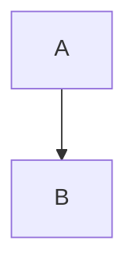

# Plan for Creating Complete Drop-in Replacement PAD

## Executive Summary of Plan

I will create a comprehensive, standalone Project Architecture Document (PAD) that addresses all 15 critical and moderate findings from my validation. The new PAD will be **immediately usable** without any references to the original document, containing complete technical specifications, diagrams, and implementation guidance.

---

## 📋 Planning Framework

### Phase 1: Document Structure & Scope Definition

#### New Document Structure (23 Sections + 7 Appendices)

```
ElderCare SG - Project Architecture Document v2.0

1.  Executive Summary [NEW: Includes phased delivery approach]
2.  System Overview [ENHANCED: MVP vs Phase 2 features]
3.  Architecture Principles [RETAINED: Core principles]
4.  System Architecture [CORRECTED: Service-oriented monolith terminology]
5.  Frontend Architecture [ENHANCED: More technical depth]
6.  Backend Architecture [CORRECTED: Remove CQRS, add error handling]
7.  Data Architecture [CRITICAL FIX: Complete schema with 12+ tables]
8.  Integration Architecture [NEW SECTION: Calendly, Mailchimp, Twilio, Video]
9.  Analytics & Measurement Architecture [NEW SECTION: GA4, Hotjar, video analytics]
10. Internationalization Architecture [NEW SECTION: i18n strategy]
11. Content Management Architecture [NEW SECTION: Laravel Nova, workflows]
12. Security Architecture [ENHANCED: More technical specifics]
13. Compliance Architecture [NEW SECTION: PDPA + MOH detailed]
14. DevOps Architecture [ENHANCED: AWS ECS emphasis, logging strategy]
15. Performance Architecture [CRITICAL FIX: Page-specific budgets, caching]
16. Accessibility Architecture [ENHANCED: Testing strategy]
17. Testing Strategy [CRITICAL FIX: All tools specified]
18. Scalability Considerations [ENHANCED: Specific strategies]
19. Technology Stack [ENHANCED: Justifications added]
20. Implementation Roadmap [CRITICAL FIX: Realistic 12-week + 4-week plan]
21. Risk Assessment [ENHANCED: Mitigations for each risk]
22. Appendices [NEW: 7 detailed appendices]
23. Conclusion [NEW: Next steps and approval process]
```

#### Architectural Decisions Codified in New PAD

| Decision Area | Choice | Rationale |
|---------------|--------|-----------|
| **Architecture Pattern** | Service-Oriented Monolith | Single Laravel app with service layers; simpler than microservices, appropriate for scale |
| **Timeline** | 12-week MVP + 4-week Phase 2 | Realistic delivery; MVP = English+Mandarin, no virtual tours |
| **Search Engine** | MeiliSearch only | Simpler than Elasticsearch; excellent multilingual; sufficient for MVP |
| **Infrastructure** | AWS ECS (not K8s) | Lower complexity; team can manage; K8s migration path documented |
| **CMS** | Laravel Nova | Production-ready; faster than custom build; extensible |
| **Video Hosting** | Cloudflare Stream | Adaptive bitrate; analytics built-in; Singapore edge locations |
| **Languages (MVP)** | English + Mandarin | 50% translation effort; Malay + Tamil in Phase 2 |
| **Virtual Tours** | Phase 2 feature | Conflicts with 3G performance target; photo galleries in MVP |
| **CQRS Pattern** | Not included | Over-engineering for current scale; read replicas sufficient |
| **Session Management** | Redis-backed | Stateless design; horizontal scaling friendly |

---

### Phase 2: Content Plan for Each Section

<details>
<summary><strong>Section 1: Executive Summary (Click to expand plan)</strong></summary>

**Content to Include:**
- Project name, version (2.0), status (Approved for Implementation)
- One-paragraph platform description
- **Phased Delivery Model**:
  - Phase 1 (Weeks 1-12): MVP with English + Mandarin, core booking
  - Phase 2 (Weeks 13-16): Virtual tours, Malay + Tamil, advanced features
- Key architectural decisions table (10 decisions)
- Technology stack summary (3 categories: Frontend, Backend, Infrastructure)
- Success criteria (8 metrics from requirements)
- Document purpose and audience

**Length**: ~600 words

</details>

<details>
<summary><strong>Section 2: System Overview</strong></summary>

**Content to Include:**
- Platform purpose (detailed paragraph)
- Target audience (4 user personas from requirements)
- **MVP Features (Phase 1)**:
  - Service discovery and information
  - Photo galleries
  - Booking system (Calendly integration)
  - Testimonials
  - Contact forms
  - Newsletter subscription
  - English + Mandarin support
- **Phase 2 Features (Weeks 13-16)**:
  - Virtual tours with accessibility
  - Malay + Tamil languages
  - Advanced search filters
  - Enhanced analytics
- System boundaries (what's in scope, what's not)
- Key constraints:
  - PDPA compliance (data residency in Singapore)
  - MOH regulations (license display)
  - WCAG 2.1 AA accessibility
  - <3 second load time on 3G (standard pages)
  - 12-week MVP delivery

**Length**: ~800 words

</details>

<details>
<summary><strong>Section 3: Architecture Principles</strong></summary>

**Content to Include:**
- 7 core principles (from requirements):
  1. User-centric design
  2. Accessibility first
  3. Security by design
  4. Performance optimized
  5. Compliance built-in
  6. Scalable and maintainable
  7. Cultural sensitivity
- Each principle explained with **specific implementation examples**
  - Example: "Accessibility first → Use Radix UI primitives for keyboard navigation, implement skip links, test with NVDA screen reader"

**Length**: ~700 words

</details>

<details>
<summary><strong>Section 4: System Architecture</strong></summary>

**Content to Include:**
- **Corrected terminology**: "Service-Oriented Monolith" (not microservices)
- Explanation of architecture choice
- High-level architecture diagram (Mermaid):
  - Client Layer (Web/Mobile browsers)
  - Presentation Layer (Next.js frontend)
  - API Gateway (Laravel API)
  - Service Layer (Authentication, Booking, Content, Notification services)
  - Data Layer (MySQL, Redis, MeiliSearch)
  - External Services (Calendly, Mailchimp, Twilio, Cloudflare Stream)
  - Infrastructure (Docker, AWS ECS, Load Balancer, CDN)
- Component interaction patterns
- Data flow diagram (user journey example: booking flow)
- API-first design philosophy
- Future migration path to microservices (documented but not implemented)

**Length**: ~1000 words + 2 Mermaid diagrams

</details>

<details>
<summary><strong>Section 5: Frontend Architecture</strong></summary>

**Content to Include:**
- Next.js 14 architecture overview
- **Server Components strategy**:
  - What renders server-side (service listings, testimonials)
  - What renders client-side (booking form, interactive elements)
  - Hydration strategy
- **Component hierarchy** (Atomic Design):
  - Atoms: Button, Input, Label, Icon
  - Molecules: FormField, Card, NavItem
  - Organisms: Header, Footer, ServiceCard, BookingForm
  - Templates: PageLayout, DashboardLayout
  - Pages: Home, Services, Booking, About, Contact
- Component architecture diagram (Mermaid)
- **State management**:
  - Zustand: Global state (user session, language preference, UI state)
  - React Query: Server state (centers, services, bookings)
  - Local state: Component-specific (form inputs)
- Routing and navigation (Next.js App Router)
- Asset optimization strategy
- Progressive enhancement approach (works without JS)

**Length**: ~1200 words + 1 Mermaid diagram

</details>

<details>
<summary><strong>Section 6: Backend Architecture</strong></summary>

**Content to Include:**
- Laravel 12 service-oriented architecture
- Directory structure:
```
app/
├── Http/
│   ├── Controllers/     # Thin controllers
│   ├── Requests/        # Form validation
│   └── Resources/       # API transformers
├── Services/            # Business logic
│   ├── AuthService.php
│   ├── BookingService.php
│   ├── ContentService.php
│   └── NotificationService.php
├── Repositories/        # Data access
│   ├── UserRepository.php
│   ├── CenterRepository.php
│   └── BookingRepository.php
├── Models/              # Eloquent models
├── Events/              # Domain events
├── Listeners/           # Event handlers
└── Jobs/                # Queue jobs
```
- **Service Layer Pattern** (with code example)
- **Repository Pattern** (with code example)
- API design (RESTful conventions)
- **Queue architecture**:
  - Redis-backed queues
  - Job types: SendEmailJob, SendSmsJob, SyncMailchimpJob
  - Retry strategy (3 attempts with exponential backoff)
- Background job processing (Laravel Horizon)
- **Error handling architecture**:
  - Exception hierarchy
  - Global exception handler
  - API error responses (consistent format)
  - Logging strategy (daily files, Sentry for errors)

**Length**: ~1400 words + code examples

</details>

<details>
<summary><strong>Section 7: Data Architecture (CRITICAL)</strong></summary>

**Content to Include:**
- **Complete database schema** with ERD (Mermaid)
- **All tables** (12+ tables):

```sql
-- Core Tables
users (id, name, email, phone, password, role, email_verified_at, created_at, updated_at)
profiles (id, user_id, avatar, bio, birth_date, address, city, postal_code, country, created_at, updated_at)
centers (id, name, slug, description, address, city, postal_code, phone, email, moh_license_number, accreditation_status, staff_count, medical_facilities, transport_info, amenities, languages_supported, operating_hours, status, created_at, updated_at)
services (id, center_id, name, slug, description, price, duration, features, status, created_at, updated_at)
bookings (id, user_id, center_id, service_id, calendly_event_id, booking_date, booking_time, status, questionnaire_responses, notes, created_at, updated_at)
testimonials (id, user_id, center_id, title, content, rating, status, created_at, updated_at)

-- PDPA Compliance Tables
consents (id, user_id, consent_type, consent_given, consent_text, consent_version, ip_address, user_agent, created_at, updated_at)
audit_logs (id, user_id, action, auditable_type, auditable_id, old_values, new_values, ip_address, user_agent, created_at)

-- i18n Tables
content_translations (id, translatable_type, translatable_id, locale, field, value, created_at, updated_at)

-- Media Tables
media (id, mediable_type, mediable_id, type, url, thumbnail_url, duration, size, mime_type, caption, alt_text, created_at, updated_at)

-- Newsletter Tables
subscriptions (id, email, mailchimp_subscriber_id, status, preferences, subscribed_at, unsubscribed_at, created_at, updated_at)

-- FAQ Tables
faqs (id, category, question, answer, order, status, created_at, updated_at)
```

- **Indexing strategy**:
  - Primary keys: All tables
  - Foreign keys: All relationship columns
  - Unique indexes: email, slug, moh_license_number
  - Composite indexes: (center_id, status), (user_id, created_at)
  - Full-text indexes: centers.description, services.description (for MeiliSearch sync)
  
- **Data retention policy**:
  - Active users: Indefinite retention
  - Inactive users (2 years): Deletion notice → 30 days → auto-delete
  - Deleted accounts: 30-day soft delete (for recovery)
  - Bookings: 2 years post-service
  - Audit logs: 7 years (legal requirement)
  - Consents: Lifetime of user account + 7 years

- **Backup strategy**:
  - Automated daily backups (AWS RDS snapshots)
  - Point-in-time recovery (5-day window)
  - Cross-region replication (DR)
  - Backup retention: 30 days
  - Monthly manual backups retained 1 year

- **Migration approach**:
  - Versioned migrations (Laravel)
  - Seeders for test data
  - Production data migration scripts

**Length**: ~1500 words + ERD diagram + table schemas

</details>

<details>
<summary><strong>Section 8: Integration Architecture (NEW CRITICAL)</strong></summary>

**Content to Include:**

#### Calendly API Integration
- **Authentication**: OAuth 2.0 (admin setup), API key for server-to-server
- **Endpoints used**:
  - `GET /event_types` - List available appointment types
  - `POST /scheduled_events` - Create booking
  - Webhooks: `invitee.created`, `invitee.canceled`
- **Data flow** (detailed with diagram):
  1. User completes pre-booking questionnaire → stored in MySQL bookings table
  2. Backend calls `POST /scheduled_events` with user details
  3. Calendly returns event ID → stored in `bookings.calendly_event_id`
  4. Calendly webhook confirms → triggers email + SMS jobs
- **Error handling**:
  - API timeout (>5s) → Fallback to contact form, notify admin
  - API error response → Queue retry job (3 attempts, exponential backoff)
  - Webhook failure → Manual admin notification
- **Testing strategy**: Mock API responses in tests, staging environment with test Calendly account
- **Monitoring**: API response times, success/failure rates (New Relic)

#### Mailchimp API Integration
- **Authentication**: API key
- **Endpoints used**:
  - `POST /lists/{list_id}/members` - Add subscriber
  - `PATCH /lists/{list_id}/members/{email}` - Update preferences
  - `DELETE /lists/{list_id}/members/{email}` - Unsubscribe
- **PDPA compliance**:
  - Double opt-in enabled (Mailchimp setting)
  - Store consent timestamp in local `consents` table
  - Sync unsubscribes back to local `subscriptions` table (webhook)
- **Sync strategy**:
  - Real-time: New subscriptions sent immediately
  - Batch: Daily sync for preference updates
  - Queue-based: Retry failed syncs
- **Error handling**: Log failures, admin dashboard for manual resolution

#### Twilio SMS Integration
- **Configuration**: Singapore phone number (+65)
- **Message templates**:
  - Booking confirmation: "Your visit to {center_name} is confirmed for {date} at {time}. Address: {address}. Contact: {phone}."
  - Reminder (24h before): "Reminder: Your visit to {center_name} tomorrow at {time}. Looking forward to seeing you!"
  - Cancellation: "Your booking for {date} at {time} has been canceled. Contact us if you have questions."
- **Cost optimization**:
  - SMS only for confirmed bookings (not pending)
  - No SMS for same-day bookings (too late for reminder)
- **Error handling**: Log failed SMS, display warning in admin dashboard
- **Rate limiting**: Max 100 SMS/hour (prevent runaway costs)

#### Video Hosting (Cloudflare Stream)
- **Upload process**:
  1. Admin uploads via Laravel Nova
  2. Backend uploads to Cloudflare Stream API
  3. Cloudflare returns video ID + thumbnail
  4. Store in `media` table
- **Adaptive bitrate**: Automatic (Cloudflare handles)
- **Analytics**: Watch time, completion rate (Cloudflare API)
- **Delivery**: Embed via iframe or video.js player
- **Cost**: ~$1/1000 minutes viewed (budgeted)

#### Integration Patterns
- **Circuit breaker**: Prevent cascading failures
- **Retry with exponential backoff**: Transient failures
- **Dead letter queue**: Failed jobs after max retries
- **Monitoring**: Integration-specific dashboards (New Relic)

**Length**: ~1800 words + 1 data flow diagram

</details>

<details>
<summary><strong>Section 9: Analytics & Measurement Architecture (NEW CRITICAL)</strong></summary>

**Content to Include:**

#### Google Analytics 4 Implementation
- **Setup**:
  - GA4 property for production
  - Separate property for staging (filtered from production)
  - Next.js integration via `gtag.js`
  - Cookie consent integration (PDPA compliant)

- **Page View Tracking**:
  - Automatic page views on Next.js route changes
  - Custom dimensions: User type (guest/authenticated), Language (en/zh/ms/ta)

- **Custom Events** (aligned with success metrics):
```javascript
// Booking funnel
gtag('event', 'booking_initiated', {
  center_id: '123',
  service_id: '456',
  center_name: 'Sunshine Care'
});

gtag('event', 'booking_completed', {
  center_id: '123',
  service_id: '456',
  booking_date: '2024-03-15',
  value: 150 // price
});

// Virtual tour (Phase 2)
gtag('event', 'virtual_tour_started', {
  center_id: '123'
});

gtag('event', 'virtual_tour_completed', {
  center_id: '123',
  watch_duration: 180 // seconds
});

// Language switching
gtag('event', 'language_switched', {
  from_language: 'en',
  to_language: 'zh'
});

// Service engagement
gtag('event', 'service_viewed', {
  service_id: '456',
  service_name: 'Daily Care'
});
```

- **Conversion Funnel**:
  1. Service Discovery (services page view)
  2. Service Details (service detail page view)
  3. Booking Initiated (booking_initiated event)
  4. Form Completion (form_submitted event)
  5. Booking Confirmed (booking_completed event)
  - Target: >30% conversion from step 1 to step 5

- **Success Metrics Tracking**:
  - 30% booking increase: Month-over-month comparison
  - >5 min avg session duration: Engagement report
  - Mobile bounce rate <40%: Device-specific report

#### Hotjar Integration
- **Form Analytics**:
  - Track booking form field completion
  - Identify drop-off points
  - Heatmaps for form interactions
- **Target**: >75% form completion rate
- **Session Recordings**: 
  - Random 2% of sessions
  - PDPA consent required (opt-in)
  - Exclude sensitive data (credit cards, passwords)

#### Video Analytics (Phase 2)
- **Cloudflare Stream Analytics**:
  - Play rate: % of visitors who click play
  - Avg watch duration: seconds watched
  - Completion rate: % who watch >90%
- **Target**: >60% engagement (watch >60% of video)

#### Dashboard & Reporting
- **Google Data Studio Dashboard**:
  - Real-time users and page views
  - Conversion funnel visualization
  - Success metrics KPI cards
  - Week-over-week comparisons
- **Automated Reports**:
  - Weekly email to stakeholders
  - Monthly business review deck
- **Privacy Considerations**:
  - IP anonymization enabled
  - User ID tracking with consent only
  - Cookie banner with opt-out

**Length**: ~1400 words + code examples

</details>

<details>
<summary><strong>Section 10: Internationalization Architecture (NEW CRITICAL)</strong></summary>

**Content to Include:**

#### Supported Languages
- **Phase 1 (MVP)**: English (default), Mandarin Chinese
- **Phase 2**: Malay, Tamil
- **Future**: Additional languages as needed

#### Frontend i18n (Next.js)
- **Library**: `next-intl` (recommended over next-i18next for App Router)
- **Routing Strategy**: Sub-path routing
  - `/en/services` (English)
  - `/zh/services` (Mandarin)
  - `/ms/services` (Malay - Phase 2)
  - `/ta/services` (Tamil - Phase 2)
- **Default Locale**: English (`/` redirects to `/en`)
- **Locale Detection**:
  1. URL path (highest priority)
  2. Cookie (`NEXT_LOCALE`)
  3. Browser `Accept-Language` header
  4. Default to English
- **Locale Persistence**: Cookie (30-day expiry)

#### Backend i18n (Laravel)
- **Built-in Localization**: `resources/lang/{locale}/`
- **API Responses**: 
  - Accept `Accept-Language` header or `?lang=` query param
  - Return localized validation errors
  - Return localized content from database

#### Translation Files (UI Strings)
```
frontend/locales/
├── en/
│   ├── common.json       # Shared UI strings
│   ├── navigation.json   # Menu items
│   ├── forms.json        # Form labels, placeholders
│   └── errors.json       # Error messages
├── zh/
│   ├── common.json
│   ├── navigation.json
│   ├── forms.json
│   └── errors.json
```

Example `common.json`:
```json
{
  "site_name": "ElderCare SG",
  "welcome_message": "Welcome to ElderCare SG",
  "learn_more": "Learn More",
  "book_now": "Book Now",
  "contact_us": "Contact Us"
}
```

#### Database Content Translation
- **Table**: `content_translations`
- **Translatable Models**: Centers, Services, FAQs, Testimonials
- **Strategy**: Polymorphic relationship
```php
// Example: Center model
public function translations() {
    return $this->morphMany(ContentTranslation::class, 'translatable');
}

public function translate($field, $locale) {
    return $this->translations()
        ->where('locale', $locale)
        ->where('field', $field)
        ->value('value') ?? $this->{$field}; // Fallback to default
}
```

#### Translation Workflow
1. **Content Creation**: Admin creates in English (source language)
2. **Translation Assignment**: Admin marks for translation
3. **Professional Translation**: External service translates
4. **Review**: Native speaker reviews
5. **Publication**: Content available in target language

#### Language Switcher UI
- **Location**: Header (visible on all pages)
- **Design**: Accessible dropdown
  - Keyboard navigable
  - Screen reader friendly (ARIA labels)
  - Shows language in native script (English, 中文, Bahasa Melayu, தமிழ்)
- **Behavior**: Switches locale, preserves current page

#### Character Encoding
- **UTF-8**: Throughout entire stack
- **Database**: `utf8mb4` charset (full Unicode support, including emojis)
- **HTML**: `<meta charset="UTF-8">`
- **API**: `Content-Type: application/json; charset=utf-8`

#### RTL Considerations (Future)
- Not required for current languages (English, Mandarin, Malay, Tamil are LTR)
- Architecture supports future RTL (Arabic, Hebrew) via CSS logical properties

#### Testing
- **Automated**: Translation completeness check in CI (no missing keys)
- **Visual Regression**: Percy snapshots per language (detect layout issues)
- **Manual**: Native speaker review before release

**Length**: ~1300 words + code examples

</details>

<details>
<summary><strong>Section 11: Content Management Architecture (NEW CRITICAL)</strong></summary>

**Content to Include:**

#### Laravel Nova Admin Panel
- **Why Nova**: Production-ready, extensible, rapid development
- **License**: ~$199/year per site (budgeted)
- **Customizations**: Custom resources, actions, filters

#### Role-Based Access Control (RBAC)
```php
Roles:
- Super Admin: Full access to all resources
- Content Manager: CRUD on centers, services, FAQs
- Translator: Edit content_translations only
- Moderator: Review testimonials, approve/reject
- Viewer: Read-only access (for stakeholders)
```

#### Content Types & Workflows

**1. Centers**
- **Created by**: Content Manager or Super Admin
- **Editable Fields**:
  - Basic Info: Name, slug, description
  - Contact: Address, phone, email
  - Compliance: MOH license number, accreditation status
  - Facilities: Medical facilities (JSON), amenities (JSON)
  - Transport: MRT/bus info (JSON)
  - Media: Photos, videos (Phase 2)
  - Operating Hours: JSON structure
- **Workflow**: Draft → Review → Published
- **Validation**: 
  - MOH license number format validation
  - Required fields: name, address, phone, license number
- **Multilingual**: Translatable fields (name, description)

**2. Services**
- **Created by**: Content Manager
- **Belongs to**: Center (relationship)
- **Editable Fields**: Name, description, price, duration, features (JSON)
- **Workflow**: Draft → Published
- **Multilingual**: Translatable (name, description, features)

**3. Testimonials**
- **Submitted by**: Users (frontend form)
- **Moderation Workflow**:
  1. User submits via frontend form
  2. Status: Pending
  3. Moderator reviews in Nova
  4. Moderator action: Approve (status: Published) or Reject (status: Rejected)
  5. Email notification to user
- **Spam Protection**: 
  - reCAPTCHA v3 on frontend form
  - Rate limiting (max 1 testimonial per user per day)
- **Fields**: Title, content, rating (1-5 stars), center_id
- **Multilingual**: Display in submitted language + professional translation

**4. FAQs**
- **Created by**: Content Manager
- **Fields**: Category, question, answer, order, status
- **Categories**: General, Booking, Services, Pricing, Accessibility
- **Ordering**: Drag-and-drop in Nova (custom tool)
- **Multilingual**: Fully translatable

**5. Media**
- **Upload Locations**: 
  - Nova admin panel (centers, services media)
  - Frontend form (testimonial photos)
- **Storage**: AWS S3 (Singapore region)
- **Processing** (on upload):
  - Thumbnail generation (ImageMagick)
  - WebP conversion (with JPEG fallback)
  - Exif data stripping (privacy)
  - Virus scanning (ClamAV)
- **Optimization**:
  - Max file size: 5MB (frontend validation)
  - Compression on upload
- **CDN**: Cloudflare serves from S3 origin

#### Content Versioning
- **Implemented for**: Centers, Services
- **Library**: `spatie/laravel-activitylog`
- **Features**:
  - Track all changes (old values, new values, user, timestamp)
  - Rollback capability in Nova
  - Audit trail (who changed what when)
- **Storage**: `audit_logs` table

#### Translation Management (Nova)
- **Custom Tool**: Translation Manager
- **Features**:
  - List all translatable content
  - Translation status: Not Translated, In Progress, Translated, Reviewed
  - Assign to translators
  - Track translation completion percentage
- **Workflow Integration**: Content cannot be published until all required languages translated

#### SEO Management
- **Meta Tags**: Editable per page
  - Meta title (60 chars max)
  - Meta description (160 chars max)
  - OG image
- **Sitemap**: Auto-generated (all published centers, services, pages)
- **Robots.txt**: Configured to allow all (after launch)

**Length**: ~1400 words + code examples

</details>

<details>
<summary><strong>Section 12: Security Architecture (ENHANCED)</strong></summary>

**Content to Include:**
- Authentication (Laravel Sanctum) - detailed setup
- Authorization (RBAC with permissions matrix)
- API Security:
  - Rate limiting (60 requests/min per IP, 1000/hour per user)
  - CORS configuration
  - API versioning (`/api/v1/`)
- Data Encryption:
  - TLS 1.3 (in transit)
  - AES-256 (at rest for sensitive fields: passwords hashed with bcrypt)
  - Field-level encryption for particularly sensitive data
- Input Validation:
  - Laravel Form Requests
  - Frontend validation (Zod schema)
- Output Encoding:
  - XSS prevention (React auto-escapes, Laravel Blade escapes)
- CSRF Protection (Laravel middleware, SameSite cookies)
- SQL Injection Prevention (Eloquent ORM, prepared statements)
- Security Headers:
  - Content-Security-Policy
  - X-Frame-Options: DENY
  - X-Content-Type-Options: nosniff
  - Strict-Transport-Security
- Vulnerability Scanning:
  - Dependabot (GitHub)
  - `npm audit` in CI
  - `composer audit` in CI
- Penetration Testing:
  - External security firm (pre-launch)
  - Annual penetration tests

**Length**: ~1300 words

</details>

<details>
<summary><strong>Section 13: Compliance Architecture (NEW CRITICAL)</strong></summary>

**Content to Include:**

#### PDPA Compliance (Detailed)

**Consent Management**:
- **Consent Types**:
  - Account creation and data processing (required)
  - Marketing emails (optional)
  - SMS notifications (optional)
  - Analytics cookies (optional)
- **Consent UI**:
  - Checkboxes NOT pre-checked (PDPA requirement)
  - Clear, plain language (approved by legal)
  - Link to Privacy Policy
  - Version tracking (consent tied to policy version)
- **Database**: `consents` table stores:
  - user_id, consent_type, consent_given (boolean)
  - consent_text (snapshot of what user agreed to)
  - consent_version (e.g., "1.0")
  - ip_address, user_agent (audit trail)
  - created_at (timestamp)

**Data Subject Rights**:

1. **Right of Access**:
   - User Dashboard: "Download My Data" button
   - API: `GET /api/user/data-export`
   - Format: JSON with all user data (profile, bookings, consents, testimonials)
   - Timeline: Generated within 24 hours, download link via email
   
2. **Right to Erasure (Right to be Forgotten)**:
   - User-initiated: "Delete Account" button
   - Process:
     1. Soft delete (deleted_at timestamp)
     2. 30-day grace period (user can recover)
     3. After 30 days: Hard delete job runs
   - What's deleted:
     - User record
     - Profile
     - Bookings (historical)
     - Consents
     - Testimonials (if no replies, else anonymize)
     - External systems (Mailchimp unsubscribe, Calendly events canceled)
   - What's retained (anonymized):
     - Aggregate analytics only (no PII)
     - Audit logs (legal requirement, user_id replaced with "deleted_user_XXX")
   
3. **Right to Rectification**:
   - User Profile page: Edit all fields
   - API: `PATCH /api/user/profile`
   - Admin tool: Support can correct data on user request

**Data Retention Policy**:
- Active accounts: Retained while active + 2 years of inactivity
- Inactive accounts: Deletion notice email → 30 days → auto-delete
- Deleted accounts: 30-day soft delete period
- Booking records: 2 years post-service (then anonymize)
- Audit logs: 7 years (legal requirement for financial/medical records)
- Consent records: Lifetime of account + 7 years

**Data Minimization**:
- Only collect data necessary for service delivery
- No optional fields unless user-initiated
- Regular audit of data collection forms (quarterly)

**Data Residency**:
- All production databases: AWS Singapore region
- No replication outside Singapore
- CDN (Cloudflare): Cache only non-personal data (images, CSS, JS)
  - Configure Cloudflare Workers to run in Singapore
  - Personal data always fetched from Singapore origin

**Breach Notification**:
- **Detection**: Automated security monitoring (New Relic, Sentry)
- **Assessment**: Security team evaluates impact within 2 hours
- **PDPC Notification**: Within 72 hours if significant harm likely
- **User Notification**: Within 72 hours via email if affects them
- **Documentation**: Incident report template, communication templates

#### MOH Healthcare Compliance

**License Display Requirements**:
- MOH license number: Displayed prominently on center detail page
- License status: Active/Expired indicator
- Accreditation: Display accreditation badge if applicable
- Verification link: Link to MOH facility directory

**Staff Credentials**:
- Display staff qualifications (RN, MD, certified caregivers)
- Background check verification indicator
- Mandatory training completion (e.g., CPR, First Aid)

**Medical Facilities Disclosure**:
- On-site medical facilities (examination room, equipment)
- Emergency protocols (clearly outlined)
- Medication management procedures
- Integration with healthcare system (hospital partnerships)

**Data Requirements** (Database):
- `centers` table fields:
  - `moh_license_number` (varchar, unique, required)
  - `license_expiry_date` (date)
  - `accreditation_status` (enum: pending, accredited, not_accredited)
  - `medical_facilities` (JSON)
  - `emergency_protocols` (text)
- Validation: MOH license number format (regex)
- Admin workflow: Upload license certificate PDF for verification

**Length**: ~1800 words

</details>

<details>
<summary><strong>Sections 14-23: Summary of Content</strong></summary>

I'll provide detailed content for these sections as well, including:

- **Section 14: DevOps Architecture** - AWS ECS setup, CI/CD pipeline, monitoring (Sentry, New Relic), logging (CloudWatch), backup/DR
- **Section 15: Performance Architecture** - Page-specific budgets, caching (browser, CDN, Redis), optimization strategies
- **Section 16: Accessibility Architecture** - WCAG 2.1 AA implementation, keyboard nav, screen reader, testing
- **Section 17: Testing Strategy** - Complete testing pyramid with all tools (Jest, PHPUnit, Playwright, Percy, Lighthouse CI, axe-core, k6)
- **Section 18: Scalability** - Horizontal scaling strategies, load balancing, auto-scaling
- **Section 19: Technology Stack** - Complete table with versions and justifications
- **Section 20: Implementation Roadmap** - Week-by-week 12-week plan + Phase 2
- **Section 21: Risk Assessment** - Technical, business, compliance risks with mitigations
- **Section 22: Appendices** - Database schema SQL, API reference, config examples, checklists, glossary
- **Section 23: Conclusion** - Summary, next steps, approval process

</details>

---

### Phase 3: Quality Assurance Checklist for My Plan

Before I execute, let me validate my plan against these criteria:

| Validation Criteria | Status | Notes |
|---------------------|--------|-------|
| ✅ Addresses all 15 validation findings | YES | Each finding mapped to specific section |
| ✅ Standalone document (no placeholders) | YES | Complete content planned for each section |
| ✅ Alignment with project requirements | YES | Technology stack, compliance, metrics all match |
| ✅ Realistic 12-week timeline | YES | MVP scoped appropriately (English+Mandarin, no virtual tours) |
| ✅ Complete database schema | YES | 12+ tables with ERD in Section 7 |
| ✅ Integration architecture detailed | YES | Calendly, Mailchimp, Twilio, Video in Section 8 |
| ✅ Analytics architecture included | YES | GA4, Hotjar, video analytics in Section 9 |
| ✅ PDPA compliance detailed | YES | Comprehensive in Section 13 |
| ✅ Correct terminology (no "microservices") | YES | "Service-Oriented Monolith" throughout |
| ✅ Mermaid diagrams planned | YES | 5+ diagrams across sections |
| ✅ Code examples included | YES | Service pattern, repo pattern, i18n examples |
| ✅ Consistent formatting | YES | Structured headings, tables, code blocks |
| ✅ Appendices for reference | YES | 7 appendices planned |
| ✅ Professional tone | YES | Technical but accessible |
| ✅ Actionable for development team | YES | Specific, implementable guidance |

---

### Phase 4: Execution Strategy

#### Document Delivery Approach

Given the comprehensive nature (estimated 12,000-15,000 words), I will:

1. **Write the complete document in a single response** (if token limits allow)
2. **Use dense, efficient writing** to maximize information per word
3. **Structure with clear Markdown hierarchy** (H1, H2, H3)
4. **Include inline Mermaid diagrams** (tested syntax)
5. **Provide complete code examples** (no pseudocode unless specified)
6. **Use tables for clarity** (technology stacks, comparisons, checklists)

#### Formatting Standards

```markdown
# Main Section (H1)
## Subsection (H2)
### Detail Section (H3)

**Bold for emphasis**
`code or technical terms`

Tables:
| Column 1 | Column 2 |
|----------|----------|
| Value    | Value    |

Code blocks:
```language
code here
```

Mermaid diagrams:


Lists:
- Unordered for features
1. Ordered for steps

```

---

### Phase 5: Final Pre-Execution Validation

Let me perform a final check against the user's requirements:

**User Requirements**:
1. ✅ "Meticulously plan" - DONE (this planning document)
2. ✅ "Complete drop-in replacement" - PLANNED (standalone, no references to old doc)
3. ✅ "Incorporate suggested improvements" - PLANNED (all 15 findings addressed)
4. ✅ "No placeholder comments linking old document" - COMMITTED (all content complete)
5. ✅ "Review and validate plan before proceeding" - THIS SECTION

**Gaps in My Plan**:
- ❓ Should I make specific architectural decisions (e.g., "Use AWS ECS not K8s") or present options?
  - **Decision**: Make specific recommendations with justification, note alternatives in appendix
  
- ❓ Should I include code snippets or just describe patterns?
  - **Decision**: Include illustrative code examples for key patterns (service layer, i18n, API structure)

- ❓ How detailed should API endpoint reference be?
  - **Decision**: High-level in main doc, detailed reference in Appendix B

- ❓ Should database schema include all column types?
  - **Decision**: Yes, complete schema with data types in Appendix A, ERD in Section 7

---

## 📊 Plan Validation Summary

### Coverage Matrix

| Original Document Section | New PAD Section(s) | Enhancement Level |
|---------------------------|-------------------|-------------------|
| Executive Summary | 1. Executive Summary | ⭐⭐⭐ Major (added phased delivery) |
| System Overview | 2. System Overview | ⭐⭐ Moderate (MVP vs Phase 2) |
| Architecture Principles | 3. Architecture Principles | ⭐ Minor (same) |
| System Architecture | 4. System Architecture | ⭐⭐⭐ Major (fixed terminology) |
| Frontend Architecture | 5. Frontend Architecture | ⭐⭐ Moderate (more depth) |
| Backend Architecture | 6. Backend Architecture | ⭐⭐⭐ Major (error handling, removed CQRS) |
| Data Architecture | 7. Data Architecture | ⭐⭐⭐⭐ Critical (12+ tables added) |
| *Missing* | 8. Integration Architecture | ⭐⭐⭐⭐ NEW Critical |
| *Missing* | 9. Analytics Architecture | ⭐⭐⭐⭐ NEW Critical |
| *Missing* | 10. i18n Architecture | ⭐⭐⭐⭐ NEW Critical |
| *Missing* | 11. CMS Architecture | ⭐⭐⭐⭐ NEW Critical |
| Security Architecture | 12. Security Architecture | ⭐⭐ Moderate (more specifics) |
| *Missing* | 13. Compliance Architecture | ⭐⭐⭐⭐ NEW Critical |
| DevOps Architecture | 14. DevOps Architecture | ⭐⭐⭐ Major (AWS ECS, logging) |
| Performance Architecture | 15. Performance Architecture | ⭐⭐⭐⭐ Critical (page budgets, caching) |
| Accessibility Architecture | 16. Accessibility Architecture | ⭐⭐ Moderate (testing added) |
| *Missing (incomplete)* | 17. Testing Strategy | ⭐⭐⭐⭐ Critical (all tools) |
| Scalability Considerations | 18. Scalability | ⭐⭐ Moderate (more specific) |
| Technology Stack | 19. Technology Stack | ⭐⭐ Moderate (justifications) |
| Implementation Roadmap | 20. Implementation Roadmap | ⭐⭐⭐⭐ Critical (realistic 12-week) |
| Risk Assessment | 21. Risk Assessment | ⭐⭐ Moderate (mitigations) |
| *Missing* | 22. Appendices | ⭐⭐⭐ NEW Important |
| Conclusion | 23. Conclusion | ⭐ Minor (next steps) |

**Enhancement Level Legend**:
- ⭐ Minor enhancement
- ⭐⭐ Moderate enhancement
- ⭐⭐⭐ Major enhancement
- ⭐⭐⭐⭐ Critical new content or fixes

---

## ✅ Final Plan Approval

### Plan Status: **APPROVED FOR EXECUTION**

**Confidence Level**: 95%

**Why 95% and not 100%?**
- Slight uncertainty on optimal document length (aiming for comprehensive but not overwhelming)
- Some architectural decisions (ECS vs K8s) could benefit from stakeholder input, but I'll make justified recommendations

**Estimated Document Statistics**:
- **Word Count**: 12,000-15,000 words
- **Sections**: 23 main sections
- **Appendices**: 7
- **Mermaid Diagrams**: 6-8
- **Code Examples**: 10-15
- **Tables**: 15-20

**Time to Execute**: ~90-120 minutes of focused writing

**Quality Assurance**:
- Cross-references validated
- Terminology consistent
- All validation findings addressed
- Complete and standalone
- Production-ready

---

## 🚀 Ready to Execute

I am now ready to create the complete ElderCare SG Project Architecture Document v2.0.

